<div align="center" style="text-align:center;margin:auto;">


<h1>Zenburn Monolith Theme</h1>
<h4>Zenburn token colors in different intensities and on different dark backgrounds to reduce eye strain.</h4>

[](https://marketplace.visualstudio.com/items/nicola-granata.zenburn-monolith)&nbsp;[](https://marketplace.visualstudio.com/items/nicola-granata.zenburn-monolith)&nbsp;[](https://marketplace.visualstudio.com/items/nicola-granata.zenburn-monolith)&nbsp;[](https://marketplace.visualstudio.com/items/nicola-granata.zenburn-monolith)&nbsp;

</div>

<!-- Goldstone / Heliotrope / Low Blue / Onyx -->
Please do not rely only on the preview images of this theme (they are of average quality), but try it. Especially if you work at night and for many hours, almost certainly, among all my skins, you will find the colors suitable to avoid eye strain.

> Tip: the display name of theme is as follow: the first part (e.g.: **Zenburn**) is token colors name, the second (e.g.: **Monolith**) is the main related colors structure, the third (e.g.: **Nadir**) part of name is the background suite and UI main colors, last part (e.g.: **Viserion**) is simply the representation name for main foreground/highlights color.


# Table of contents
1. [Zenburn token colors based skins](#zenburn-token-colors-based-skins "Zenburn token colors based skins")
1. [Zenburn Monolith Preview Gallery](#zenburn-monolith-preview-gallery "Zenburn Monolith Preview Gallery")
	* [**Goldstone** (10 skins): Deep blue flat UI and Desatured Token Colors](#goldstone-10-skins-deep-blue-flat-ui-and-desatured-token-colors "**Goldstone** (10 skins): Deep blue flat UI and Desatured Token Colors")
	* [**Heliotrope** (10 skins): Petrol Blue flat UI and Desatured Token Colors](#heliotrope-10-skins-petrol-blue-flat-ui-and-desatured-token-colors "**Heliotrope** (10 skins): Petrol Blue flat UI and Desatured Token Colors")
	* [**Low Blue** (1 skin): Low Blue Light on UI and Token Colors](#low-blue-1-skin-low-blue-light-on-ui-and-token-colors "**Low Blue** (1 skin): Low Blue Light on UI and Token Colors")
	* [**Onyx** (10 skins): Flat Grayed UI and Desatured Token Colors](#onyx-10-skins-flat-grayed-ui-and-desatured-token-colors "**Onyx** (10 skins): Flat Grayed UI and Desatured Token Colors")
1. [Free Fonts for coding](#free-fonts-for-coding "Free Fonts for coding")
	* [Fonts Comparative Table and Downloads](#fonts-comparative-table-and-downloads "Fonts Comparative Table and Downloads")
		* [Fonts data sheet symbols legend](#fonts-data-sheet-symbols-legend "Fonts data sheet symbols legend")
		* [Fonts data sheet and Downloads](#fonts-data-sheet-and-downloads "Fonts data sheet and Downloads")
	* [Optimal Settings](#optimal-settings "Optimal Settings")
1. [All my Themes](#all-my-themes "All my Themes")
1. [Latest Changelog for Zenburn Monolith Theme](#latest-changelog-for-zenburn-monolith-theme "Latest Changelog for Zenburn Monolith Theme")
1. [About Token Colors](#about-token-colors "About Token Colors")
	* [Apophis based](#apophis-based "Apophis based")
	* [Zenburn based](#zenburn-based "Zenburn based")
1. [About my PHP Script **VSCode Themes Master**](#about-my-php-script-vscode-themes-master "About my PHP Script **VSCode Themes Master**")
1. [Gratitude](#gratitude "Gratitude")
1. [License](#license "License")


<!--
//# Zenburn Monolith Theme 
-->


<div align="right"><a href="#table-of-contents" alt="Table of contents" title="Go to Table of contents">&#128316;</a></div>

# Zenburn token colors based skins

All the skins shown below are part of a suite designed to try to reduce visual fatigue while using `Visual Studio Code`.

The ultimate goal of the suite is to offer a good chance to find a theme that reduces disturbing elements and eye strain as much as possible.

However, attempts were made to leave error signals and selections clearly visible with moderate color contrasts.

> Tip 1: The skins are quite similar but you can find the right color intensity based on the `sRGB` representation of your monitor and the sensitivity of your eyes to certain frequencies.

> Tip 2: If you like code version control and want to add PHPDoc / JSDoc (Documentor) data to your functions, try [**Version Boss**](https://marketplace.visualstudio.com/items/nicola-granata.version-boss)! `Version Boss` is a free extension that `simplifies versioning of scripting files`. Download it at [Marketplace](https://marketplace.visualstudio.com/items/nicola-granata.version-boss).


<div align="right"><a href="#table-of-contents" alt="Table of contents" title="Go to Table of contents">&#128316;</a></div>

# Zenburn Monolith Preview Gallery

<!--
`Note`: This demo not contains all subset of variants, because the representation of color in GIF format is not completely faithful.


-->
<!--

// ## Zenburn Monolith variants descriptions

| Variant | Description |
|--- |--- |
|`Goldstone`|Deep blue flat UI and Desatured Token Colors|
|`Heliotrope`|Petrol Blue flat UI and Desatured Token Colors|
|`Low Blue`|Low Blue Light on UI and Token Colors|
|`Onyx`|Flat Grayed UI and Desatured Token Colors|

// ## Zenburn Monolith Skins list:

- `Zenburn Monolith - Goldstone - Amethyst`;
- `Zenburn Monolith - Goldstone - Aquamarine`;
- `Zenburn Monolith - Goldstone - Beryl`;
- `Zenburn Monolith - Goldstone - Howlite`;
- `Zenburn Monolith - Goldstone - Limestone`;
- `Zenburn Monolith - Goldstone - Morion`;
- `Zenburn Monolith - Goldstone - Obsidian`;
- `Zenburn Monolith - Goldstone - Quartz`;
- `Zenburn Monolith - Goldstone - Sulfur`;
- `Zenburn Monolith - Goldstone - Turquenite`;
- `Zenburn Monolith - Heliotrope - Amethyst`;
- `Zenburn Monolith - Heliotrope - Aquamarine`;
- `Zenburn Monolith - Heliotrope - Beryl`;
- `Zenburn Monolith - Heliotrope - Howlite`;
- `Zenburn Monolith - Heliotrope - Limestone`;
- `Zenburn Monolith - Heliotrope - Morion`;
- `Zenburn Monolith - Heliotrope - Obsidian`;
- `Zenburn Monolith - Heliotrope - Quartz`;
- `Zenburn Monolith - Heliotrope - Sulfur`;
- `Zenburn Monolith - Heliotrope - Turquenite`;
- `Zenburn Monolith - Low Blue - Obsidian`;
- `Zenburn Monolith - Onyx - Amethyst`;
- `Zenburn Monolith - Onyx - Aquamarine`;
- `Zenburn Monolith - Onyx - Beryl`;
- `Zenburn Monolith - Onyx - Howlite`;
- `Zenburn Monolith - Onyx - Limestone`;
- `Zenburn Monolith - Onyx - Morion`;
- `Zenburn Monolith - Onyx - Obsidian`;
- `Zenburn Monolith - Onyx - Quartz`;
- `Zenburn Monolith - Onyx - Sulfur`;
- `Zenburn Monolith - Onyx - Turquenite`.

-->


<div align="right"><a href="#table-of-contents" alt="Table of contents" title="Go to Table of contents">&#128316;</a></div>

## **Goldstone** (10 skins): Deep blue flat UI and Desatured Token Colors
<center> <a href="https://github.com/nicolagranata/vscode-theme-zenburn-monolith/tree/master/_gfx/zenburn-monolith-goldstone-aquamarine-preview.png" title="Go to Zenburn Monolith - Goldstone - Aquamarine" target="github">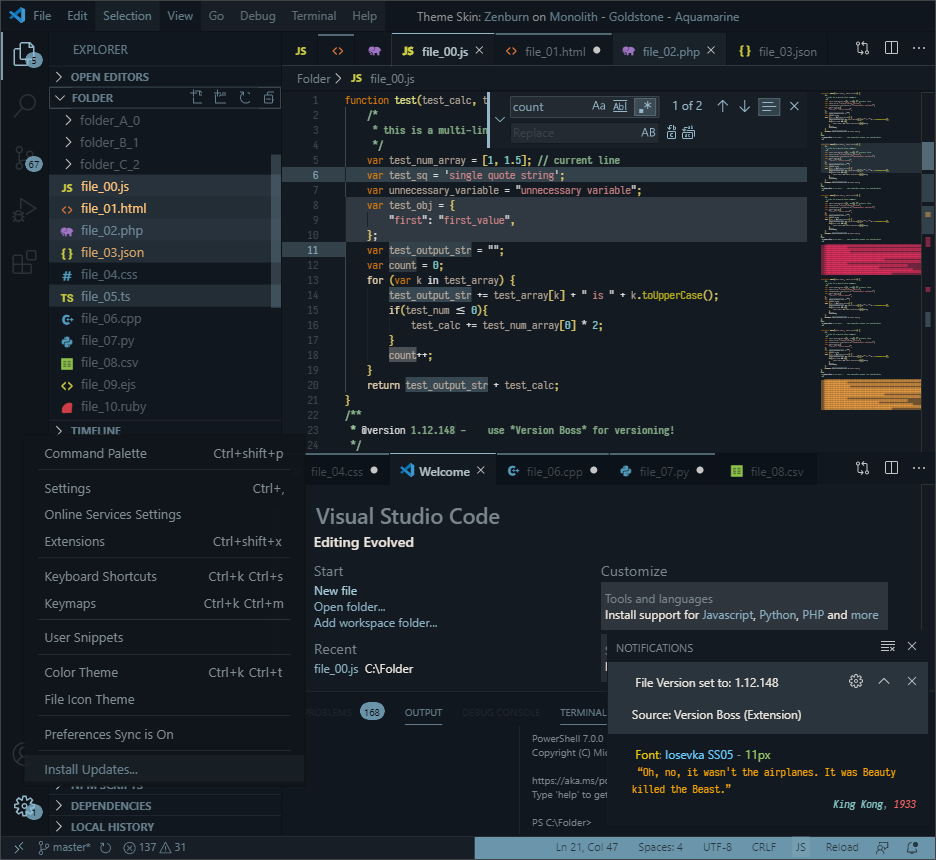</a>
</center>

<div>Goldstone - <a href="https://github.com/nicolagranata/vscode-theme-zenburn-monolith/tree/master/_gfx/zenburn-monolith-goldstone-aquamarine-preview.png" title="Go to Zenburn Monolith - Goldstone - Aquamarine" target="github">Aquamarine</a> 
</div>


<center>
<table style="max-width:960px;">
<tr><td style="font-size:90%;padding:4px;vertical-align:top;"><a href="https://github.com/nicolagranata/vscode-theme-zenburn-monolith/tree/master/_gfx/zenburn-monolith-goldstone-amethyst-preview.png" title="Go to Zenburn Monolith - Goldstone - Amethyst" target="github">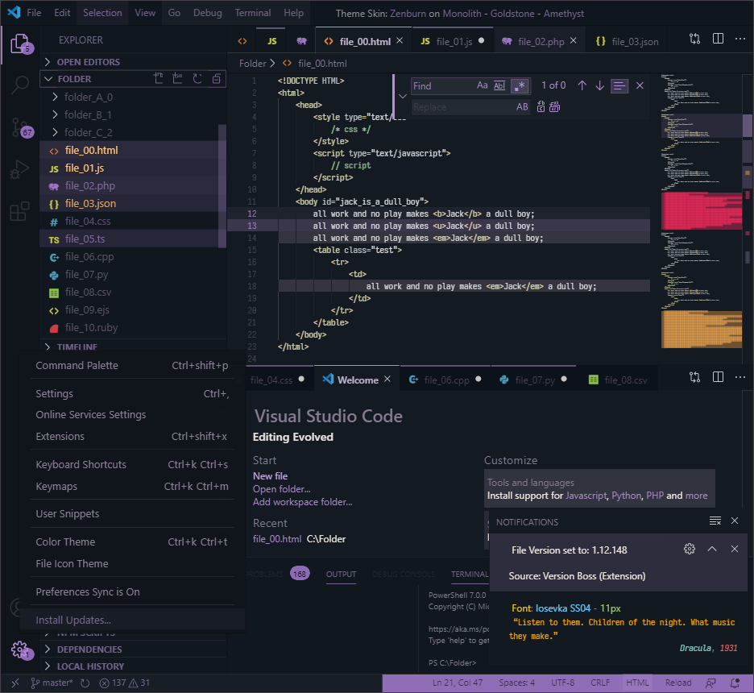</a>
</td><td style="font-size:90%;padding:4px;vertical-align:top;"><a href="https://github.com/nicolagranata/vscode-theme-zenburn-monolith/tree/master/_gfx/zenburn-monolith-goldstone-beryl-preview.png" title="Go to Zenburn Monolith - Goldstone - Beryl" target="github">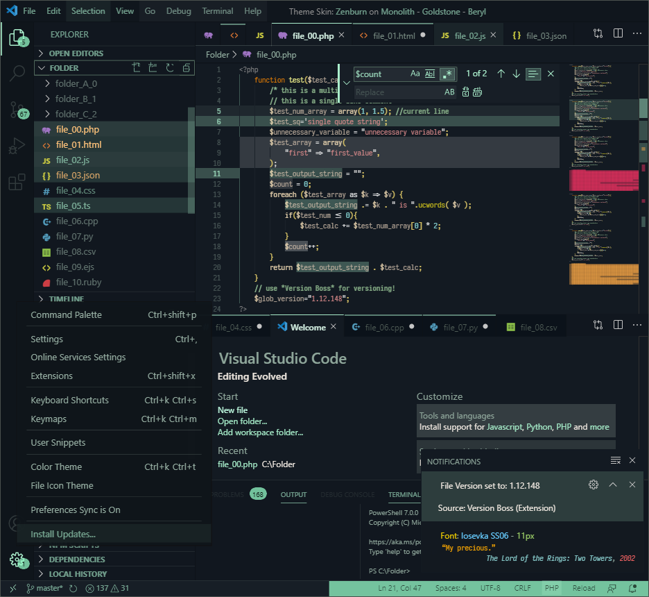</a>
</td><td style="font-size:90%;padding:4px;vertical-align:top;"><a href="https://github.com/nicolagranata/vscode-theme-zenburn-monolith/tree/master/_gfx/zenburn-monolith-goldstone-howlite-preview.png" title="Go to Zenburn Monolith - Goldstone - Howlite" target="github">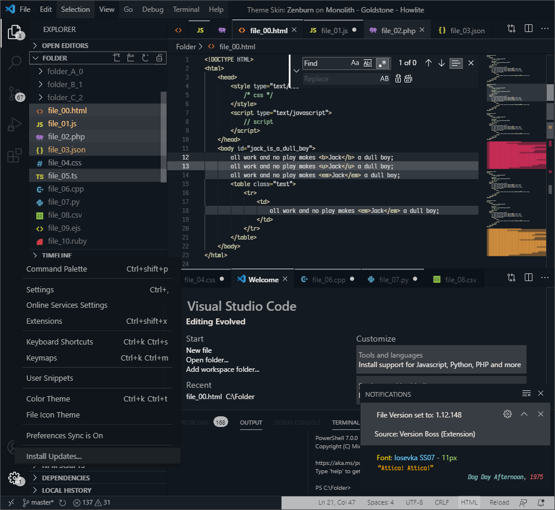</a>
</td><td style="font-size:90%;padding:4px;vertical-align:top;"><a href="https://github.com/nicolagranata/vscode-theme-zenburn-monolith/tree/master/_gfx/zenburn-monolith-goldstone-limestone-preview.png" title="Go to Zenburn Monolith - Goldstone - Limestone" target="github">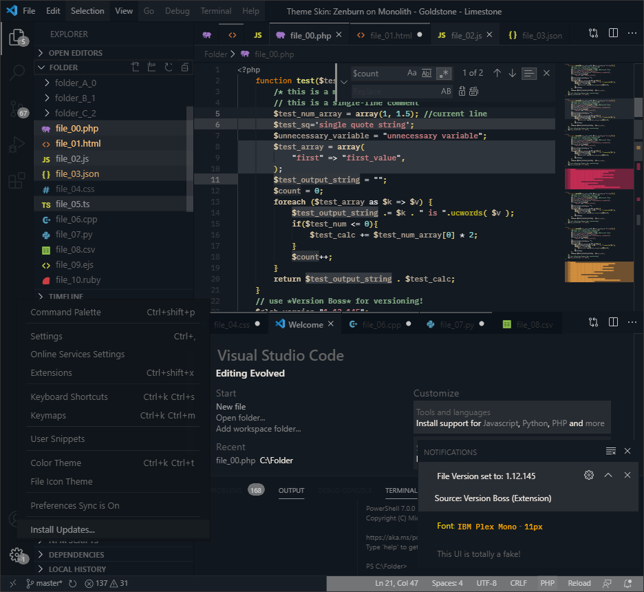</a>
</td></tr>
<tr><td style="font-size:90%;padding:4px;vertical-align:top;">Goldstone - <a href="https://github.com/nicolagranata/vscode-theme-zenburn-monolith/tree/master/_gfx/zenburn-monolith-goldstone-amethyst-preview.png" title="Go to Zenburn Monolith - Goldstone - Amethyst" target="github">Amethyst</a> 
</td><td style="font-size:90%;padding:4px;vertical-align:top;">Goldstone - <a href="https://github.com/nicolagranata/vscode-theme-zenburn-monolith/tree/master/_gfx/zenburn-monolith-goldstone-beryl-preview.png" title="Go to Zenburn Monolith - Goldstone - Beryl" target="github">Beryl</a> 
</td><td style="font-size:90%;padding:4px;vertical-align:top;">Goldstone - <a href="https://github.com/nicolagranata/vscode-theme-zenburn-monolith/tree/master/_gfx/zenburn-monolith-goldstone-howlite-preview.png" title="Go to Zenburn Monolith - Goldstone - Howlite" target="github">Howlite</a> 
</td><td style="font-size:90%;padding:4px;vertical-align:top;">Goldstone - <a href="https://github.com/nicolagranata/vscode-theme-zenburn-monolith/tree/master/_gfx/zenburn-monolith-goldstone-limestone-preview.png" title="Go to Zenburn Monolith - Goldstone - Limestone" target="github">Limestone</a> 
</td></tr>
<tr><td style="font-size:90%;padding:4px;vertical-align:top;"><a href="https://github.com/nicolagranata/vscode-theme-zenburn-monolith/tree/master/_gfx/zenburn-monolith-goldstone-morion-preview.png" title="Go to Zenburn Monolith - Goldstone - Morion" target="github">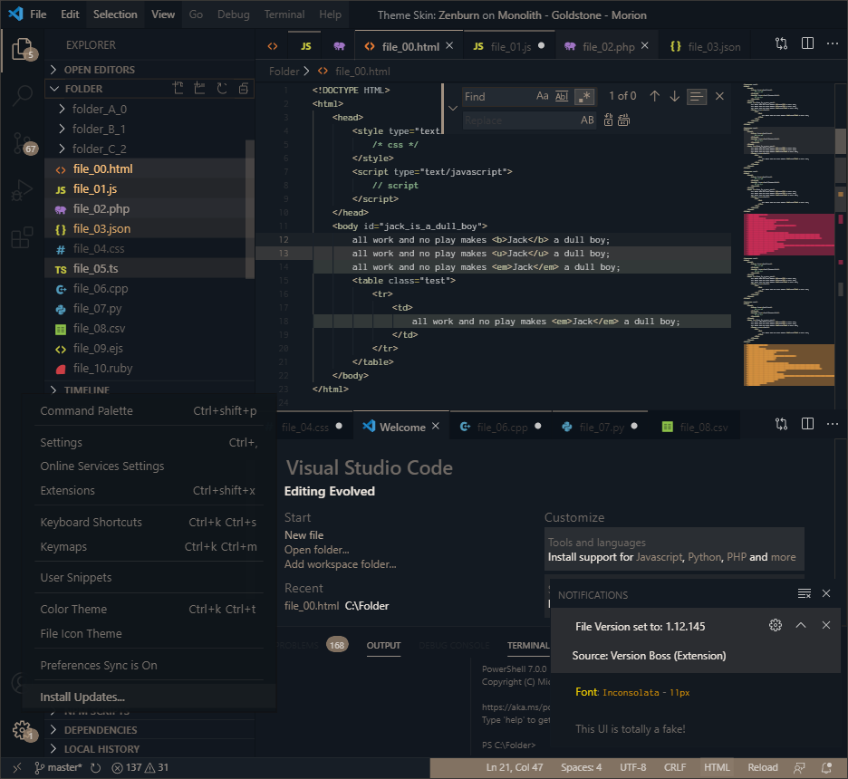</a>
</td><td style="font-size:90%;padding:4px;vertical-align:top;"><a href="https://github.com/nicolagranata/vscode-theme-zenburn-monolith/tree/master/_gfx/zenburn-monolith-goldstone-obsidian-preview.png" title="Go to Zenburn Monolith - Goldstone - Obsidian" target="github">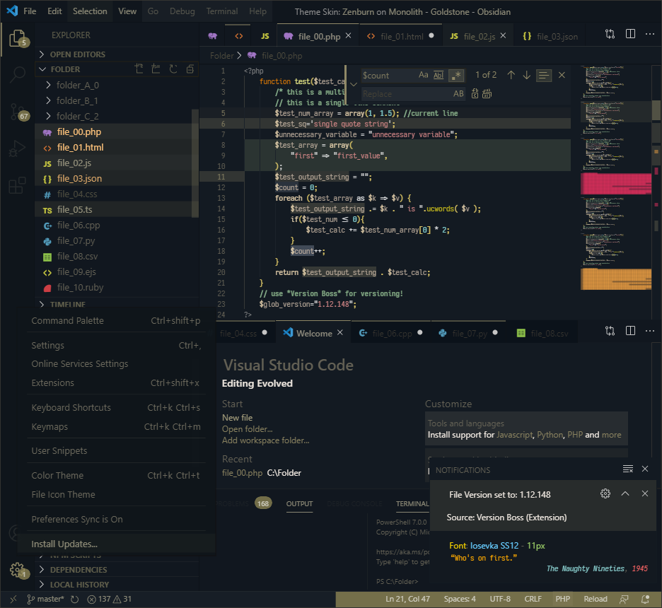</a>
</td><td style="font-size:90%;padding:4px;vertical-align:top;"><a href="https://github.com/nicolagranata/vscode-theme-zenburn-monolith/tree/master/_gfx/zenburn-monolith-goldstone-quartz-preview.png" title="Go to Zenburn Monolith - Goldstone - Quartz" target="github">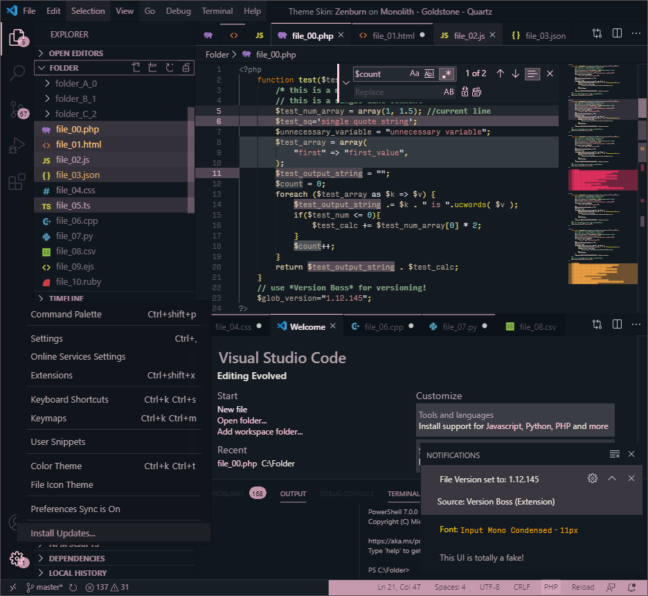</a>
</td><td style="font-size:90%;padding:4px;vertical-align:top;"><a href="https://github.com/nicolagranata/vscode-theme-zenburn-monolith/tree/master/_gfx/zenburn-monolith-goldstone-sulfur-preview.png" title="Go to Zenburn Monolith - Goldstone - Sulfur" target="github">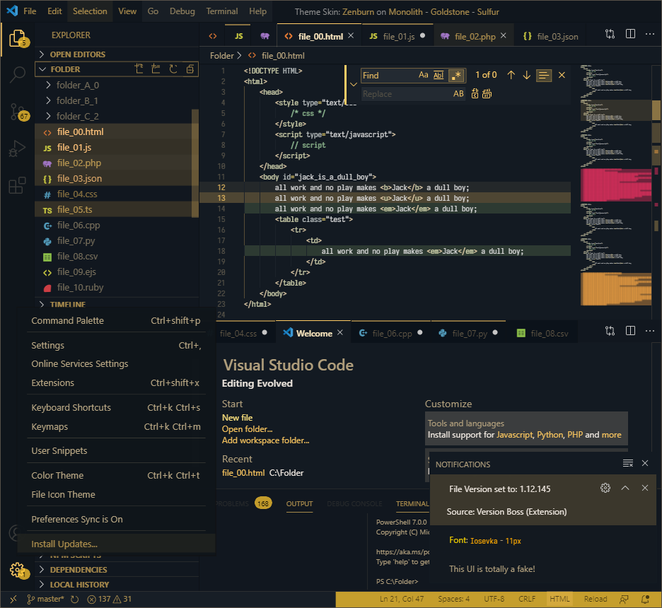</a>
</td></tr>
<tr><td style="font-size:90%;padding:4px;vertical-align:top;">Goldstone - <a href="https://github.com/nicolagranata/vscode-theme-zenburn-monolith/tree/master/_gfx/zenburn-monolith-goldstone-morion-preview.png" title="Go to Zenburn Monolith - Goldstone - Morion" target="github">Morion</a> 
</td><td style="font-size:90%;padding:4px;vertical-align:top;">Goldstone - <a href="https://github.com/nicolagranata/vscode-theme-zenburn-monolith/tree/master/_gfx/zenburn-monolith-goldstone-obsidian-preview.png" title="Go to Zenburn Monolith - Goldstone - Obsidian" target="github">Obsidian</a> 
</td><td style="font-size:90%;padding:4px;vertical-align:top;">Goldstone - <a href="https://github.com/nicolagranata/vscode-theme-zenburn-monolith/tree/master/_gfx/zenburn-monolith-goldstone-quartz-preview.png" title="Go to Zenburn Monolith - Goldstone - Quartz" target="github">Quartz</a> 
</td><td style="font-size:90%;padding:4px;vertical-align:top;">Goldstone - <a href="https://github.com/nicolagranata/vscode-theme-zenburn-monolith/tree/master/_gfx/zenburn-monolith-goldstone-sulfur-preview.png" title="Go to Zenburn Monolith - Goldstone - Sulfur" target="github">Sulfur</a> 
</td></tr>
<tr><td style="font-size:90%;padding:4px;vertical-align:top;"><a href="https://github.com/nicolagranata/vscode-theme-zenburn-monolith/tree/master/_gfx/zenburn-monolith-goldstone-turquenite-preview.png" title="Go to Zenburn Monolith - Goldstone - Turquenite" target="github"></a>
</td><td colspan="3" rowspan="2" width="75%"></td></tr>
<tr><td style="font-size:90%;padding:4px;vertical-align:top;">Goldstone - <a href="https://github.com/nicolagranata/vscode-theme-zenburn-monolith/tree/master/_gfx/zenburn-monolith-goldstone-turquenite-preview.png" title="Go to Zenburn Monolith - Goldstone - Turquenite" target="github">Turquenite</a> 
</td></tr>

</table>
</center>


<div align="right"><a href="#table-of-contents" alt="Table of contents" title="Go to Table of contents">&#128316;</a></div>

## **Heliotrope** (10 skins): Petrol Blue flat UI and Desatured Token Colors
<center> <a href="https://github.com/nicolagranata/vscode-theme-zenburn-monolith/tree/master/_gfx/zenburn-monolith-heliotrope-limestone-preview.png" title="Go to Zenburn Monolith - Heliotrope - Limestone" target="github">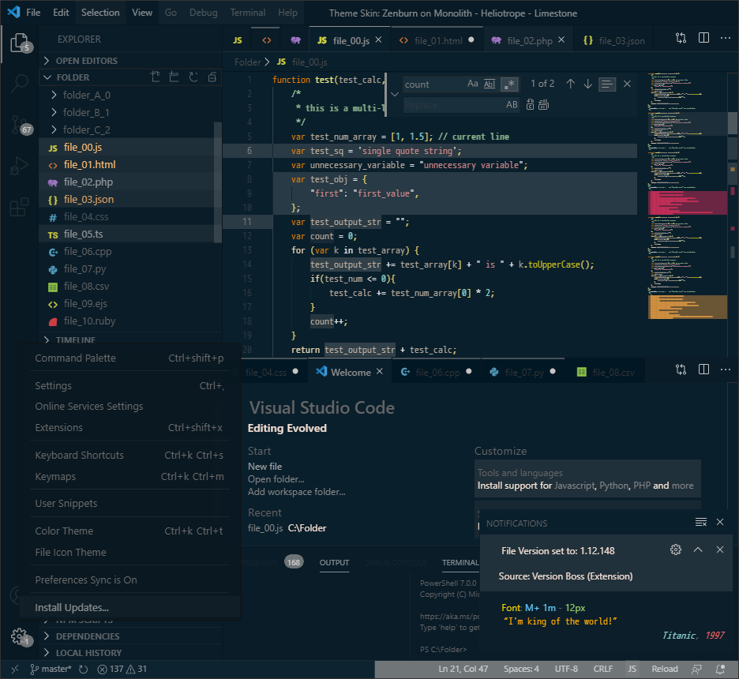</a>
</center>

<div>Heliotrope - <a href="https://github.com/nicolagranata/vscode-theme-zenburn-monolith/tree/master/_gfx/zenburn-monolith-heliotrope-limestone-preview.png" title="Go to Zenburn Monolith - Heliotrope - Limestone" target="github">Limestone</a> 
</div>


<center>
<table style="max-width:960px;">
<tr><td style="font-size:90%;padding:4px;vertical-align:top;"><a href="https://github.com/nicolagranata/vscode-theme-zenburn-monolith/tree/master/_gfx/zenburn-monolith-heliotrope-amethyst-preview.png" title="Go to Zenburn Monolith - Heliotrope - Amethyst" target="github">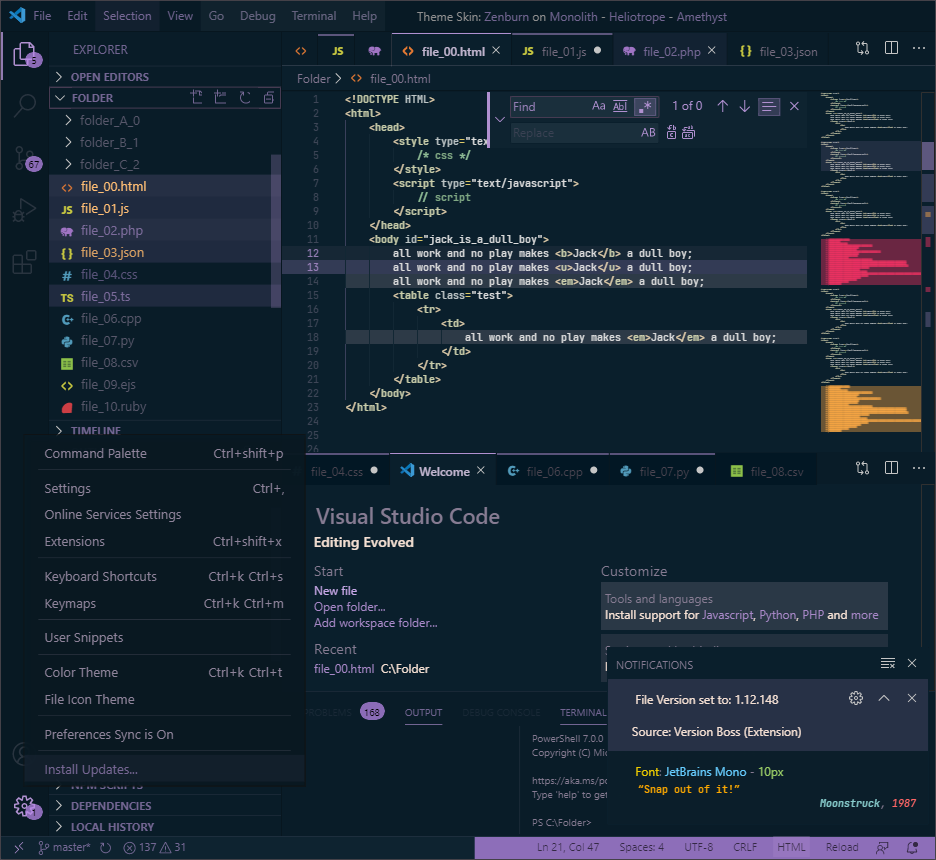</a>
</td><td style="font-size:90%;padding:4px;vertical-align:top;"><a href="https://github.com/nicolagranata/vscode-theme-zenburn-monolith/tree/master/_gfx/zenburn-monolith-heliotrope-aquamarine-preview.png" title="Go to Zenburn Monolith - Heliotrope - Aquamarine" target="github">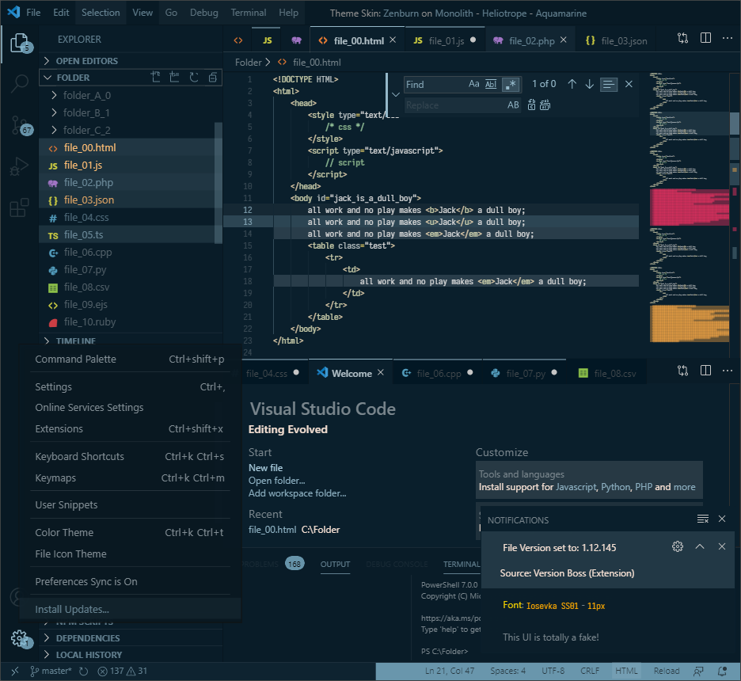</a>
</td><td style="font-size:90%;padding:4px;vertical-align:top;"><a href="https://github.com/nicolagranata/vscode-theme-zenburn-monolith/tree/master/_gfx/zenburn-monolith-heliotrope-beryl-preview.png" title="Go to Zenburn Monolith - Heliotrope - Beryl" target="github">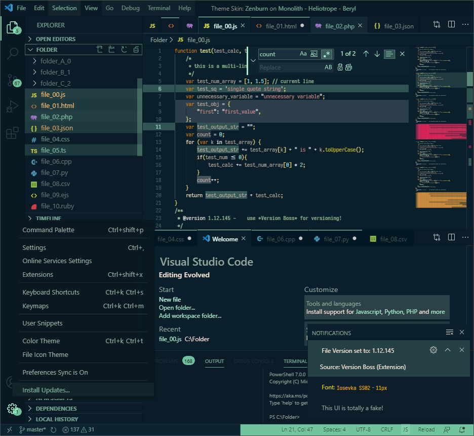</a>
</td><td style="font-size:90%;padding:4px;vertical-align:top;"><a href="https://github.com/nicolagranata/vscode-theme-zenburn-monolith/tree/master/_gfx/zenburn-monolith-heliotrope-howlite-preview.png" title="Go to Zenburn Monolith - Heliotrope - Howlite" target="github">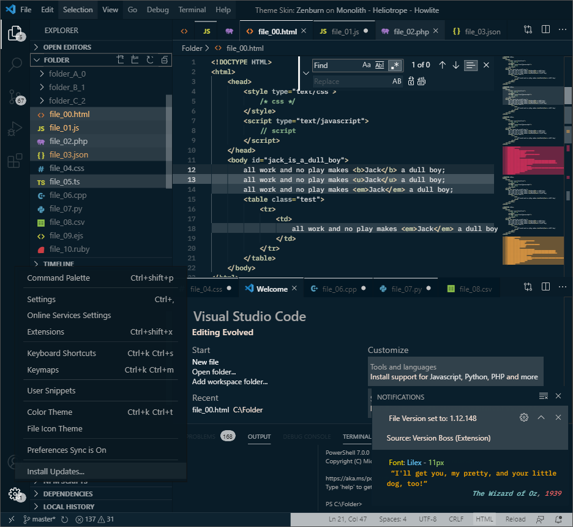</a>
</td></tr>
<tr><td style="font-size:90%;padding:4px;vertical-align:top;">Heliotrope - <a href="https://github.com/nicolagranata/vscode-theme-zenburn-monolith/tree/master/_gfx/zenburn-monolith-heliotrope-amethyst-preview.png" title="Go to Zenburn Monolith - Heliotrope - Amethyst" target="github">Amethyst</a> 
</td><td style="font-size:90%;padding:4px;vertical-align:top;">Heliotrope - <a href="https://github.com/nicolagranata/vscode-theme-zenburn-monolith/tree/master/_gfx/zenburn-monolith-heliotrope-aquamarine-preview.png" title="Go to Zenburn Monolith - Heliotrope - Aquamarine" target="github">Aquamarine</a> 
</td><td style="font-size:90%;padding:4px;vertical-align:top;">Heliotrope - <a href="https://github.com/nicolagranata/vscode-theme-zenburn-monolith/tree/master/_gfx/zenburn-monolith-heliotrope-beryl-preview.png" title="Go to Zenburn Monolith - Heliotrope - Beryl" target="github">Beryl</a> 
</td><td style="font-size:90%;padding:4px;vertical-align:top;">Heliotrope - <a href="https://github.com/nicolagranata/vscode-theme-zenburn-monolith/tree/master/_gfx/zenburn-monolith-heliotrope-howlite-preview.png" title="Go to Zenburn Monolith - Heliotrope - Howlite" target="github">Howlite</a> 
</td></tr>
<tr><td style="font-size:90%;padding:4px;vertical-align:top;"><a href="https://github.com/nicolagranata/vscode-theme-zenburn-monolith/tree/master/_gfx/zenburn-monolith-heliotrope-morion-preview.png" title="Go to Zenburn Monolith - Heliotrope - Morion" target="github">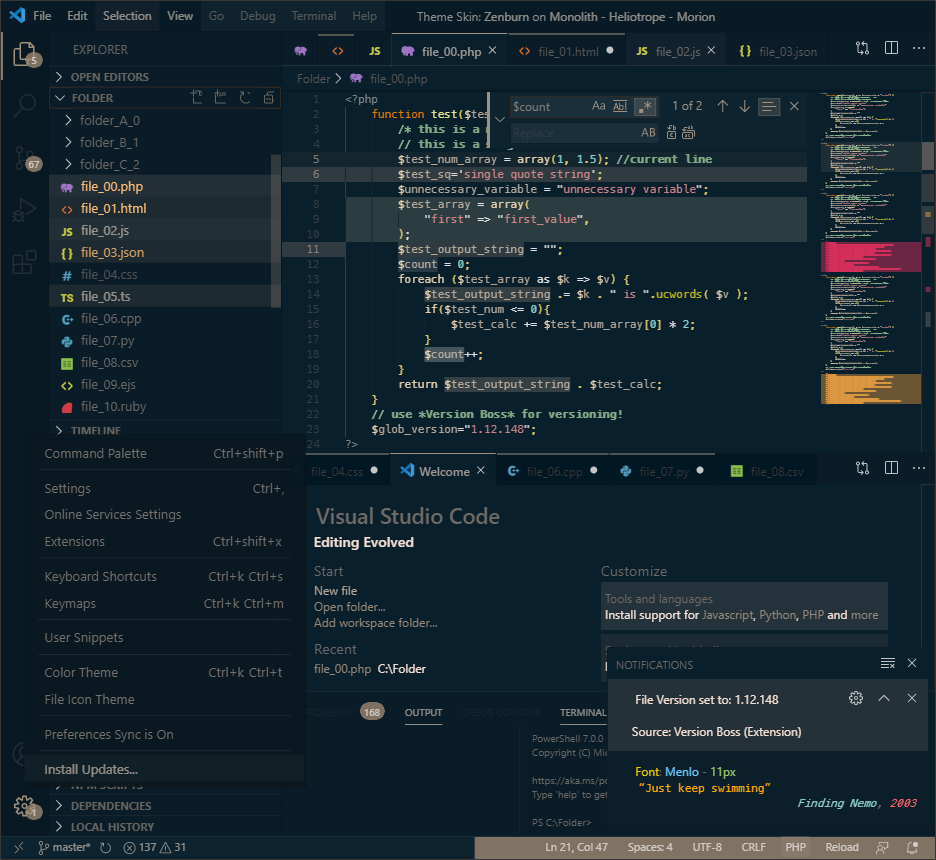</a>
</td><td style="font-size:90%;padding:4px;vertical-align:top;"><a href="https://github.com/nicolagranata/vscode-theme-zenburn-monolith/tree/master/_gfx/zenburn-monolith-heliotrope-obsidian-preview.png" title="Go to Zenburn Monolith - Heliotrope - Obsidian" target="github">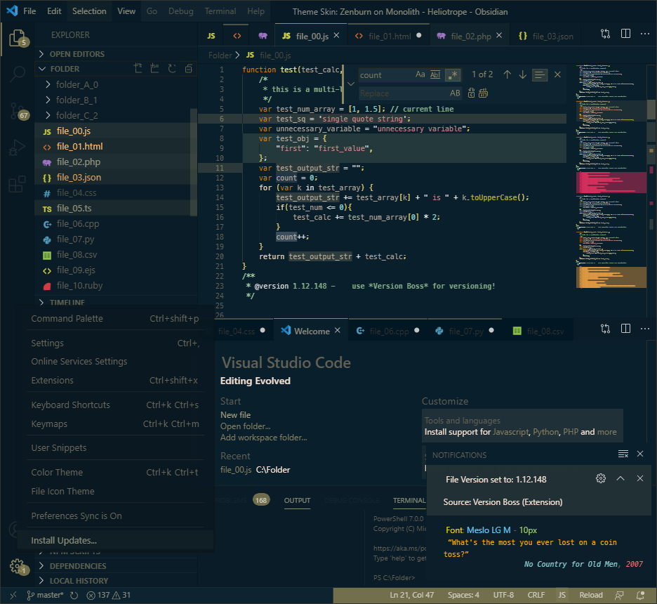</a>
</td><td style="font-size:90%;padding:4px;vertical-align:top;"><a href="https://github.com/nicolagranata/vscode-theme-zenburn-monolith/tree/master/_gfx/zenburn-monolith-heliotrope-quartz-preview.png" title="Go to Zenburn Monolith - Heliotrope - Quartz" target="github">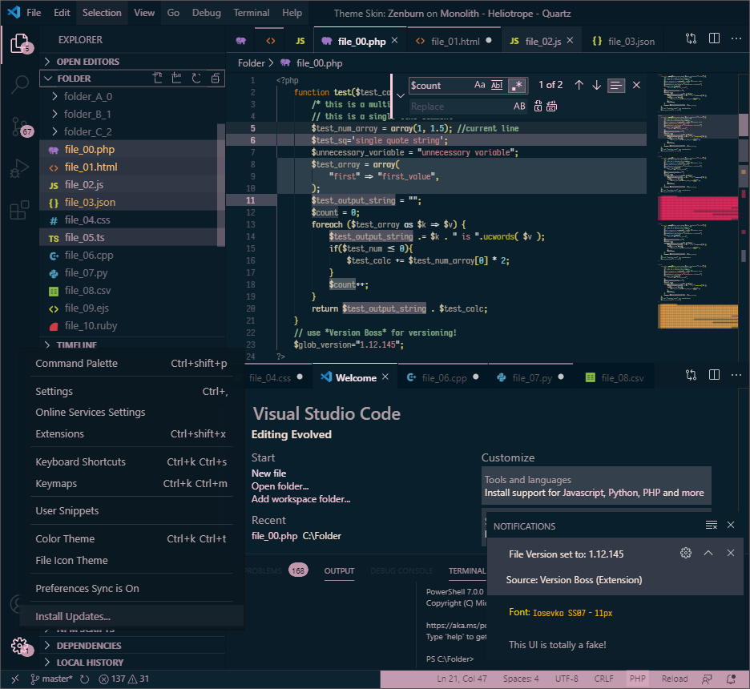</a>
</td><td style="font-size:90%;padding:4px;vertical-align:top;"><a href="https://github.com/nicolagranata/vscode-theme-zenburn-monolith/tree/master/_gfx/zenburn-monolith-heliotrope-sulfur-preview.png" title="Go to Zenburn Monolith - Heliotrope - Sulfur" target="github">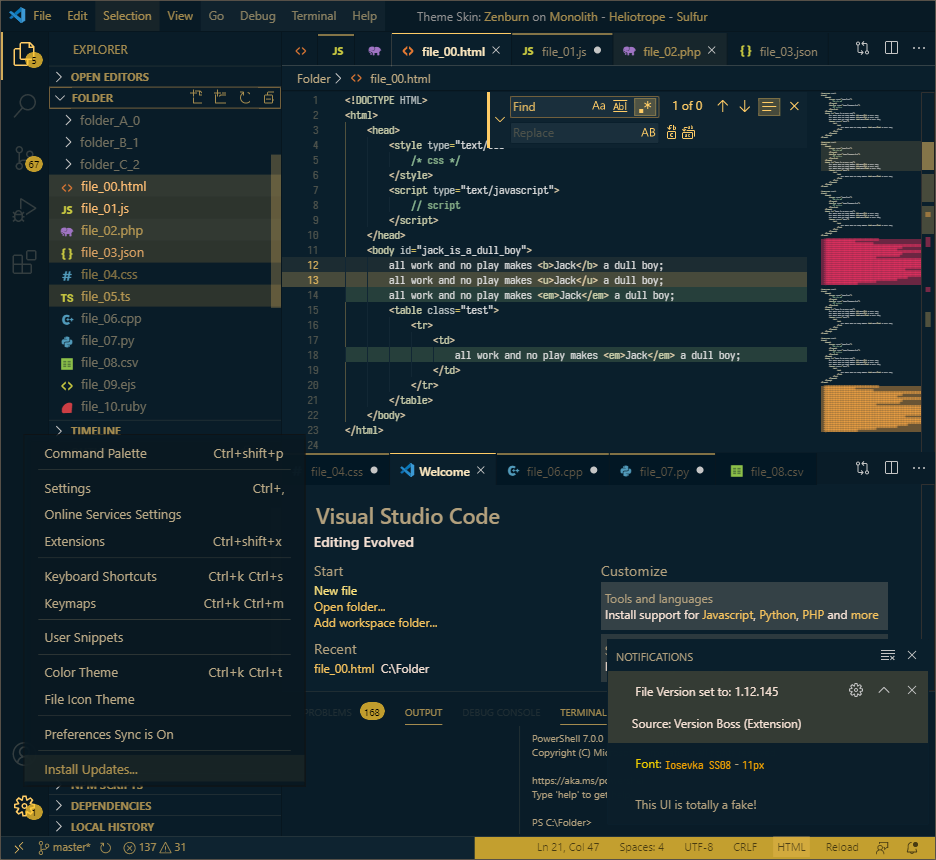</a>
</td></tr>
<tr><td style="font-size:90%;padding:4px;vertical-align:top;">Heliotrope - <a href="https://github.com/nicolagranata/vscode-theme-zenburn-monolith/tree/master/_gfx/zenburn-monolith-heliotrope-morion-preview.png" title="Go to Zenburn Monolith - Heliotrope - Morion" target="github">Morion</a> 
</td><td style="font-size:90%;padding:4px;vertical-align:top;">Heliotrope - <a href="https://github.com/nicolagranata/vscode-theme-zenburn-monolith/tree/master/_gfx/zenburn-monolith-heliotrope-obsidian-preview.png" title="Go to Zenburn Monolith - Heliotrope - Obsidian" target="github">Obsidian</a> 
</td><td style="font-size:90%;padding:4px;vertical-align:top;">Heliotrope - <a href="https://github.com/nicolagranata/vscode-theme-zenburn-monolith/tree/master/_gfx/zenburn-monolith-heliotrope-quartz-preview.png" title="Go to Zenburn Monolith - Heliotrope - Quartz" target="github">Quartz</a> 
</td><td style="font-size:90%;padding:4px;vertical-align:top;">Heliotrope - <a href="https://github.com/nicolagranata/vscode-theme-zenburn-monolith/tree/master/_gfx/zenburn-monolith-heliotrope-sulfur-preview.png" title="Go to Zenburn Monolith - Heliotrope - Sulfur" target="github">Sulfur</a> 
</td></tr>
<tr><td style="font-size:90%;padding:4px;vertical-align:top;"><a href="https://github.com/nicolagranata/vscode-theme-zenburn-monolith/tree/master/_gfx/zenburn-monolith-heliotrope-turquenite-preview.png" title="Go to Zenburn Monolith - Heliotrope - Turquenite" target="github">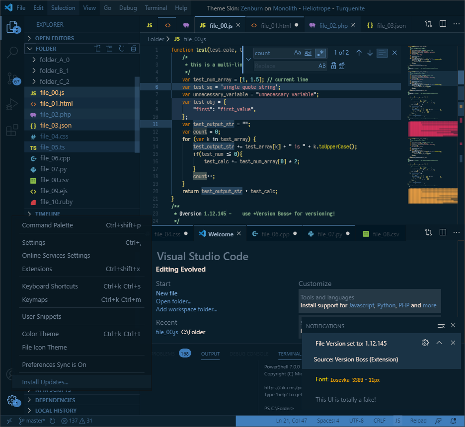</a>
</td><td colspan="3" rowspan="2" width="75%"></td></tr>
<tr><td style="font-size:90%;padding:4px;vertical-align:top;">Heliotrope - <a href="https://github.com/nicolagranata/vscode-theme-zenburn-monolith/tree/master/_gfx/zenburn-monolith-heliotrope-turquenite-preview.png" title="Go to Zenburn Monolith - Heliotrope - Turquenite" target="github">Turquenite</a> 
</td></tr>

</table>
</center>


<div align="right"><a href="#table-of-contents" alt="Table of contents" title="Go to Table of contents">&#128316;</a></div>

## **Low Blue** (1 skin): Low Blue Light on UI and Token Colors
<center> <a href="https://github.com/nicolagranata/vscode-theme-zenburn-monolith/tree/master/_gfx/zenburn-monolith-lowblue-obsidian-preview.png" title="Go to Zenburn Monolith - Low Blue - Obsidian" target="github">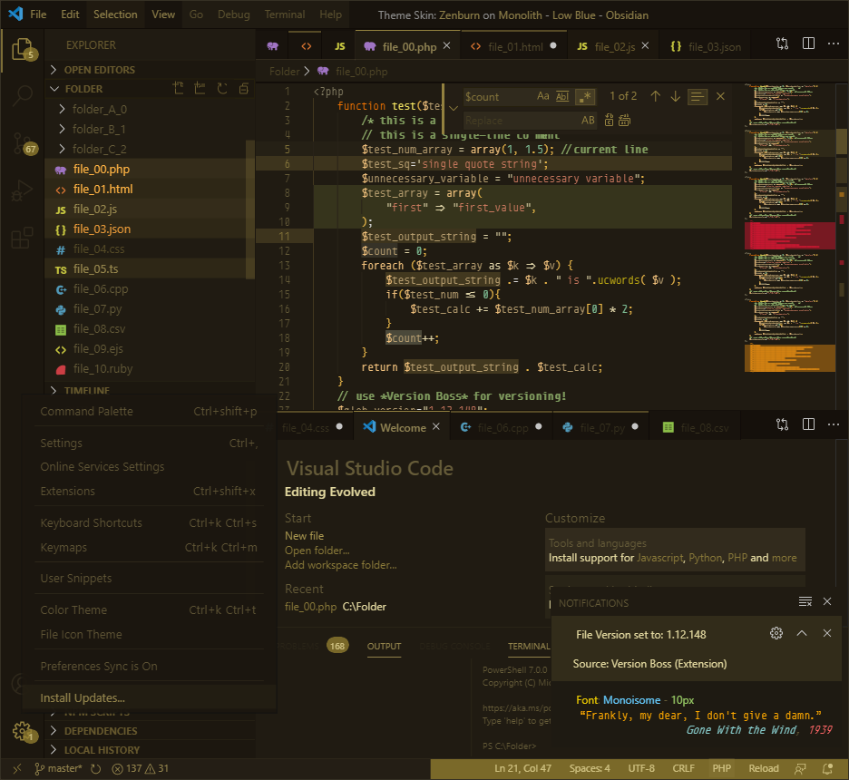</a>
</center>

<div>Low Blue - <a href="https://github.com/nicolagranata/vscode-theme-zenburn-monolith/tree/master/_gfx/zenburn-monolith-lowblue-obsidian-preview.png" title="Go to Zenburn Monolith - Low Blue - Obsidian" target="github">Obsidian</a> 
</div>


<center>
<table style="max-width:960px;">

</table>
</center>


<div align="right"><a href="#table-of-contents" alt="Table of contents" title="Go to Table of contents">&#128316;</a></div>

## **Onyx** (10 skins): Flat Grayed UI and Desatured Token Colors
<center> <a href="https://github.com/nicolagranata/vscode-theme-zenburn-monolith/tree/master/_gfx/zenburn-monolith-onyx-morion-preview.png" title="Go to Zenburn Monolith - Onyx - Morion" target="github">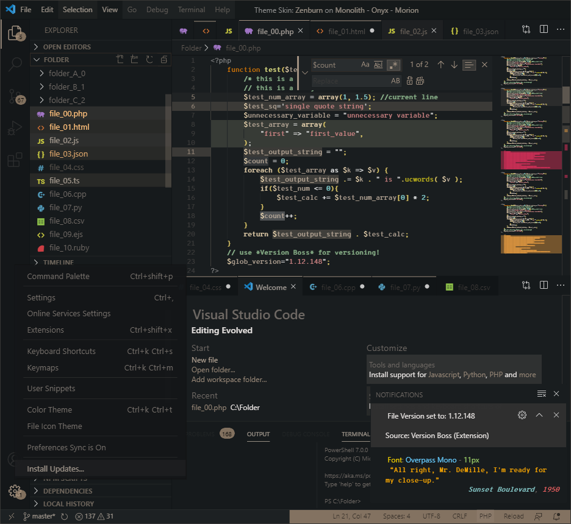</a>
</center>

<div>Onyx - <a href="https://github.com/nicolagranata/vscode-theme-zenburn-monolith/tree/master/_gfx/zenburn-monolith-onyx-morion-preview.png" title="Go to Zenburn Monolith - Onyx - Morion" target="github">Morion</a> 
</div>


<center>
<table style="max-width:960px;">
<tr><td style="font-size:90%;padding:4px;vertical-align:top;"><a href="https://github.com/nicolagranata/vscode-theme-zenburn-monolith/tree/master/_gfx/zenburn-monolith-onyx-amethyst-preview.png" title="Go to Zenburn Monolith - Onyx - Amethyst" target="github">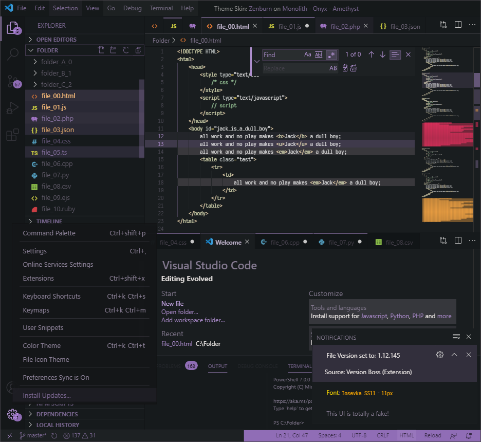</a>
</td><td style="font-size:90%;padding:4px;vertical-align:top;"><a href="https://github.com/nicolagranata/vscode-theme-zenburn-monolith/tree/master/_gfx/zenburn-monolith-onyx-aquamarine-preview.png" title="Go to Zenburn Monolith - Onyx - Aquamarine" target="github">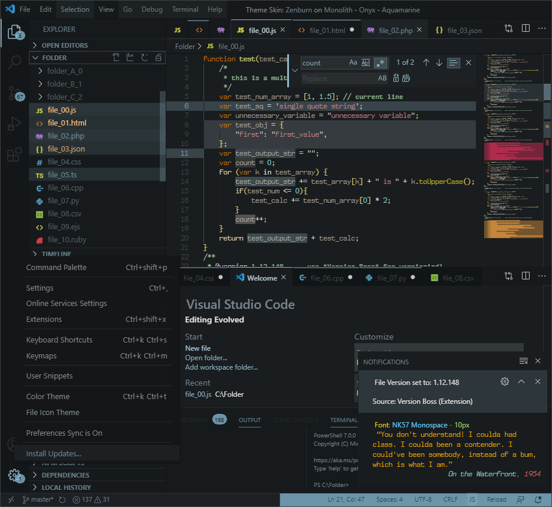</a>
</td><td style="font-size:90%;padding:4px;vertical-align:top;"><a href="https://github.com/nicolagranata/vscode-theme-zenburn-monolith/tree/master/_gfx/zenburn-monolith-onyx-beryl-preview.png" title="Go to Zenburn Monolith - Onyx - Beryl" target="github">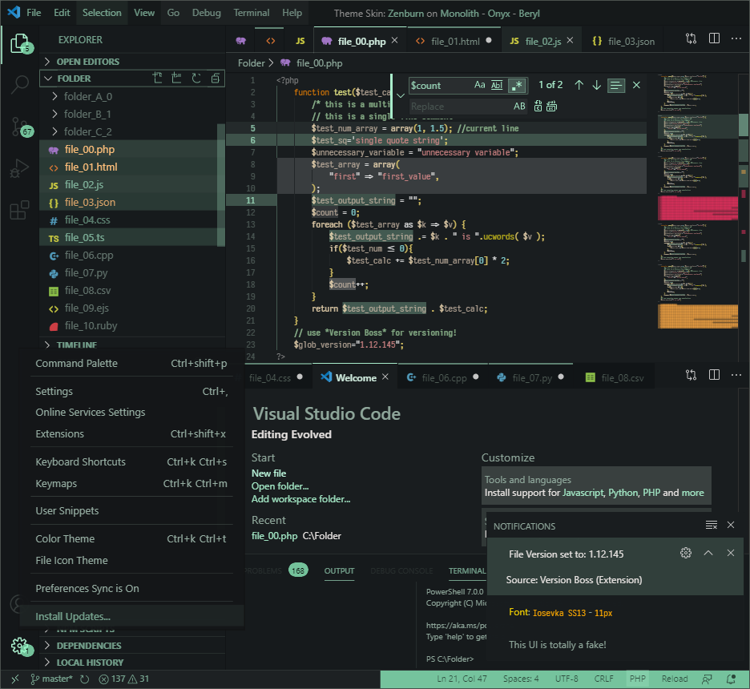</a>
</td><td style="font-size:90%;padding:4px;vertical-align:top;"><a href="https://github.com/nicolagranata/vscode-theme-zenburn-monolith/tree/master/_gfx/zenburn-monolith-onyx-howlite-preview.png" title="Go to Zenburn Monolith - Onyx - Howlite" target="github">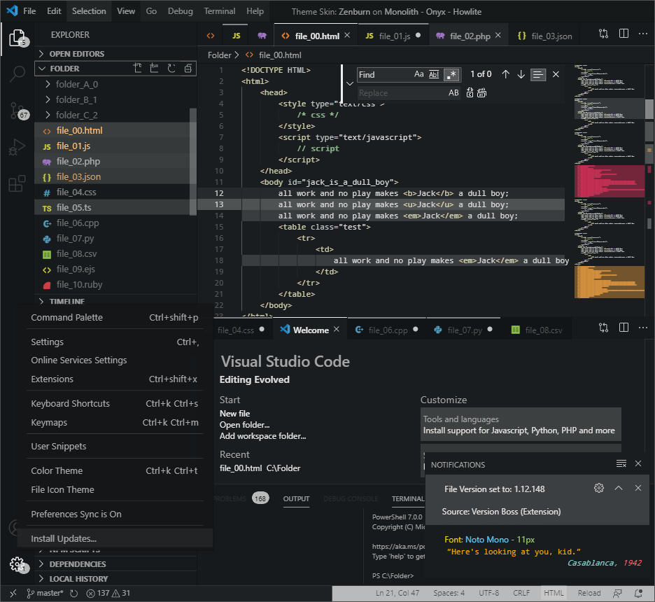</a>
</td></tr>
<tr><td style="font-size:90%;padding:4px;vertical-align:top;">Onyx - <a href="https://github.com/nicolagranata/vscode-theme-zenburn-monolith/tree/master/_gfx/zenburn-monolith-onyx-amethyst-preview.png" title="Go to Zenburn Monolith - Onyx - Amethyst" target="github">Amethyst</a> 
</td><td style="font-size:90%;padding:4px;vertical-align:top;">Onyx - <a href="https://github.com/nicolagranata/vscode-theme-zenburn-monolith/tree/master/_gfx/zenburn-monolith-onyx-aquamarine-preview.png" title="Go to Zenburn Monolith - Onyx - Aquamarine" target="github">Aquamarine</a> 
</td><td style="font-size:90%;padding:4px;vertical-align:top;">Onyx - <a href="https://github.com/nicolagranata/vscode-theme-zenburn-monolith/tree/master/_gfx/zenburn-monolith-onyx-beryl-preview.png" title="Go to Zenburn Monolith - Onyx - Beryl" target="github">Beryl</a> 
</td><td style="font-size:90%;padding:4px;vertical-align:top;">Onyx - <a href="https://github.com/nicolagranata/vscode-theme-zenburn-monolith/tree/master/_gfx/zenburn-monolith-onyx-howlite-preview.png" title="Go to Zenburn Monolith - Onyx - Howlite" target="github">Howlite</a> 
</td></tr>
<tr><td style="font-size:90%;padding:4px;vertical-align:top;"><a href="https://github.com/nicolagranata/vscode-theme-zenburn-monolith/tree/master/_gfx/zenburn-monolith-onyx-limestone-preview.png" title="Go to Zenburn Monolith - Onyx - Limestone" target="github">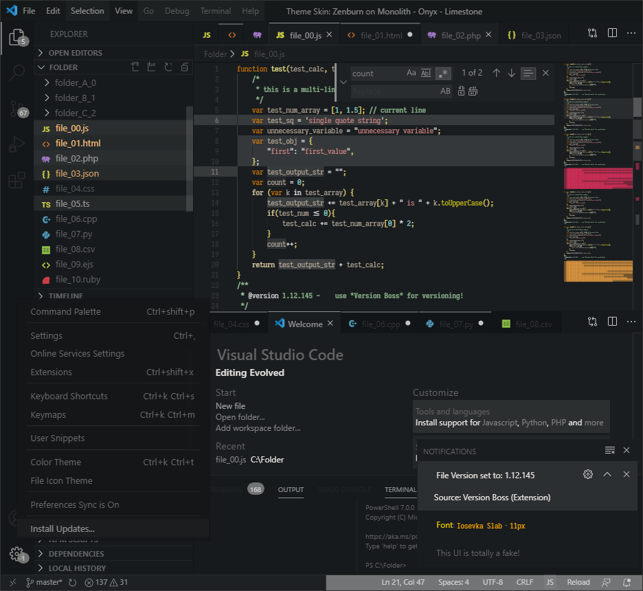</a>
</td><td style="font-size:90%;padding:4px;vertical-align:top;"><a href="https://github.com/nicolagranata/vscode-theme-zenburn-monolith/tree/master/_gfx/zenburn-monolith-onyx-obsidian-preview.png" title="Go to Zenburn Monolith - Onyx - Obsidian" target="github">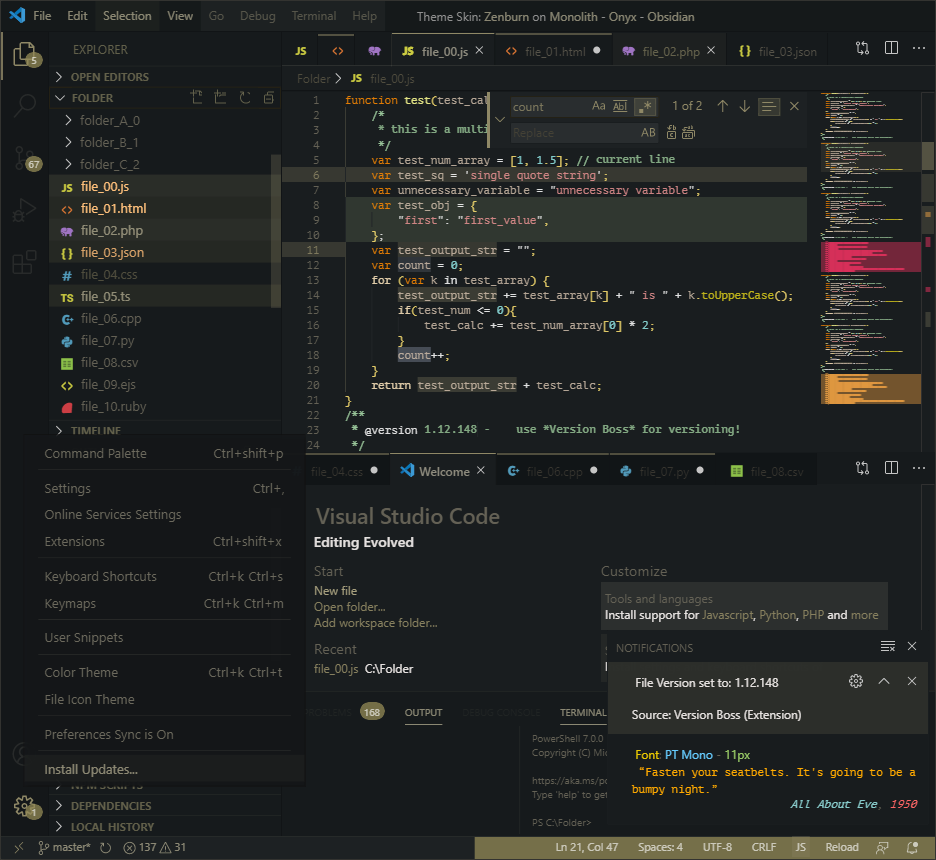</a>
</td><td style="font-size:90%;padding:4px;vertical-align:top;"><a href="https://github.com/nicolagranata/vscode-theme-zenburn-monolith/tree/master/_gfx/zenburn-monolith-onyx-quartz-preview.png" title="Go to Zenburn Monolith - Onyx - Quartz" target="github">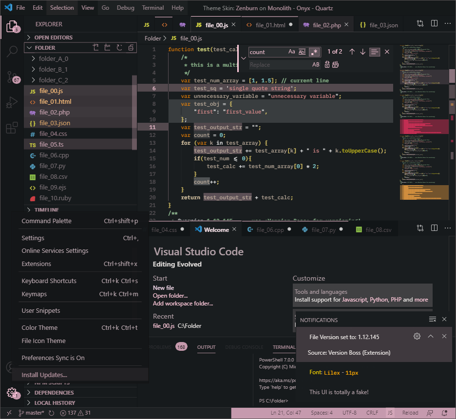</a>
</td><td style="font-size:90%;padding:4px;vertical-align:top;"><a href="https://github.com/nicolagranata/vscode-theme-zenburn-monolith/tree/master/_gfx/zenburn-monolith-onyx-sulfur-preview.png" title="Go to Zenburn Monolith - Onyx - Sulfur" target="github">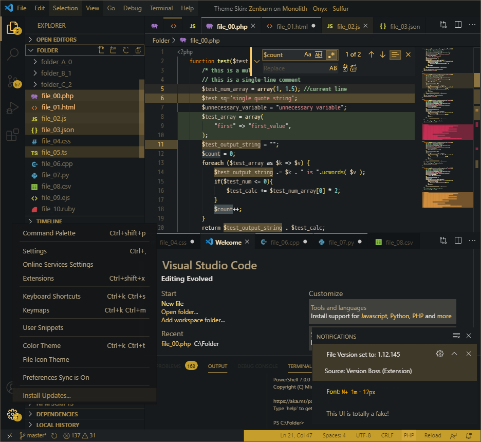</a>
</td></tr>
<tr><td style="font-size:90%;padding:4px;vertical-align:top;">Onyx - <a href="https://github.com/nicolagranata/vscode-theme-zenburn-monolith/tree/master/_gfx/zenburn-monolith-onyx-limestone-preview.png" title="Go to Zenburn Monolith - Onyx - Limestone" target="github">Limestone</a> 
</td><td style="font-size:90%;padding:4px;vertical-align:top;">Onyx - <a href="https://github.com/nicolagranata/vscode-theme-zenburn-monolith/tree/master/_gfx/zenburn-monolith-onyx-obsidian-preview.png" title="Go to Zenburn Monolith - Onyx - Obsidian" target="github">Obsidian</a> 
</td><td style="font-size:90%;padding:4px;vertical-align:top;">Onyx - <a href="https://github.com/nicolagranata/vscode-theme-zenburn-monolith/tree/master/_gfx/zenburn-monolith-onyx-quartz-preview.png" title="Go to Zenburn Monolith - Onyx - Quartz" target="github">Quartz</a> 
</td><td style="font-size:90%;padding:4px;vertical-align:top;">Onyx - <a href="https://github.com/nicolagranata/vscode-theme-zenburn-monolith/tree/master/_gfx/zenburn-monolith-onyx-sulfur-preview.png" title="Go to Zenburn Monolith - Onyx - Sulfur" target="github">Sulfur</a> 
</td></tr>
<tr><td style="font-size:90%;padding:4px;vertical-align:top;"><a href="https://github.com/nicolagranata/vscode-theme-zenburn-monolith/tree/master/_gfx/zenburn-monolith-onyx-turquenite-preview.png" title="Go to Zenburn Monolith - Onyx - Turquenite" target="github">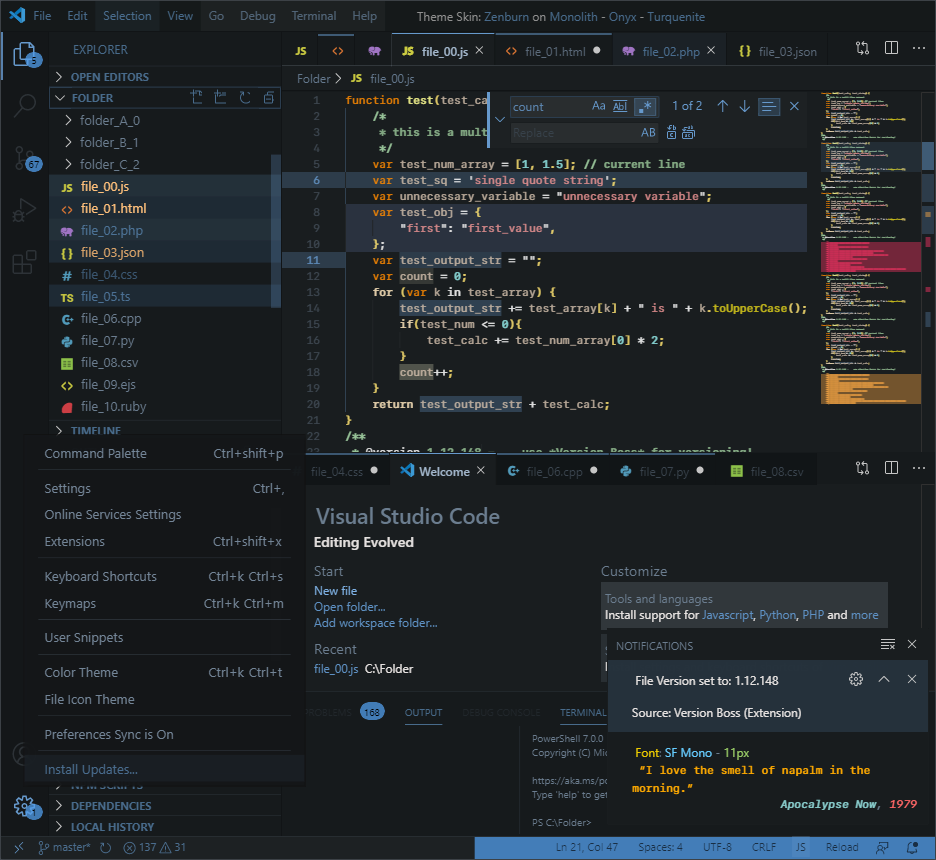</a>
</td><td colspan="3" rowspan="2" width="75%"></td></tr>
<tr><td style="font-size:90%;padding:4px;vertical-align:top;">Onyx - <a href="https://github.com/nicolagranata/vscode-theme-zenburn-monolith/tree/master/_gfx/zenburn-monolith-onyx-turquenite-preview.png" title="Go to Zenburn Monolith - Onyx - Turquenite" target="github">Turquenite</a> 
</td></tr>

</table>
</center>


<div align="right"><a href="#table-of-contents" alt="Table of contents" title="Go to Table of contents">&#128316;</a></div>

# Free Fonts for coding

The settings for the following fonts are correctly tested on a 24" monitor FullHD and 32" Monitor QHD. The indicated sizes are the minimum to obtain a clear display of the fonts.

> Tip 1: `Readability rating` is based on the readability of the font to the size of `10px`:  the fonts with rating `5.0` have these characteristics, the other evaluations indicate that the font is readable at a size greater than `10px` but that they occupy more space and, consequently you have fewer rows and columns per screen page. Some fonts at the size of `12px` can have rating `4.5` / `5.0` because they occupy same visual space to the size of `10px` of other fonts present in the selection with rating `5.0`: anyway, at the right size (`12px`-`14px`), all fonts readability rating is `5.0`/`5.0`.

> Tip 2: Some fonts `Weight` property start from `300` / `400` / `500`: values below these values has no effect. Others, instead, start from `100` but can be thiny and unreadable below size `12pt`. `Note`: the `Weight` value is the minimum value for readability, at the indicated size, on my monitor: you can find other setting more comfortable for your eyes.

> Tip 3: When you go to download page you can find different variants of the same font but with same *font name* (e.g. version with different line-height or letter "k" with no loop): you cannot install all font variants because they have same *font name* in font manager: when you install a font variant, the previous font variant will be overwritten.

> Tip 4: if available, install the fonts in **OTF** format.


<div align="right"><a href="#table-of-contents" alt="Table of contents" title="Go to Table of contents">&#128316;</a></div>

## Fonts Comparative Table and Downloads

Click on the name of font to download, and the script icon to go to optimal settings to copy/paste in your `Settings.ini`.

> Tip 1: The indicated fonts often receive updates. I suggest you check every now and then and, if necessary, download the new version.

### Fonts data sheet symbols legend

<center>

| **Sym** | **Label** |
| :---: | :--- |
|<span title="Font Name and Download" style="font-weight:normal;font-size:130%;line-height:100%;" >&#127462;&#8259;&#127487;</span>|Font Name and Download|
|<span title=" Minimum Size recommended for good Readability" style="font-weight:normal;font-size:130%;line-height:100%;" >&#128474;</span>| Minimum Size recommended for good Readability|
|<span title="Font Line Height Preset" style="font-weight:normal;font-size:130%;line-height:100%;" >&#8683;</span>|Font Line Height Preset|
|<span title="Font Weight Preset" style="font-weight:normal;font-size:130%;line-height:100%;" >&#8660;</span>|Font Weight Preset|
|<span title="Font Letter Spacing Preset" style="font-weight:normal;font-size:130%;line-height:100%;" >&#8700;</span>|Font Letter Spacing Preset|
|<span title="Font has Ligatures" style="font-weight:normal;font-size:130%;line-height:100%;" >&#8655;</span>|Font has Ligatures|
|<span title="Font has Script Variant for Italic" style="font-weight:normal;font-size:130%;line-height:100%;" >&#119998;</span>|Font has Script Variant for Italic|
|<span title="Font is Serif" style="font-weight:normal;font-size:130%;line-height:100%;" >&#65332;</span>|Font is Serif|
|<span title="Font has Zero Slashed or Zero Dotted" style="font-weight:bold;" >&Oslash;</span>|Font has Zero Slashed or Zero Dotted|
|<span title="Font Readability at Size 10px*" style="font-weight:normal;font-size:130%;line-height:100%;" >&#128065;</span>|Font Readability at Size 10px*|
|<span title="Font Download" style="font-weight:normal;font-size:130%;line-height:100%;" >&#129095;</span>|Font Download|
|<span title="Go to Settings for Font" style="font-weight:normal;font-size:130%;line-height:100%;" >&#128195;</span>|Go to Settings for Font|


</center>

### Fonts data sheet and Downloads

<center>


|**N.**|<span title="Font Name and Download" style="font-weight:normal;font-size:130%;line-height:100%;" >&#127462;&#8259;&#127487;</span> |<span title=" Minimum Size recommended for good Readability" style="font-weight:normal;font-size:130%;line-height:100%;" >&#128474;</span> |<span title="Font Line Height Preset" style="font-weight:normal;font-size:130%;line-height:100%;" >&#8683;</span> |<span title="Font Letter Spacing Preset" style="font-weight:normal;font-size:130%;line-height:100%;" >&#8700;</span> |<span title="Font has Ligatures" style="font-weight:normal;font-size:130%;line-height:100%;" >&#8655;</span> |<span title="Font has Script Variant for Italic" style="font-weight:normal;font-size:130%;line-height:100%;" >&#119998;</span> |<span title="Font is Serif" style="font-weight:normal;font-size:130%;line-height:100%;" >&#65332;</span> |<span title="Font has Zero Slashed or Zero Dotted" style="font-weight:bold;" >&Oslash;</span> |<span title="Font Readability at Size 10px*" style="font-weight:normal;font-size:130%;line-height:100%;" >&#128065;</span> |<span title="Font Download" style="font-weight:normal;font-size:130%;line-height:100%;" >&#129095;</span> |<span title="Go to Settings for Font" style="font-weight:normal;font-size:130%;line-height:100%;" >&#128195;</span> |
|---:|---|:---:|:---:|:---:|:---:|:---:|:---:|:---:|:---:|---|---|
| 01 |  [Andale Mono](https://www.cufonfonts.com/download/font/andale-mono "Download Andale Mono")  | 11 | 16 | 0.0 | <span style="color:#cc0000;"></span> | <span style="color:#cc0000;"></span> | <span style="color:#cc0000;"></span> | <span style="color:ForestGreen;">&#9679;</span> | 4.0 |  [&#129095;](https://www.cufonfonts.com/download/font/andale-mono "Download Andale Mono")  | [&#128195;](#font-01-129095 "Go to Settings for Font &#129095;")  |
| 02 |  [Anonymous Pro](https://www.marksimonson.com/fonts/view/anonymous-pro "Download Anonymous Pro")  | 11 | 15 | 0.0 | <span style="color:#cc0000;"></span> | <span style="color:#cc0000;"></span> | <span style="color:ForestGreen;">&#9679;</span> | <span style="color:ForestGreen;">&#9679;</span> | 4.5 |  [&#129095;](https://www.marksimonson.com/fonts/view/anonymous-pro "Download Anonymous Pro")  | [&#128195;](#font-02-129095 "Go to Settings for Font &#129095;")  |
| 03 |  [Antikor Mono](https://www.cufonfonts.com/download/font/antikor-mono "Download Antikor Mono")  | 11 | 15 | 0.0 | <span style="color:#cc0000;"></span> | <span style="color:ForestGreen;">&#9679;</span> | <span style="color:#cc0000;"></span> | <span style="color:ForestGreen;">&#9679;</span> | 4.0 |  [&#129095;](https://www.cufonfonts.com/download/font/antikor-mono "Download Antikor Mono")  | [&#128195;](#font-03-129095 "Go to Settings for Font &#129095;")  |
| 04 |  [Antikor Text](https://www.cufonfonts.com/download/font/antikor-mono "Download Antikor Text")  | 11 | 16 | 0.0 | <span style="color:#cc0000;"></span> | <span style="color:ForestGreen;">&#9679;</span> | <span style="color:#cc0000;"></span> | <span style="color:ForestGreen;">&#9679;</span> | 4.0 |  [&#129095;](https://www.cufonfonts.com/download/font/antikor-mono "Download Antikor Text")  | [&#128195;](#font-04-129095 "Go to Settings for Font &#129095;")  |
| 05 |  [AverageMono](https://fontlibrary.org/en/font/average-mono "Download AverageMono")  | 12 | 18 | 0.0 | <span style="color:#cc0000;"></span> | <span style="color:#cc0000;"></span> | <span style="color:ForestGreen;">&#9679;</span> | <span style="color:#cc0000;"></span> | 4.0 |  [&#129095;](https://fontlibrary.org/en/font/average-mono "Download AverageMono")  | [&#128195;](#font-05-129095 "Go to Settings for Font &#129095;")  |
| 06 |  [B612 Mono](https://fonts.google.com/specimen/B612+Mono "Download B612 Mono")  | 10 | 15 | 0.0 | <span style="color:#cc0000;"></span> | <span style="color:#cc0000;"></span> | <span style="color:ForestGreen;">&#9679;</span> | <span style="color:#cc0000;"></span> | 4.0 |  [&#129095;](https://fonts.google.com/specimen/B612+Mono "Download B612 Mono")  | [&#128195;](#font-06-129095 "Go to Settings for Font &#129095;")  |
| 07 |  [CamingoCode](https://www.janfromm.de/typefaces/camingomono/camingocode/ "Download CamingoCode")  | 12 | 16 | 0.0 | <span style="color:#cc0000;"></span> | <span style="color:#cc0000;"></span> | <span style="color:ForestGreen;">&#9679;</span> | <span style="color:ForestGreen;">&#9679;</span> | 4.0 |  [&#129095;](https://www.janfromm.de/typefaces/camingomono/camingocode/ "Download CamingoCode")  | [&#128195;](#font-07-129095 "Go to Settings for Font &#129095;")  |
| 08 |  [Cascadia Code](https://github.com/microsoft/cascadia-code/releases "Download Cascadia Code")  | 11 | 16 | 0.0 | <span style="color:ForestGreen;">&#9679;</span> | <span style="color:#cc0000;"></span> | <span style="color:ForestGreen;">&#9679;</span> | <span style="color:ForestGreen;">&#9679;</span> | 4.0 |  [&#129095;](https://github.com/microsoft/cascadia-code/releases "Download Cascadia Code")  | [&#128195;](#font-08-129095 "Go to Settings for Font &#129095;")  |
| 09 |  [Cascadia Mono](https://github.com/microsoft/cascadia-code/releases "Download Cascadia Mono")  | 11 | 15 | 0.0 | <span style="color:#cc0000;"></span> | <span style="color:#cc0000;"></span> | <span style="color:ForestGreen;">&#9679;</span> | <span style="color:ForestGreen;">&#9679;</span> | 4.0 |  [&#129095;](https://github.com/microsoft/cascadia-code/releases "Download Cascadia Mono")  | [&#128195;](#font-09-129095 "Go to Settings for Font &#129095;")  |
| 10 |  [Code New Roman](https://www.dafont.com/code-new-roman.font "Download Code New Roman")  | 12 | 16 | 0.0 | <span style="color:#cc0000;"></span> | <span style="color:#cc0000;"></span> | <span style="color:ForestGreen;">&#9679;</span> | <span style="color:ForestGreen;">&#9679;</span> | 4.0 |  [&#129095;](https://www.dafont.com/code-new-roman.font "Download Code New Roman")  | [&#128195;](#font-10-129095 "Go to Settings for Font &#129095;")  |
||||||||||||||
|**N.**|<span title="Font Name and Download" style="font-weight:normal;font-size:130%;line-height:100%;" >&#127462;&#8259;&#127487;</span> |<span title=" Minimum Size recommended for good Readability" style="font-weight:normal;font-size:130%;line-height:100%;" >&#128474;</span> |<span title="Font Line Height Preset" style="font-weight:normal;font-size:130%;line-height:100%;" >&#8683;</span> |<span title="Font Letter Spacing Preset" style="font-weight:normal;font-size:130%;line-height:100%;" >&#8700;</span> |<span title="Font has Ligatures" style="font-weight:normal;font-size:130%;line-height:100%;" >&#8655;</span> |<span title="Font has Script Variant for Italic" style="font-weight:normal;font-size:130%;line-height:100%;" >&#119998;</span> |<span title="Font is Serif" style="font-weight:normal;font-size:130%;line-height:100%;" >&#65332;</span> |<span title="Font has Zero Slashed or Zero Dotted" style="font-weight:bold;" >&Oslash;</span> |<span title="Font Readability at Size 10px*" style="font-weight:normal;font-size:130%;line-height:100%;" >&#128065;</span> |<span title="Font Download" style="font-weight:normal;font-size:130%;line-height:100%;" >&#129095;</span> |<span title="Go to Settings for Font" style="font-weight:normal;font-size:130%;line-height:100%;" >&#128195;</span> |
||||||||||||||
| 11 |  [Consola Mono](https://fontlibrary.org/en/font/consolamono "Download Consola Mono")  | 11 | 18 | 0.0 | <span style="color:#cc0000;"></span> | <span style="color:#cc0000;"></span> | <span style="color:#cc0000;"></span> | <span style="color:ForestGreen;">&#9679;</span> | 3.5 |  [&#129095;](https://fontlibrary.org/en/font/consolamono "Download Consola Mono")  | [&#128195;](#font-11-129095 "Go to Settings for Font &#129095;")  |
| 12 |  [Consolas Ligaturized v2](https://github.com/somq/consolas-ligaturized/ "Download Consolas Ligaturized v2")  | 11 | 16 | 0.0 | <span style="color:ForestGreen;">&#9679;</span> | <span style="color:#cc0000;"></span> | <span style="color:#cc0000;"></span> | <span style="color:ForestGreen;">&#9679;</span> | 4.5 |  [&#129095;](https://github.com/somq/consolas-ligaturized/ "Download Consolas Ligaturized v2")  | [&#128195;](#font-12-129095 "Go to Settings for Font &#129095;")  |
| 13 |  [Conta Mono](https://fontesk.com/conta-typeface/ "Download Conta Mono")  | 12 | 18 | 0.0 | <span style="color:#cc0000;"></span> | <span style="color:#cc0000;"></span> | <span style="color:#cc0000;"></span> | <span style="color:#cc0000;"></span> | 4.0 |  [&#129095;](https://fontesk.com/conta-typeface/ "Download Conta Mono")  | [&#128195;](#font-13-129095 "Go to Settings for Font &#129095;")  |
| 14 |  [CosmicSansNeueMono](https://github.com/gregkh/cosmic-sans-neue "Download CosmicSansNeueMono")  | 12 | 15 | 0.0 | <span style="color:#cc0000;"></span> | <span style="color:#cc0000;"></span> | <span style="color:#cc0000;"></span> | <span style="color:ForestGreen;">&#9679;</span> | 4.0 |  [&#129095;](https://github.com/gregkh/cosmic-sans-neue "Download CosmicSansNeueMono")  | [&#128195;](#font-14-129095 "Go to Settings for Font &#129095;")  |
| 15 |  [Courier Prime Code](https://github.com/quoteunquoteapps/CourierPrimeCode "Download Courier Prime Code")  | 12 | 15 | 0.0 | <span style="color:#cc0000;"></span> | <span style="color:#cc0000;"></span> | <span style="color:ForestGreen;">&#9679;</span> | <span style="color:ForestGreen;">&#9679;</span> | 4.0 |  [&#129095;](https://github.com/quoteunquoteapps/CourierPrimeCode "Download Courier Prime Code")  | [&#128195;](#font-15-129095 "Go to Settings for Font &#129095;")  |
| 16 |  [Cousine](https://www.fontsc.com/font/download/cousine "Download Cousine")  | 11 | 16 | 0.0 | <span style="color:#cc0000;"></span> | <span style="color:#cc0000;"></span> | <span style="color:ForestGreen;">&#9679;</span> | <span style="color:ForestGreen;">&#9679;</span> | 4.0 |  [&#129095;](https://www.fontsc.com/font/download/cousine "Download Cousine")  | [&#128195;](#font-16-129095 "Go to Settings for Font &#129095;")  |
| 17 |  [DM Mono](https://fonts.google.com/specimen/DM+Mono?category=Monospace&preview.size=11 "Download DM Mono")  | 11 | 16 | 0.0 | <span style="color:#cc0000;"></span> | <span style="color:#cc0000;"></span> | <span style="color:ForestGreen;">&#9679;</span> | <span style="color:ForestGreen;">&#9679;</span> | 3.5 |  [&#129095;](https://fonts.google.com/specimen/DM+Mono?category=Monospace&preview.size=11 "Download DM Mono")  | [&#128195;](#font-17-129095 "Go to Settings for Font &#129095;")  |
| 18 |  [DaddyTimeMono](https://github.com/BourgeoisBear/DaddyTimeMono "Download DaddyTimeMono")  | 12 | 16 | 0.0 | <span style="color:#cc0000;"></span> | <span style="color:#cc0000;"></span> | <span style="color:#cc0000;"></span> | <span style="color:ForestGreen;">&#9679;</span> | 4.0 |  [&#129095;](https://github.com/BourgeoisBear/DaddyTimeMono "Download DaddyTimeMono")  | [&#128195;](#font-18-129095 "Go to Settings for Font &#129095;")  |
| 19 |  [DejaVu Sans Code](https://github.com/SSNikolaevich/DejaVuSansCode/releases/ "Download DejaVu Sans Code")  | 11 | 15 | 0.0 | <span style="color:ForestGreen;">&#9679;</span> | <span style="color:#cc0000;"></span> | <span style="color:ForestGreen;">&#9679;</span> | <span style="color:ForestGreen;">&#9679;</span> | 4.0 |  [&#129095;](https://github.com/SSNikolaevich/DejaVuSansCode/releases/ "Download DejaVu Sans Code")  | [&#128195;](#font-19-129095 "Go to Settings for Font &#129095;")  |
| 20 |  [DejaVu Sans Mono](https://sourceforge.net/projects/dejavu/ "Download DejaVu Sans Mono")  | 11 | 15 | 0.0 | <span style="color:#cc0000;"></span> | <span style="color:#cc0000;"></span> | <span style="color:ForestGreen;">&#9679;</span> | <span style="color:ForestGreen;">&#9679;</span> | 4.0 |  [&#129095;](https://sourceforge.net/projects/dejavu/ "Download DejaVu Sans Mono")  | [&#128195;](#font-20-129095 "Go to Settings for Font &#129095;")  |
||||||||||||||
|**N.**|<span title="Font Name and Download" style="font-weight:normal;font-size:130%;line-height:100%;" >&#127462;&#8259;&#127487;</span> |<span title=" Minimum Size recommended for good Readability" style="font-weight:normal;font-size:130%;line-height:100%;" >&#128474;</span> |<span title="Font Line Height Preset" style="font-weight:normal;font-size:130%;line-height:100%;" >&#8683;</span> |<span title="Font Letter Spacing Preset" style="font-weight:normal;font-size:130%;line-height:100%;" >&#8700;</span> |<span title="Font has Ligatures" style="font-weight:normal;font-size:130%;line-height:100%;" >&#8655;</span> |<span title="Font has Script Variant for Italic" style="font-weight:normal;font-size:130%;line-height:100%;" >&#119998;</span> |<span title="Font is Serif" style="font-weight:normal;font-size:130%;line-height:100%;" >&#65332;</span> |<span title="Font has Zero Slashed or Zero Dotted" style="font-weight:bold;" >&Oslash;</span> |<span title="Font Readability at Size 10px*" style="font-weight:normal;font-size:130%;line-height:100%;" >&#128065;</span> |<span title="Font Download" style="font-weight:normal;font-size:130%;line-height:100%;" >&#129095;</span> |<span title="Go to Settings for Font" style="font-weight:normal;font-size:130%;line-height:100%;" >&#128195;</span> |
||||||||||||||
| 21 |  [DejaVu Sans Mono - Bront](https://github.com/chrismwendt/bront "Download DejaVu Sans Mono - Bront - Notes: Tweaked `DejaVu Sans Mono` and `Ubuntu Mono`")  | 11 | 15 | 0.0 | <span style="color:#cc0000;"></span> | <span style="color:#cc0000;"></span> | <span style="color:#cc0000;"></span> | <span style="color:ForestGreen;">&#9679;</span> | 4.0 |  [&#129095;](https://github.com/chrismwendt/bront "Download DejaVu Sans Mono - Bront - Notes: Tweaked `DejaVu Sans Mono` and `Ubuntu Mono`")  | [&#128195;](#font-21-129095 "Go to Settings for Font &#129095;")  |
| 22 |  [Droid Sans Mono](https://www.fontsquirrel.com/fonts/download/droid-sans "Download Droid Sans Mono")  | 10 | 14 | 0.0 | <span style="color:#cc0000;"></span> | <span style="color:#cc0000;"></span> | <span style="color:ForestGreen;">&#9679;</span> | <span style="color:#cc0000;"></span> | 4.5 |  [&#129095;](https://www.fontsquirrel.com/fonts/download/droid-sans "Download Droid Sans Mono")  | [&#128195;](#font-22-129095 "Go to Settings for Font &#129095;")  |
| 23 |  [Envy Code R](https://damieng.com/blog/2008/05/26/envy-code-r-preview-7-coding-font-released "Download Envy Code R")  | 11 | 14 | 0.0 | <span style="color:#cc0000;"></span> | <span style="color:#cc0000;"></span> | <span style="color:ForestGreen;">&#9679;</span> | <span style="color:ForestGreen;">&#9679;</span> | 4.5 |  [&#129095;](https://damieng.com/blog/2008/05/26/envy-code-r-preview-7-coding-font-released "Download Envy Code R")  | [&#128195;](#font-23-129095 "Go to Settings for Font &#129095;")  |
| 24 |  [Fantasque Sans Mono](https://github.com/belluzj/fantasque-sans/releases "Download Fantasque Sans Mono")  | 12 | 16 | 0.0 | <span style="color:ForestGreen;">&#9679;</span> | <span style="color:#cc0000;"></span> | <span style="color:ForestGreen;">&#9679;</span> | <span style="color:ForestGreen;">&#9679;</span> | 4.0 |  [&#129095;](https://github.com/belluzj/fantasque-sans/releases "Download Fantasque Sans Mono")  | [&#128195;](#font-24-129095 "Go to Settings for Font &#129095;")  |
| 25 |  [Fira Code](https://github.com/tonsky/FiraCode "Download Fira Code")  | 10 | 16 | 0.0 | <span style="color:ForestGreen;">&#9679;</span> | <span style="color:#cc0000;"></span> | <span style="color:ForestGreen;">&#9679;</span> | <span style="color:ForestGreen;">&#9679;</span> | 4.0 |  [&#129095;](https://github.com/tonsky/FiraCode "Download Fira Code")  | [&#128195;](#font-25-129095 "Go to Settings for Font &#129095;")  |
| 26 |  [Fira Code iScript](https://github.com/kencrocken/FiraCodeiScript "Download Fira Code iScript - Notes: Fira Code iScript = Fira Code + Script12 Fonts")  | 11 | 14 | 0.0 | <span style="color:ForestGreen;">&#9679;</span> | <span style="color:ForestGreen;">&#9679;</span> | <span style="color:ForestGreen;">&#9679;</span> | <span style="color:ForestGreen;">&#9679;</span> | 4.0 |  [&#129095;](https://github.com/kencrocken/FiraCodeiScript "Download Fira Code iScript - Notes: Fira Code iScript = Fira Code + Script12 Fonts")  | [&#128195;](#font-26-129095 "Go to Settings for Font &#129095;")  |
| 27 |  [Fira Mono](https://fonts.google.com/specimen/Fira+Mono "Download Fira Mono")  | 11 | 15 | 0.0 | <span style="color:#cc0000;"></span> | <span style="color:#cc0000;"></span> | <span style="color:ForestGreen;">&#9679;</span> | <span style="color:ForestGreen;">&#9679;</span> | 4.0 |  [&#129095;](https://fonts.google.com/specimen/Fira+Mono "Download Fira Mono")  | [&#128195;](#font-27-129095 "Go to Settings for Font &#129095;")  |
| 28 |  [FiraFlott](https://github.com/kosimst/FiraFlott "Download FiraFlott - Notes: FiraFlott = Fira Code + FlottFlot Fonts")  | 10 | 14 | 0.0 | <span style="color:ForestGreen;">&#9679;</span> | <span style="color:ForestGreen;">&#9679;</span> | <span style="color:ForestGreen;">&#9679;</span> | <span style="color:ForestGreen;">&#9679;</span> | 4.5 |  [&#129095;](https://github.com/kosimst/FiraFlott "Download FiraFlott - Notes: FiraFlott = Fira Code + FlottFlot Fonts")  | [&#128195;](#font-28-129095 "Go to Settings for Font &#129095;")  |
| 29 |  [Hack](https://sourcefoundry.org/hack "Download Hack")  | 10 | 14 | 0.0 | <span style="color:#cc0000;"></span> | <span style="color:#cc0000;"></span> | <span style="color:ForestGreen;">&#9679;</span> | <span style="color:ForestGreen;">&#9679;</span> | 5.0 |  [&#129095;](https://sourcefoundry.org/hack "Download Hack")  | [&#128195;](#font-29-129095 "Go to Settings for Font &#129095;")  |
| 30 |  [Hasklig](https://github.com/i-tu/Hasklig "Download Hasklig - Notes: Fork of `Source Code Pro`")  | 11 | 16 | 0.0 | <span style="color:ForestGreen;">&#9679;</span> | <span style="color:#cc0000;"></span> | <span style="color:ForestGreen;">&#9679;</span> | <span style="color:ForestGreen;">&#9679;</span> | 4.0 |  [&#129095;](https://github.com/i-tu/Hasklig "Download Hasklig - Notes: Fork of `Source Code Pro`")  | [&#128195;](#font-30-129095 "Go to Settings for Font &#129095;")  |
||||||||||||||
|**N.**|<span title="Font Name and Download" style="font-weight:normal;font-size:130%;line-height:100%;" >&#127462;&#8259;&#127487;</span> |<span title=" Minimum Size recommended for good Readability" style="font-weight:normal;font-size:130%;line-height:100%;" >&#128474;</span> |<span title="Font Line Height Preset" style="font-weight:normal;font-size:130%;line-height:100%;" >&#8683;</span> |<span title="Font Letter Spacing Preset" style="font-weight:normal;font-size:130%;line-height:100%;" >&#8700;</span> |<span title="Font has Ligatures" style="font-weight:normal;font-size:130%;line-height:100%;" >&#8655;</span> |<span title="Font has Script Variant for Italic" style="font-weight:normal;font-size:130%;line-height:100%;" >&#119998;</span> |<span title="Font is Serif" style="font-weight:normal;font-size:130%;line-height:100%;" >&#65332;</span> |<span title="Font has Zero Slashed or Zero Dotted" style="font-weight:bold;" >&Oslash;</span> |<span title="Font Readability at Size 10px*" style="font-weight:normal;font-size:130%;line-height:100%;" >&#128065;</span> |<span title="Font Download" style="font-weight:normal;font-size:130%;line-height:100%;" >&#129095;</span> |<span title="Go to Settings for Font" style="font-weight:normal;font-size:130%;line-height:100%;" >&#128195;</span> |
||||||||||||||
| 31 |  [Hermit](https://pcaro.es/p/hermit/ "Download Hermit")  | 10 | 14 | 0.0 | <span style="color:#cc0000;"></span> | <span style="color:#cc0000;"></span> | <span style="color:ForestGreen;">&#9679;</span> | <span style="color:ForestGreen;">&#9679;</span> | 5.0 |  [&#129095;](https://pcaro.es/p/hermit/ "Download Hermit")  | [&#128195;](#font-31-129095 "Go to Settings for Font &#129095;")  |
| 32 |  [IBM Plex Mono](https://fonts.google.com/specimen/IBM+Plex+Mono "Download IBM Plex Mono")  | 11 | 16 | 0.0 | <span style="color:#cc0000;"></span> | <span style="color:#cc0000;"></span> | <span style="color:ForestGreen;">&#9679;</span> | <span style="color:ForestGreen;">&#9679;</span> | 5.0 |  [&#129095;](https://fonts.google.com/specimen/IBM+Plex+Mono "Download IBM Plex Mono")  | [&#128195;](#font-32-129095 "Go to Settings for Font &#129095;")  |
| 33 |  [Inconsolata](https://fonts.google.com/specimen/Inconsolata "Download Inconsolata")  | 11 | 15 | 0.2 | <span style="color:#cc0000;"></span> | <span style="color:#cc0000;"></span> | <span style="color:ForestGreen;">&#9679;</span> | <span style="color:ForestGreen;">&#9679;</span> | 3.0 |  [&#129095;](https://fonts.google.com/specimen/Inconsolata "Download Inconsolata")  | [&#128195;](#font-33-129095 "Go to Settings for Font &#129095;")  |
| 34 |  [Input Mono](https://input.fontbureau.com/download "Download Input Mono")  | 11 | 15 | 0.0 | <span style="color:#cc0000;"></span> | <span style="color:#cc0000;"></span> | <span style="color:ForestGreen;">&#9679;</span> | <span style="color:ForestGreen;">&#9679;</span> | 4.0 |  [&#129095;](https://input.fontbureau.com/download "Download Input Mono")  | [&#128195;](#font-34-129095 "Go to Settings for Font &#129095;")  |
| 35 |  [Input Mono Condensed](https://input.fontbureau.com/download "Download Input Mono Condensed")  | 11 | 15 | 0.0 | <span style="color:#cc0000;"></span> | <span style="color:#cc0000;"></span> | <span style="color:ForestGreen;">&#9679;</span> | <span style="color:ForestGreen;">&#9679;</span> | 4.0 |  [&#129095;](https://input.fontbureau.com/download "Download Input Mono Condensed")  | [&#128195;](#font-35-129095 "Go to Settings for Font &#129095;")  |
| 36 |  [Iosevka](https://typeof.net/Iosevka "Download Iosevka - Notes: Monospace, Default - Many version of this font by Key Shape, Spacing and Ligatures, Styles")  | 11 | 15 | 0.0 | <span style="color:ForestGreen;">&#9679;</span> | <span style="color:#cc0000;"></span> | <span style="color:#cc0000;"></span> | <span style="color:ForestGreen;">&#9679;</span> | 4.0 |  [&#129095;](https://typeof.net/Iosevka "Download Iosevka - Notes: Monospace, Default - Many version of this font by Key Shape, Spacing and Ligatures, Styles")  | [&#128195;](#font-36-129095 "Go to Settings for Font &#129095;")  |
| 37 |  [Iosevka Curly](https://typeof.net/Iosevka "Download Iosevka Curly - Notes: Monospace, Curly.")  | 11 | 15 | 0.0 | <span style="color:ForestGreen;">&#9679;</span> | <span style="color:#cc0000;"></span> | <span style="color:#cc0000;"></span> | <span style="color:ForestGreen;">&#9679;</span> | 4.0 |  [&#129095;](https://typeof.net/Iosevka "Download Iosevka Curly - Notes: Monospace, Curly.")  | [&#128195;](#font-37-129095 "Go to Settings for Font &#129095;")  |
| 38 |  [Iosevka Curly Slab](https://typeof.net/Iosevka "Download Iosevka Curly Slab - Notes: Monospace, Curly Slab")  | 11 | 15 | 0.0 | <span style="color:ForestGreen;">&#9679;</span> | <span style="color:#cc0000;"></span> | <span style="color:ForestGreen;">&#9679;</span> | <span style="color:ForestGreen;">&#9679;</span> | 3.5 |  [&#129095;](https://typeof.net/Iosevka "Download Iosevka Curly Slab - Notes: Monospace, Curly Slab")  | [&#128195;](#font-38-129095 "Go to Settings for Font &#129095;")  |
| 39 |  [Iosevka SS01](https://typeof.net/Iosevka "Download Iosevka SS01 - Notes: Monospace, Andale Mono Style")  | 11 | 15 | 0.0 | <span style="color:ForestGreen;">&#9679;</span> | <span style="color:#cc0000;"></span> | <span style="color:#cc0000;"></span> | <span style="color:ForestGreen;">&#9679;</span> | 4.0 |  [&#129095;](https://typeof.net/Iosevka "Download Iosevka SS01 - Notes: Monospace, Andale Mono Style")  | [&#128195;](#font-39-129095 "Go to Settings for Font &#129095;")  |
| 40 |  [Iosevka SS02](https://typeof.net/Iosevka "Download Iosevka SS02 - Notes: Monospace, Anonymous Pro Style")  | 11 | 15 | 0.0 | <span style="color:ForestGreen;">&#9679;</span> | <span style="color:#cc0000;"></span> | <span style="color:#cc0000;"></span> | <span style="color:ForestGreen;">&#9679;</span> | 4.0 |  [&#129095;](https://typeof.net/Iosevka "Download Iosevka SS02 - Notes: Monospace, Anonymous Pro Style")  | [&#128195;](#font-40-129095 "Go to Settings for Font &#129095;")  |
||||||||||||||
|**N.**|<span title="Font Name and Download" style="font-weight:normal;font-size:130%;line-height:100%;" >&#127462;&#8259;&#127487;</span> |<span title=" Minimum Size recommended for good Readability" style="font-weight:normal;font-size:130%;line-height:100%;" >&#128474;</span> |<span title="Font Line Height Preset" style="font-weight:normal;font-size:130%;line-height:100%;" >&#8683;</span> |<span title="Font Letter Spacing Preset" style="font-weight:normal;font-size:130%;line-height:100%;" >&#8700;</span> |<span title="Font has Ligatures" style="font-weight:normal;font-size:130%;line-height:100%;" >&#8655;</span> |<span title="Font has Script Variant for Italic" style="font-weight:normal;font-size:130%;line-height:100%;" >&#119998;</span> |<span title="Font is Serif" style="font-weight:normal;font-size:130%;line-height:100%;" >&#65332;</span> |<span title="Font has Zero Slashed or Zero Dotted" style="font-weight:bold;" >&Oslash;</span> |<span title="Font Readability at Size 10px*" style="font-weight:normal;font-size:130%;line-height:100%;" >&#128065;</span> |<span title="Font Download" style="font-weight:normal;font-size:130%;line-height:100%;" >&#129095;</span> |<span title="Go to Settings for Font" style="font-weight:normal;font-size:130%;line-height:100%;" >&#128195;</span> |
||||||||||||||
| 41 |  [Iosevka SS03](https://typeof.net/Iosevka "Download Iosevka SS03 - Notes: Monospace, Consolas Style")  | 11 | 15 | 0.0 | <span style="color:ForestGreen;">&#9679;</span> | <span style="color:#cc0000;"></span> | <span style="color:#cc0000;"></span> | <span style="color:ForestGreen;">&#9679;</span> | 4.0 |  [&#129095;](https://typeof.net/Iosevka "Download Iosevka SS03 - Notes: Monospace, Consolas Style")  | [&#128195;](#font-41-129095 "Go to Settings for Font &#129095;")  |
| 42 |  [Iosevka SS04](https://typeof.net/Iosevka "Download Iosevka SS04 - Notes: Monospace, Menlo Style")  | 11 | 15 | 0.0 | <span style="color:ForestGreen;">&#9679;</span> | <span style="color:#cc0000;"></span> | <span style="color:#cc0000;"></span> | <span style="color:ForestGreen;">&#9679;</span> | 4.0 |  [&#129095;](https://typeof.net/Iosevka "Download Iosevka SS04 - Notes: Monospace, Menlo Style")  | [&#128195;](#font-42-129095 "Go to Settings for Font &#129095;")  |
| 43 |  [Iosevka SS05](https://typeof.net/Iosevka "Download Iosevka SS05 - Notes: Monospace, Fira Mono Style")  | 11 | 15 | 0.0 | <span style="color:ForestGreen;">&#9679;</span> | <span style="color:#cc0000;"></span> | <span style="color:#cc0000;"></span> | <span style="color:ForestGreen;">&#9679;</span> | 4.0 |  [&#129095;](https://typeof.net/Iosevka "Download Iosevka SS05 - Notes: Monospace, Fira Mono Style")  | [&#128195;](#font-43-129095 "Go to Settings for Font &#129095;")  |
| 44 |  [Iosevka SS06](https://typeof.net/Iosevka "Download Iosevka SS06 - Notes: Monospace, Liberation Mono Style")  | 11 | 15 | 0.0 | <span style="color:ForestGreen;">&#9679;</span> | <span style="color:#cc0000;"></span> | <span style="color:#cc0000;"></span> | <span style="color:ForestGreen;">&#9679;</span> | 4.0 |  [&#129095;](https://typeof.net/Iosevka "Download Iosevka SS06 - Notes: Monospace, Liberation Mono Style")  | [&#128195;](#font-44-129095 "Go to Settings for Font &#129095;")  |
| 45 |  [Iosevka SS07](https://typeof.net/Iosevka "Download Iosevka SS07 - Notes: Monospace, Monaco Style")  | 11 | 15 | 0.0 | <span style="color:ForestGreen;">&#9679;</span> | <span style="color:#cc0000;"></span> | <span style="color:#cc0000;"></span> | <span style="color:ForestGreen;">&#9679;</span> | 4.0 |  [&#129095;](https://typeof.net/Iosevka "Download Iosevka SS07 - Notes: Monospace, Monaco Style")  | [&#128195;](#font-45-129095 "Go to Settings for Font &#129095;")  |
| 46 |  [Iosevka SS08](https://typeof.net/Iosevka "Download Iosevka SS08 - Notes: Monospace, Pragmata Pro Style")  | 11 | 15 | 0.0 | <span style="color:ForestGreen;">&#9679;</span> | <span style="color:#cc0000;"></span> | <span style="color:#cc0000;"></span> | <span style="color:ForestGreen;">&#9679;</span> | 4.0 |  [&#129095;](https://typeof.net/Iosevka "Download Iosevka SS08 - Notes: Monospace, Pragmata Pro Style")  | [&#128195;](#font-46-129095 "Go to Settings for Font &#129095;")  |
| 47 |  [Iosevka SS09](https://typeof.net/Iosevka "Download Iosevka SS09 - Notes: Monospace, Source Code Pro Style")  | 11 | 15 | 0.0 | <span style="color:ForestGreen;">&#9679;</span> | <span style="color:#cc0000;"></span> | <span style="color:#cc0000;"></span> | <span style="color:ForestGreen;">&#9679;</span> | 4.0 |  [&#129095;](https://typeof.net/Iosevka "Download Iosevka SS09 - Notes: Monospace, Source Code Pro Style")  | [&#128195;](#font-47-129095 "Go to Settings for Font &#129095;")  |
| 48 |  [Iosevka SS10](https://typeof.net/Iosevka "Download Iosevka SS10 - Notes: Monospace, Envy Code R Style")  | 11 | 15 | 0.0 | <span style="color:ForestGreen;">&#9679;</span> | <span style="color:#cc0000;"></span> | <span style="color:#cc0000;"></span> | <span style="color:ForestGreen;">&#9679;</span> | 4.0 |  [&#129095;](https://typeof.net/Iosevka "Download Iosevka SS10 - Notes: Monospace, Envy Code R Style")  | [&#128195;](#font-48-129095 "Go to Settings for Font &#129095;")  |
| 49 |  [Iosevka SS11](https://typeof.net/Iosevka "Download Iosevka SS11 - Notes: Monospace, X Windows Fixed Style")  | 11 | 15 | 0.0 | <span style="color:ForestGreen;">&#9679;</span> | <span style="color:#cc0000;"></span> | <span style="color:#cc0000;"></span> | <span style="color:ForestGreen;">&#9679;</span> | 4.0 |  [&#129095;](https://typeof.net/Iosevka "Download Iosevka SS11 - Notes: Monospace, X Windows Fixed Style")  | [&#128195;](#font-49-129095 "Go to Settings for Font &#129095;")  |
| 50 |  [Iosevka SS12](https://typeof.net/Iosevka "Download Iosevka SS12 - Notes: Monospace, Ubuntu Mono Style")  | 11 | 15 | 0.0 | <span style="color:ForestGreen;">&#9679;</span> | <span style="color:#cc0000;"></span> | <span style="color:#cc0000;"></span> | <span style="color:ForestGreen;">&#9679;</span> | 4.0 |  [&#129095;](https://typeof.net/Iosevka "Download Iosevka SS12 - Notes: Monospace, Ubuntu Mono Style")  | [&#128195;](#font-50-129095 "Go to Settings for Font &#129095;")  |
||||||||||||||
|**N.**|<span title="Font Name and Download" style="font-weight:normal;font-size:130%;line-height:100%;" >&#127462;&#8259;&#127487;</span> |<span title=" Minimum Size recommended for good Readability" style="font-weight:normal;font-size:130%;line-height:100%;" >&#128474;</span> |<span title="Font Line Height Preset" style="font-weight:normal;font-size:130%;line-height:100%;" >&#8683;</span> |<span title="Font Letter Spacing Preset" style="font-weight:normal;font-size:130%;line-height:100%;" >&#8700;</span> |<span title="Font has Ligatures" style="font-weight:normal;font-size:130%;line-height:100%;" >&#8655;</span> |<span title="Font has Script Variant for Italic" style="font-weight:normal;font-size:130%;line-height:100%;" >&#119998;</span> |<span title="Font is Serif" style="font-weight:normal;font-size:130%;line-height:100%;" >&#65332;</span> |<span title="Font has Zero Slashed or Zero Dotted" style="font-weight:bold;" >&Oslash;</span> |<span title="Font Readability at Size 10px*" style="font-weight:normal;font-size:130%;line-height:100%;" >&#128065;</span> |<span title="Font Download" style="font-weight:normal;font-size:130%;line-height:100%;" >&#129095;</span> |<span title="Go to Settings for Font" style="font-weight:normal;font-size:130%;line-height:100%;" >&#128195;</span> |
||||||||||||||
| 51 |  [Iosevka SS13](https://typeof.net/Iosevka "Download Iosevka SS13 - Notes: Monospace, Lucida Style")  | 11 | 15 | 0.0 | <span style="color:ForestGreen;">&#9679;</span> | <span style="color:#cc0000;"></span> | <span style="color:#cc0000;"></span> | <span style="color:ForestGreen;">&#9679;</span> | 4.0 |  [&#129095;](https://typeof.net/Iosevka "Download Iosevka SS13 - Notes: Monospace, Lucida Style")  | [&#128195;](#font-51-129095 "Go to Settings for Font &#129095;")  |
| 52 |  [Iosevka SS14](https://typeof.net/Iosevka "Download Iosevka SS14 - Notes: Monospace, JetBrains Mono Style")  | 11 | 15 | 0.0 | <span style="color:ForestGreen;">&#9679;</span> | <span style="color:#cc0000;"></span> | <span style="color:#cc0000;"></span> | <span style="color:ForestGreen;">&#9679;</span> | 4.0 |  [&#129095;](https://typeof.net/Iosevka "Download Iosevka SS14 - Notes: Monospace, JetBrains Mono Style")  | [&#128195;](#font-52-129095 "Go to Settings for Font &#129095;")  |
| 53 |  [Iosevka Slab](https://typeof.net/Iosevka "Download Iosevka Slab - Notes: Monospace, Slab")  | 11 | 15 | 0.0 | <span style="color:ForestGreen;">&#9679;</span> | <span style="color:#cc0000;"></span> | <span style="color:ForestGreen;">&#9679;</span> | <span style="color:ForestGreen;">&#9679;</span> | 4.0 |  [&#129095;](https://typeof.net/Iosevka "Download Iosevka Slab - Notes: Monospace, Slab")  | [&#128195;](#font-53-129095 "Go to Settings for Font &#129095;")  |
| 54 |  [JetBrains Mono](https://www.jetbrains.com/lp/mono/ "Download JetBrains Mono")  | 10 | 14 | 0.0 | <span style="color:#cc0000;"></span> | <span style="color:#cc0000;"></span> | <span style="color:ForestGreen;">&#9679;</span> | <span style="color:ForestGreen;">&#9679;</span> | 4.5 |  [&#129095;](https://www.jetbrains.com/lp/mono/ "Download JetBrains Mono")  | [&#128195;](#font-54-129095 "Go to Settings for Font &#129095;")  |
| 55 |  [Lekton](https://fonts.google.com/specimen/Lekton "Download Lekton")  | 14 | 18 | 0.0 | <span style="color:#cc0000;"></span> | <span style="color:#cc0000;"></span> | <span style="color:ForestGreen;">&#9679;</span> | <span style="color:ForestGreen;">&#9679;</span> | 3.0 |  [&#129095;](https://fonts.google.com/specimen/Lekton "Download Lekton")  | [&#128195;](#font-55-129095 "Go to Settings for Font &#129095;")  |
| 56 |  [Liberation Mono](https://dl.1001fonts.com/liberation-mono.zip "Download Liberation Mono")  | 11 | 15 | 0.0 | <span style="color:#cc0000;"></span> | <span style="color:#cc0000;"></span> | <span style="color:ForestGreen;">&#9679;</span> | <span style="color:ForestGreen;">&#9679;</span> | 4.5 |  [&#129095;](https://dl.1001fonts.com/liberation-mono.zip "Download Liberation Mono")  | [&#128195;](#font-56-129095 "Go to Settings for Font &#129095;")  |
| 57 |  [Lilex](https://github.com/mishamyrt/Lilex/releases "Download Lilex")  | 11 | 16 | 0.0 | <span style="color:ForestGreen;">&#9679;</span> | <span style="color:#cc0000;"></span> | <span style="color:ForestGreen;">&#9679;</span> | <span style="color:ForestGreen;">&#9679;</span> | 3.5 |  [&#129095;](https://github.com/mishamyrt/Lilex/releases "Download Lilex")  | [&#128195;](#font-57-129095 "Go to Settings for Font &#129095;")  |
| 58 |  [M+ 1m](https://www.fontsquirrel.com/fonts/M-1m "Download M+ 1m")  | 12 | 18 | 0.0 | <span style="color:#cc0000;"></span> | <span style="color:#cc0000;"></span> | <span style="color:ForestGreen;">&#9679;</span> | <span style="color:ForestGreen;">&#9679;</span> | 3.5 |  [&#129095;](https://www.fontsquirrel.com/fonts/M-1m "Download M+ 1m")  | [&#128195;](#font-58-129095 "Go to Settings for Font &#129095;")  |
| 59 |  [Menlo](https://github.com/hbin/top-programming-fonts "Download Menlo")  | 11 | 15 | 0.0 | <span style="color:#cc0000;"></span> | <span style="color:#cc0000;"></span> | <span style="color:ForestGreen;">&#9679;</span> | <span style="color:ForestGreen;">&#9679;</span> | 4.0 |  [&#129095;](https://github.com/hbin/top-programming-fonts "Download Menlo")  | [&#128195;](#font-59-129095 "Go to Settings for Font &#129095;")  |
| 60 |  [Mensch](https://robey.lag.net/2010/06/21/mensch-font.html "Download Mensch - Notes: `Menlo` Tweaked")  | 11 | 15 | 0.0 | <span style="color:#cc0000;"></span> | <span style="color:#cc0000;"></span> | <span style="color:ForestGreen;">&#9679;</span> | <span style="color:ForestGreen;">&#9679;</span> | 4.0 |  [&#129095;](https://robey.lag.net/2010/06/21/mensch-font.html "Download Mensch - Notes: `Menlo` Tweaked")  | [&#128195;](#font-60-129095 "Go to Settings for Font &#129095;")  |
||||||||||||||
|**N.**|<span title="Font Name and Download" style="font-weight:normal;font-size:130%;line-height:100%;" >&#127462;&#8259;&#127487;</span> |<span title=" Minimum Size recommended for good Readability" style="font-weight:normal;font-size:130%;line-height:100%;" >&#128474;</span> |<span title="Font Line Height Preset" style="font-weight:normal;font-size:130%;line-height:100%;" >&#8683;</span> |<span title="Font Letter Spacing Preset" style="font-weight:normal;font-size:130%;line-height:100%;" >&#8700;</span> |<span title="Font has Ligatures" style="font-weight:normal;font-size:130%;line-height:100%;" >&#8655;</span> |<span title="Font has Script Variant for Italic" style="font-weight:normal;font-size:130%;line-height:100%;" >&#119998;</span> |<span title="Font is Serif" style="font-weight:normal;font-size:130%;line-height:100%;" >&#65332;</span> |<span title="Font has Zero Slashed or Zero Dotted" style="font-weight:bold;" >&Oslash;</span> |<span title="Font Readability at Size 10px*" style="font-weight:normal;font-size:130%;line-height:100%;" >&#128065;</span> |<span title="Font Download" style="font-weight:normal;font-size:130%;line-height:100%;" >&#129095;</span> |<span title="Go to Settings for Font" style="font-weight:normal;font-size:130%;line-height:100%;" >&#128195;</span> |
||||||||||||||
| 61 |  [Meslo LG M](https://github.com/andreberg/Meslo-Font "Download Meslo LG M")  | 10 | 14 | 0.0 | <span style="color:#cc0000;"></span> | <span style="color:#cc0000;"></span> | <span style="color:ForestGreen;">&#9679;</span> | <span style="color:ForestGreen;">&#9679;</span> | 4.0 |  [&#129095;](https://github.com/andreberg/Meslo-Font "Download Meslo LG M")  | [&#128195;](#font-61-129095 "Go to Settings for Font &#129095;")  |
| 62 |  [Meslo LG S](https://github.com/andreberg/Meslo-Font "Download Meslo LG S - Notes: (Meslo LG) S / M / L are the line gap variants in vertical spacing.")  | 10 | 14 | 0.0 | <span style="color:#cc0000;"></span> | <span style="color:#cc0000;"></span> | <span style="color:ForestGreen;">&#9679;</span> | <span style="color:ForestGreen;">&#9679;</span> | 5.0 |  [&#129095;](https://github.com/andreberg/Meslo-Font "Download Meslo LG S - Notes: (Meslo LG) S / M / L are the line gap variants in vertical spacing.")  | [&#128195;](#font-62-129095 "Go to Settings for Font &#129095;")  |
| 63 |  [Monofur NF](https://github.com/ryanoasis/nerd-fonts/tree/master/patched-fonts/Monofur "Download Monofur NF - Notes: `Monofur Nerd Font`: Mono and with font-ligatures versions have the same name")  | 14 | 16 | 0.0 | <span style="color:ForestGreen;">&#9679;</span> | <span style="color:#cc0000;"></span> | <span style="color:#cc0000;"></span> | <span style="color:ForestGreen;">&#9679;</span> | 3.0 |  [&#129095;](https://github.com/ryanoasis/nerd-fonts/tree/master/patched-fonts/Monofur "Download Monofur NF - Notes: `Monofur Nerd Font`: Mono and with font-ligatures versions have the same name")  | [&#128195;](#font-63-129095 "Go to Settings for Font &#129095;")  |
| 64 |  [Monoid](https://larsenwork.com/monoid/ "Download Monoid")  | 10 | 16 | 0.0 | <span style="color:ForestGreen;">&#9679;</span> | <span style="color:#cc0000;"></span> | <span style="color:#cc0000;"></span> | <span style="color:ForestGreen;">&#9679;</span> | 4.5 |  [&#129095;](https://larsenwork.com/monoid/ "Download Monoid")  | [&#128195;](#font-64-129095 "Go to Settings for Font &#129095;")  |
| 65 |  [Monoisome](https://larsenwork.com/monoid/ "Download Monoisome - Notes: Monoisome = Monoid + Font Awesome")  | 10 | 16 | 0.0 | <span style="color:ForestGreen;">&#9679;</span> | <span style="color:#cc0000;"></span> | <span style="color:#cc0000;"></span> | <span style="color:ForestGreen;">&#9679;</span> | 4.5 |  [&#129095;](https://larsenwork.com/monoid/ "Download Monoisome - Notes: Monoisome = Monoid + Font Awesome")  | [&#128195;](#font-65-129095 "Go to Settings for Font &#129095;")  |
| 66 |  [Mononoki](https://www.fontsc.com/font/download/noto-mono "Download Mononoki")  | 11 | 15 | 0.0 | <span style="color:#cc0000;"></span> | <span style="color:#cc0000;"></span> | <span style="color:ForestGreen;">&#9679;</span> | <span style="color:ForestGreen;">&#9679;</span> | 5.0 |  [&#129095;](https://www.fontsc.com/font/download/noto-mono "Download Mononoki")  | [&#128195;](#font-66-129095 "Go to Settings for Font &#129095;")  |
| 67 |  [NK57 Monospace](https://dl.1001fonts.com/nk57-monospace.zip "Download NK57 Monospace")  | 10 | 16 | 0.0 | <span style="color:#cc0000;"></span> | <span style="color:#cc0000;"></span> | <span style="color:ForestGreen;">&#9679;</span> | <span style="color:ForestGreen;">&#9679;</span> | 4.5 |  [&#129095;](https://dl.1001fonts.com/nk57-monospace.zip "Download NK57 Monospace")  | [&#128195;](#font-67-129095 "Go to Settings for Font &#129095;")  |
| 68 |  [NanumGothicCoding](https://fonts.google.com/specimen/Nanum+Gothic+Coding&preview.size=12 "Download NanumGothicCoding")  | 11 | 16 | 0.5 | <span style="color:#cc0000;"></span> | <span style="color:#cc0000;"></span> | <span style="color:#cc0000;"></span> | <span style="color:#cc0000;"></span> | 4.0 |  [&#129095;](https://fonts.google.com/specimen/Nanum+Gothic+Coding&preview.size=12 "Download NanumGothicCoding")  | [&#128195;](#font-68-129095 "Go to Settings for Font &#129095;")  |
| 69 |  [Noto Mono](https://www.fontsc.com/font/download/noto-mono "Download Noto Mono")  | 11 | 16 | 0.0 | <span style="color:#cc0000;"></span> | <span style="color:#cc0000;"></span> | <span style="color:ForestGreen;">&#9679;</span> | <span style="color:ForestGreen;">&#9679;</span> | 4.5 |  [&#129095;](https://www.fontsc.com/font/download/noto-mono "Download Noto Mono")  | [&#128195;](#font-69-129095 "Go to Settings for Font &#129095;")  |
| 70 |  [Office Code Pro](https://github.com/nathco/Office-Code-Pro "Download Office Code Pro - Notes: Fork of `Source Code Pro`")  | 11 | 14 | 0.0 | <span style="color:#cc0000;"></span> | <span style="color:#cc0000;"></span> | <span style="color:ForestGreen;">&#9679;</span> | <span style="color:ForestGreen;">&#9679;</span> | 4.0 |  [&#129095;](https://github.com/nathco/Office-Code-Pro "Download Office Code Pro - Notes: Fork of `Source Code Pro`")  | [&#128195;](#font-70-129095 "Go to Settings for Font &#129095;")  |
||||||||||||||
|**N.**|<span title="Font Name and Download" style="font-weight:normal;font-size:130%;line-height:100%;" >&#127462;&#8259;&#127487;</span> |<span title=" Minimum Size recommended for good Readability" style="font-weight:normal;font-size:130%;line-height:100%;" >&#128474;</span> |<span title="Font Line Height Preset" style="font-weight:normal;font-size:130%;line-height:100%;" >&#8683;</span> |<span title="Font Letter Spacing Preset" style="font-weight:normal;font-size:130%;line-height:100%;" >&#8700;</span> |<span title="Font has Ligatures" style="font-weight:normal;font-size:130%;line-height:100%;" >&#8655;</span> |<span title="Font has Script Variant for Italic" style="font-weight:normal;font-size:130%;line-height:100%;" >&#119998;</span> |<span title="Font is Serif" style="font-weight:normal;font-size:130%;line-height:100%;" >&#65332;</span> |<span title="Font has Zero Slashed or Zero Dotted" style="font-weight:bold;" >&Oslash;</span> |<span title="Font Readability at Size 10px*" style="font-weight:normal;font-size:130%;line-height:100%;" >&#128065;</span> |<span title="Font Download" style="font-weight:normal;font-size:130%;line-height:100%;" >&#129095;</span> |<span title="Go to Settings for Font" style="font-weight:normal;font-size:130%;line-height:100%;" >&#128195;</span> |
||||||||||||||
| 71 |  [Overpass Mono](https://www.fontsc.com/font/download/overpass-mono "Download Overpass Mono")  | 11 | 15 | 0.0 | <span style="color:#cc0000;"></span> | <span style="color:#cc0000;"></span> | <span style="color:ForestGreen;">&#9679;</span> | <span style="color:ForestGreen;">&#9679;</span> | 4.0 |  [&#129095;](https://www.fontsc.com/font/download/overpass-mono "Download Overpass Mono")  | [&#128195;](#font-71-129095 "Go to Settings for Font &#129095;")  |
| 72 |  [Oxygen Mono](https://www.fontsc.com/font/download/oxygen-mono "Download Oxygen Mono")  | 11 | 15 | 0.0 | <span style="color:#cc0000;"></span> | <span style="color:#cc0000;"></span> | <span style="color:ForestGreen;">&#9679;</span> | <span style="color:ForestGreen;">&#9679;</span> | 4.5 |  [&#129095;](https://www.fontsc.com/font/download/oxygen-mono "Download Oxygen Mono")  | [&#128195;](#font-72-129095 "Go to Settings for Font &#129095;")  |
| 73 |  [PT Mono](https://fonts.google.com/specimen/PT+Mono?selection.family=PT+Mono "Download PT Mono")  | 11 | 15 | 0.0 | <span style="color:#cc0000;"></span> | <span style="color:#cc0000;"></span> | <span style="color:ForestGreen;">&#9679;</span> | <span style="color:ForestGreen;">&#9679;</span> | 4.0 |  [&#129095;](https://fonts.google.com/specimen/PT+Mono?selection.family=PT+Mono "Download PT Mono")  | [&#128195;](#font-73-129095 "Go to Settings for Font &#129095;")  |
| 74 |  [ProggyVector](https://github.com/bluescan/proggyfonts "Download ProggyVector")  | 11 | 15 | 0.0 | <span style="color:#cc0000;"></span> | <span style="color:#cc0000;"></span> | <span style="color:ForestGreen;">&#9679;</span> | <span style="color:#cc0000;"></span> | 4.5 |  [&#129095;](https://github.com/bluescan/proggyfonts "Download ProggyVector")  | [&#128195;](#font-74-129095 "Go to Settings for Font &#129095;")  |
| 75 |  [Roboto Mono](https://fonts.google.com/specimen/Roboto+Mono "Download Roboto Mono")  | 10 | 14 | 0.2 | <span style="color:#cc0000;"></span> | <span style="color:#cc0000;"></span> | <span style="color:ForestGreen;">&#9679;</span> | <span style="color:ForestGreen;">&#9679;</span> | 5.0 |  [&#129095;](https://fonts.google.com/specimen/Roboto+Mono "Download Roboto Mono")  | [&#128195;](#font-75-129095 "Go to Settings for Font &#129095;")  |
| 76 |  [SF Mono](https://www.cufonfonts.com/download/font/sf-mono "Download SF Mono")  | 11 | 16 | 0.0 | <span style="color:#cc0000;"></span> | <span style="color:#cc0000;"></span> | <span style="color:#cc0000;"></span> | <span style="color:ForestGreen;">&#9679;</span> | 4.0 |  [&#129095;](https://www.cufonfonts.com/download/font/sf-mono "Download SF Mono")  | [&#128195;](#font-76-129095 "Go to Settings for Font &#129095;")  |
| 77 |  [Sometype Mono](https://monospacedfont.com/ "Download Sometype Mono")  | 11 | 15 | 0.0 | <span style="color:#cc0000;"></span> | <span style="color:#cc0000;"></span> | <span style="color:ForestGreen;">&#9679;</span> | <span style="color:ForestGreen;">&#9679;</span> | 4.5 |  [&#129095;](https://monospacedfont.com/ "Download Sometype Mono")  | [&#128195;](#font-77-129095 "Go to Settings for Font &#129095;")  |
| 78 |  [Source Code Pro](https://fonts.google.com/specimen/Source+Code+Pro "Download Source Code Pro")  | 12 | 16 | 0.0 | <span style="color:#cc0000;"></span> | <span style="color:#cc0000;"></span> | <span style="color:ForestGreen;">&#9679;</span> | <span style="color:ForestGreen;">&#9679;</span> | 3.0 |  [&#129095;](https://fonts.google.com/specimen/Source+Code+Pro "Download Source Code Pro")  | [&#128195;](#font-78-129095 "Go to Settings for Font &#129095;")  |
| 79 |  [Space Mono](https://www.fontsc.com/font/download/space-mono "Download Space Mono")  | 11 | 15 | 0.0 | <span style="color:#cc0000;"></span> | <span style="color:#cc0000;"></span> | <span style="color:ForestGreen;">&#9679;</span> | <span style="color:ForestGreen;">&#9679;</span> | 4.5 |  [&#129095;](https://www.fontsc.com/font/download/space-mono "Download Space Mono")  | [&#128195;](#font-79-129095 "Go to Settings for Font &#129095;")  |
| 80 |  [Sudo](https://www.cufonfonts.com/download/font/andale-mono "Download Sudo")  | 14 | 16 | 0.0 | <span style="color:#cc0000;"></span> | <span style="color:#cc0000;"></span> | <span style="color:#cc0000;"></span> | <span style="color:ForestGreen;">&#9679;</span> | 3.5 |  [&#129095;](https://www.cufonfonts.com/download/font/andale-mono "Download Sudo")  | [&#128195;](#font-80-129095 "Go to Settings for Font &#129095;")  |
||||||||||||||
|**N.**|<span title="Font Name and Download" style="font-weight:normal;font-size:130%;line-height:100%;" >&#127462;&#8259;&#127487;</span> |<span title=" Minimum Size recommended for good Readability" style="font-weight:normal;font-size:130%;line-height:100%;" >&#128474;</span> |<span title="Font Line Height Preset" style="font-weight:normal;font-size:130%;line-height:100%;" >&#8683;</span> |<span title="Font Letter Spacing Preset" style="font-weight:normal;font-size:130%;line-height:100%;" >&#8700;</span> |<span title="Font has Ligatures" style="font-weight:normal;font-size:130%;line-height:100%;" >&#8655;</span> |<span title="Font has Script Variant for Italic" style="font-weight:normal;font-size:130%;line-height:100%;" >&#119998;</span> |<span title="Font is Serif" style="font-weight:normal;font-size:130%;line-height:100%;" >&#65332;</span> |<span title="Font has Zero Slashed or Zero Dotted" style="font-weight:bold;" >&Oslash;</span> |<span title="Font Readability at Size 10px*" style="font-weight:normal;font-size:130%;line-height:100%;" >&#128065;</span> |<span title="Font Download" style="font-weight:normal;font-size:130%;line-height:100%;" >&#129095;</span> |<span title="Go to Settings for Font" style="font-weight:normal;font-size:130%;line-height:100%;" >&#128195;</span> |
||||||||||||||
| 81 |  [Ubuntu Mono](https://www.fontsquirrel.com/fonts/ubuntu-mono "Download Ubuntu Mono - Notes: Tweaked `DejaVu Sans Mono` and `Ubuntu Mono`")  | 12 | 16 | 0.0 | <span style="color:#cc0000;"></span> | <span style="color:#cc0000;"></span> | <span style="color:ForestGreen;">&#9679;</span> | <span style="color:ForestGreen;">&#9679;</span> | 4.5 |  [&#129095;](https://www.fontsquirrel.com/fonts/ubuntu-mono "Download Ubuntu Mono - Notes: Tweaked `DejaVu Sans Mono` and `Ubuntu Mono`")  | [&#128195;](#font-81-129095 "Go to Settings for Font &#129095;")  |
| 82 |  [Ubuntu Mono - Bront](https://github.com/chrismwendt/bront "Download Ubuntu Mono - Bront - Notes: Tweaked `DejaVu Sans Mono` and `Ubuntu Mono`")  | 12 | 16 | 0.0 | <span style="color:#cc0000;"></span> | <span style="color:#cc0000;"></span> | <span style="color:ForestGreen;">&#9679;</span> | <span style="color:ForestGreen;">&#9679;</span> | 4.5 |  [&#129095;](https://github.com/chrismwendt/bront "Download Ubuntu Mono - Bront - Notes: Tweaked `DejaVu Sans Mono` and `Ubuntu Mono`")  | [&#128195;](#font-82-129095 "Go to Settings for Font &#129095;")  |
| 83 |  [Victor Mono](https://rubjo.github.io/victor-mono "Download Victor Mono")  | 11 | 16 | 0.4 | <span style="color:ForestGreen;">&#9679;</span> | <span style="color:ForestGreen;">&#9679;</span> | <span style="color:ForestGreen;">&#9679;</span> | <span style="color:ForestGreen;">&#9679;</span> | 4.0 |  [&#129095;](https://rubjo.github.io/victor-mono "Download Victor Mono")  | [&#128195;](#font-83-129095 "Go to Settings for Font &#129095;")  |
| 84 |  [iA Writer Mono S](https://ia.net/downloads#fonts "Download iA Writer Mono S")  | 10 | 14 | 0.0 | <span style="color:#cc0000;"></span> | <span style="color:#cc0000;"></span> | <span style="color:#cc0000;"></span> | <span style="color:ForestGreen;">&#9679;</span> | 5.0 |  [&#129095;](https://ia.net/downloads#fonts "Download iA Writer Mono S")  | [&#128195;](#font-84-129095 "Go to Settings for Font &#129095;")  |


</center>


<div align="right"><a href="#table-of-contents" alt="Table of contents" title="Go to Table of contents">&#128316;</a></div>

## Optimal Settings

> Tip 1: Download the fonts and copy / paste settings below in your `Settings.ini`.

> Tip 2: Fonts with the script variant in italics may have specific settings to add to your `Settings.ini`: you can find these settings on the font websites or you can accept the default presets in the examples below.

<center>

<table>
<tr>
<td style="vertical-align:top;"><div><a id=font-01-129095></a>01 - <a href="https://www.cufonfonts.com/download/font/andale-mono" title="Download Andale Mono">Andale Mono</a>&nbsp;&#11206; <span style="float:right;font-weight:normal;">[&nbsp;<span title="Font has Zero Slashed or Zero Dotted" >&Oslash;</span>&nbsp;]</span></div>

<div style="text-align:left;font-size:12px;vertical-align:top;style="height:1%;"">

```json
// --- FONT SETTINGS :: BEGIN
"editor.fontFamily": "Andale Mono",
"editor.fontSize": 11,
"editor.lineHeight": 16,
"editor.fontWeight": "500",
"editor.letterSpacing": 0.0,
"editor.fontLigatures": false,
// --- FONT SETTINGS :: END
```

</div><td style="vertical-align:top;"><div><a id=font-02-129095></a>02 - <a href="https://www.marksimonson.com/fonts/view/anonymous-pro" title="Download Anonymous Pro">Anonymous Pro</a>&nbsp;&#11206; <span style="float:right;font-weight:normal;">[&nbsp;<span title="Font is Serif" >&#65332;</span>&nbsp;<span title="Font has Zero Slashed or Zero Dotted" >&Oslash;</span>&nbsp;]</span></div>

<div style="text-align:left;font-size:12px;vertical-align:top;style="height:1%;"">

```json
// --- FONT SETTINGS :: BEGIN
"editor.fontFamily": "Anonymous Pro",
"editor.fontSize": 11,
"editor.lineHeight": 15,
"editor.fontWeight": "500",
"editor.letterSpacing": 0.0,
"editor.fontLigatures": false,
// --- FONT SETTINGS :: END
```

</div></tr>
<tr>
<td style="vertical-align:top;"><div><a id=font-03-129095></a>03 - <a href="https://www.cufonfonts.com/download/font/antikor-mono" title="Download Antikor Mono">Antikor Mono</a>&nbsp;&#11206; <span style="float:right;font-weight:normal;">[&nbsp;<span title="Font has Script Variant for Italic" >&#119998;</span>&nbsp;<span title="Font has Zero Slashed or Zero Dotted" >&Oslash;</span>&nbsp;]</span></div>

<div style="text-align:left;font-size:12px;vertical-align:top;style="height:1%;"">

```json
// --- FONT SETTINGS :: BEGIN
"editor.fontFamily": "Antikor Mono",
"editor.fontSize": 11,
"editor.lineHeight": 15,
"editor.fontWeight": "500",
"editor.letterSpacing": 0.0,
"editor.fontLigatures": false,

// Note: these tips are taken
// from the FiraFlott website
// Customization for font
// with Script Variants Italic
"editor.tokenColorCustomizations": {
 "textMateRules": [
  {
   "scope": [
    "comment",
    "entity.name.type.class",
    "keyword",
    "constant",
    "storage.modifier",
    "storage.type.class.js",
   ],
   "settings": {
    "fontStyle": "italic"
   }
  },
  {
   "scope": [
    "invalid",
    "keyword.operator",
    "constant.numeric.css",
    "keyword.other.unit.px.css",
    "constant.numeric.decimal.js",
    "constant.numeric.json"
   ],
   "settings": {
    "fontStyle": ""
   }
  }
 ]
},
// --- FONT SETTINGS :: END
```

</div><td style="vertical-align:top;"><div><a id=font-04-129095></a>04 - <a href="https://www.cufonfonts.com/download/font/antikor-mono" title="Download Antikor Text">Antikor Text</a>&nbsp;&#11206; <span style="float:right;font-weight:normal;">[&nbsp;<span title="Font has Script Variant for Italic" >&#119998;</span>&nbsp;<span title="Font has Zero Slashed or Zero Dotted" >&Oslash;</span>&nbsp;]</span></div>

<div style="text-align:left;font-size:12px;vertical-align:top;style="height:1%;"">

```json
// --- FONT SETTINGS :: BEGIN
"editor.fontFamily": "Antikor Text",
"editor.fontSize": 11,
"editor.lineHeight": 16,
"editor.fontWeight": "500",
"editor.letterSpacing": 0.0,
"editor.fontLigatures": false,

// Note: these tips are taken
// from the FiraFlott website
// Customization for font
// with Script Variants Italic
"editor.tokenColorCustomizations": {
 "textMateRules": [
  {
   "scope": [
    "comment",
    "entity.name.type.class",
    "keyword",
    "constant",
    "storage.modifier",
    "storage.type.class.js",
   ],
   "settings": {
    "fontStyle": "italic"
   }
  },
  {
   "scope": [
    "invalid",
    "keyword.operator",
    "constant.numeric.css",
    "keyword.other.unit.px.css",
    "constant.numeric.decimal.js",
    "constant.numeric.json"
   ],
   "settings": {
    "fontStyle": ""
   }
  }
 ]
},
// --- FONT SETTINGS :: END
```

</div></tr>
<tr>
<td style="vertical-align:top;"><div><a id=font-05-129095></a>05 - <a href="https://fontlibrary.org/en/font/average-mono" title="Download AverageMono">AverageMono</a>&nbsp;&#11206; <span style="float:right;font-weight:normal;">[&nbsp;<span title="Font is Serif" >&#65332;</span>&nbsp;]</span></div>

<div style="text-align:left;font-size:12px;vertical-align:top;style="height:1%;"">

```json
// --- FONT SETTINGS :: BEGIN
"editor.fontFamily": "AverageMono",
"editor.fontSize": 12,
"editor.lineHeight": 18,
"editor.fontWeight": "500",
"editor.letterSpacing": 0.0,
"editor.fontLigatures": false,
// --- FONT SETTINGS :: END
```

</div><td style="vertical-align:top;"><div><a id=font-06-129095></a>06 - <a href="https://fonts.google.com/specimen/B612+Mono" title="Download B612 Mono">B612 Mono</a>&nbsp;&#11206; <span style="float:right;font-weight:normal;">[&nbsp;<span title="Font is Serif" >&#65332;</span>&nbsp;]</span></div>

<div style="text-align:left;font-size:12px;vertical-align:top;style="height:1%;"">

```json
// --- FONT SETTINGS :: BEGIN
"editor.fontFamily": "B612 Mono",
"editor.fontSize": 10,
"editor.lineHeight": 15,
"editor.fontWeight": "500",
"editor.letterSpacing": 0.0,
"editor.fontLigatures": false,
// --- FONT SETTINGS :: END
```

</div></tr>
<tr>
<td style="vertical-align:top;"><div><a id=font-07-129095></a>07 - <a href="https://www.janfromm.de/typefaces/camingomono/camingocode/" title="Download CamingoCode">CamingoCode</a>&nbsp;&#11206; <span style="float:right;font-weight:normal;">[&nbsp;<span title="Font is Serif" >&#65332;</span>&nbsp;<span title="Font has Zero Slashed or Zero Dotted" >&Oslash;</span>&nbsp;]</span></div>

<div style="text-align:left;font-size:12px;vertical-align:top;style="height:1%;"">

```json
// --- FONT SETTINGS :: BEGIN
"editor.fontFamily": "CamingoCode",
"editor.fontSize": 12,
"editor.lineHeight": 16,
"editor.fontWeight": "500",
"editor.letterSpacing": 0.0,
"editor.fontLigatures": false,
// --- FONT SETTINGS :: END
```

</div><td style="vertical-align:top;"><div><a id=font-08-129095></a>08 - <a href="https://github.com/microsoft/cascadia-code/releases" title="Download Cascadia Code">Cascadia Code</a>&nbsp;&#11206; <span style="float:right;font-weight:normal;">[&nbsp;<span title="Font has Ligatures" >&#8655;</span>&nbsp;<span title="Font is Serif" >&#65332;</span>&nbsp;<span title="Font has Zero Slashed or Zero Dotted" >&Oslash;</span>&nbsp;]</span></div>

<div style="text-align:left;font-size:12px;vertical-align:top;style="height:1%;"">

```json
// --- FONT SETTINGS :: BEGIN
"editor.fontFamily": "Cascadia Code",
"editor.fontSize": 11,
"editor.lineHeight": 16,
"editor.fontWeight": "400",
"editor.letterSpacing": 0.0,
"editor.fontLigatures": true,
// --- FONT SETTINGS :: END
```

</div></tr>
<tr>
<td style="vertical-align:top;"><div><a id=font-09-129095></a>09 - <a href="https://github.com/microsoft/cascadia-code/releases" title="Download Cascadia Mono">Cascadia Mono</a>&nbsp;&#11206; <span style="float:right;font-weight:normal;">[&nbsp;<span title="Font is Serif" >&#65332;</span>&nbsp;<span title="Font has Zero Slashed or Zero Dotted" >&Oslash;</span>&nbsp;]</span></div>

<div style="text-align:left;font-size:12px;vertical-align:top;style="height:1%;"">

```json
// --- FONT SETTINGS :: BEGIN
"editor.fontFamily": "Cascadia Mono",
"editor.fontSize": 11,
"editor.lineHeight": 15,
"editor.fontWeight": "400",
"editor.letterSpacing": 0.0,
"editor.fontLigatures": false,
// --- FONT SETTINGS :: END
```

</div><td style="vertical-align:top;"><div><a id=font-10-129095></a>10 - <a href="https://www.dafont.com/code-new-roman.font" title="Download Code New Roman">Code New Roman</a>&nbsp;&#11206; <span style="float:right;font-weight:normal;">[&nbsp;<span title="Font is Serif" >&#65332;</span>&nbsp;<span title="Font has Zero Slashed or Zero Dotted" >&Oslash;</span>&nbsp;]</span></div>

<div style="text-align:left;font-size:12px;vertical-align:top;style="height:1%;"">

```json
// --- FONT SETTINGS :: BEGIN
"editor.fontFamily": "Code New Roman",
"editor.fontSize": 12,
"editor.lineHeight": 16,
"editor.fontWeight": "500",
"editor.letterSpacing": 0.0,
"editor.fontLigatures": false,
// --- FONT SETTINGS :: END
```

</div></tr>
<tr>
<td style="vertical-align:top;"><div><a id=font-11-129095></a>11 - <a href="https://fontlibrary.org/en/font/consolamono" title="Download Consola Mono">Consola Mono</a>&nbsp;&#11206; <span style="float:right;font-weight:normal;">[&nbsp;<span title="Font has Zero Slashed or Zero Dotted" >&Oslash;</span>&nbsp;]</span></div>

<div style="text-align:left;font-size:12px;vertical-align:top;style="height:1%;"">

```json
// --- FONT SETTINGS :: BEGIN
"editor.fontFamily": "Consola Mono",
"editor.fontSize": 11,
"editor.lineHeight": 18,
"editor.fontWeight": "500",
"editor.letterSpacing": 0.0,
"editor.fontLigatures": false,
// --- FONT SETTINGS :: END
```

</div><td style="vertical-align:top;"><div><a id=font-12-129095></a>12 - <a href="https://github.com/somq/consolas-ligaturized/" title="Download Consolas Ligaturized v2">Consolas Ligaturized v2</a>&nbsp;&#11206; <span style="float:right;font-weight:normal;">[&nbsp;<span title="Font has Ligatures" >&#8655;</span>&nbsp;<span title="Font has Zero Slashed or Zero Dotted" >&Oslash;</span>&nbsp;]</span></div>

<div style="text-align:left;font-size:12px;vertical-align:top;style="height:1%;"">

```json
// --- FONT SETTINGS :: BEGIN
"editor.fontFamily": "Consolas Ligaturized v2",
"editor.fontSize": 11,
"editor.lineHeight": 16,
"editor.fontWeight": "500",
"editor.letterSpacing": 0.0,
"editor.fontLigatures": true,
// --- FONT SETTINGS :: END
```

</div></tr>
<tr>
<td style="vertical-align:top;"><div><a id=font-13-129095></a>13 - <a href="https://fontesk.com/conta-typeface/" title="Download Conta Mono">Conta Mono</a>&nbsp;&#11206; <span style="float:right;font-weight:normal;">[&nbsp;&nbsp;]</span></div>

<div style="text-align:left;font-size:12px;vertical-align:top;style="height:1%;"">

```json
// --- FONT SETTINGS :: BEGIN
"editor.fontFamily": "Conta Mono",
"editor.fontSize": 12,
"editor.lineHeight": 18,
"editor.fontWeight": "500",
"editor.letterSpacing": 0.0,
"editor.fontLigatures": false,
// --- FONT SETTINGS :: END
```

</div><td style="vertical-align:top;"><div><a id=font-14-129095></a>14 - <a href="https://github.com/gregkh/cosmic-sans-neue" title="Download CosmicSansNeueMono">CosmicSansNeueMono</a>&nbsp;&#11206; <span style="float:right;font-weight:normal;">[&nbsp;<span title="Font has Zero Slashed or Zero Dotted" >&Oslash;</span>&nbsp;]</span></div>

<div style="text-align:left;font-size:12px;vertical-align:top;style="height:1%;"">

```json
// --- FONT SETTINGS :: BEGIN
"editor.fontFamily": "CosmicSansNeueMono",
"editor.fontSize": 12,
"editor.lineHeight": 15,
"editor.fontWeight": "500",
"editor.letterSpacing": 0.0,
"editor.fontLigatures": false,
// --- FONT SETTINGS :: END
```

</div></tr>
<tr>
<td style="vertical-align:top;"><div><a id=font-15-129095></a>15 - <a href="https://github.com/quoteunquoteapps/CourierPrimeCode" title="Download Courier Prime Code">Courier Prime Code</a>&nbsp;&#11206; <span style="float:right;font-weight:normal;">[&nbsp;<span title="Font is Serif" >&#65332;</span>&nbsp;<span title="Font has Zero Slashed or Zero Dotted" >&Oslash;</span>&nbsp;]</span></div>

<div style="text-align:left;font-size:12px;vertical-align:top;style="height:1%;"">

```json
// --- FONT SETTINGS :: BEGIN
"editor.fontFamily": "Courier Prime Code",
"editor.fontSize": 12,
"editor.lineHeight": 15,
"editor.fontWeight": "500",
"editor.letterSpacing": 0.0,
"editor.fontLigatures": false,
// --- FONT SETTINGS :: END
```

</div><td style="vertical-align:top;"><div><a id=font-16-129095></a>16 - <a href="https://www.fontsc.com/font/download/cousine" title="Download Cousine">Cousine</a>&nbsp;&#11206; <span style="float:right;font-weight:normal;">[&nbsp;<span title="Font is Serif" >&#65332;</span>&nbsp;<span title="Font has Zero Slashed or Zero Dotted" >&Oslash;</span>&nbsp;]</span></div>

<div style="text-align:left;font-size:12px;vertical-align:top;style="height:1%;"">

```json
// --- FONT SETTINGS :: BEGIN
"editor.fontFamily": "Cousine",
"editor.fontSize": 11,
"editor.lineHeight": 16,
"editor.fontWeight": "500",
"editor.letterSpacing": 0.0,
"editor.fontLigatures": false,
// --- FONT SETTINGS :: END
```

</div></tr>
<tr>
<td style="vertical-align:top;"><div><a id=font-17-129095></a>17 - <a href="https://fonts.google.com/specimen/DM+Mono?category=Monospace&preview.size=11" title="Download DM Mono">DM Mono</a>&nbsp;&#11206; <span style="float:right;font-weight:normal;">[&nbsp;<span title="Font is Serif" >&#65332;</span>&nbsp;<span title="Font has Zero Slashed or Zero Dotted" >&Oslash;</span>&nbsp;]</span></div>

<div style="text-align:left;font-size:12px;vertical-align:top;style="height:1%;"">

```json
// --- FONT SETTINGS :: BEGIN
"editor.fontFamily": "DM Mono",
"editor.fontSize": 11,
"editor.lineHeight": 16,
"editor.fontWeight": "400",
"editor.letterSpacing": 0.0,
"editor.fontLigatures": false,
// --- FONT SETTINGS :: END
```

</div><td style="vertical-align:top;"><div><a id=font-18-129095></a>18 - <a href="https://github.com/BourgeoisBear/DaddyTimeMono" title="Download DaddyTimeMono">DaddyTimeMono</a>&nbsp;&#11206; <span style="float:right;font-weight:normal;">[&nbsp;<span title="Font has Zero Slashed or Zero Dotted" >&Oslash;</span>&nbsp;]</span></div>

<div style="text-align:left;font-size:12px;vertical-align:top;style="height:1%;"">

```json
// --- FONT SETTINGS :: BEGIN
"editor.fontFamily": "DaddyTimeMono",
"editor.fontSize": 12,
"editor.lineHeight": 16,
"editor.fontWeight": "500",
"editor.letterSpacing": 0.0,
"editor.fontLigatures": false,
// --- FONT SETTINGS :: END
```

</div></tr>
<tr>
<td style="vertical-align:top;"><div><a id=font-19-129095></a>19 - <a href="https://github.com/SSNikolaevich/DejaVuSansCode/releases/" title="Download DejaVu Sans Code">DejaVu Sans Code</a>&nbsp;&#11206; <span style="float:right;font-weight:normal;">[&nbsp;<span title="Font has Ligatures" >&#8655;</span>&nbsp;<span title="Font is Serif" >&#65332;</span>&nbsp;<span title="Font has Zero Slashed or Zero Dotted" >&Oslash;</span>&nbsp;]</span></div>

<div style="text-align:left;font-size:12px;vertical-align:top;style="height:1%;"">

```json
// --- FONT SETTINGS :: BEGIN
"editor.fontFamily": "DejaVu Sans Code",
"editor.fontSize": 11,
"editor.lineHeight": 15,
"editor.fontWeight": "500",
"editor.letterSpacing": 0.0,
"editor.fontLigatures": true,
// --- FONT SETTINGS :: END
```

</div><td style="vertical-align:top;"><div><a id=font-20-129095></a>20 - <a href="https://sourceforge.net/projects/dejavu/" title="Download DejaVu Sans Mono">DejaVu Sans Mono</a>&nbsp;&#11206; <span style="float:right;font-weight:normal;">[&nbsp;<span title="Font is Serif" >&#65332;</span>&nbsp;<span title="Font has Zero Slashed or Zero Dotted" >&Oslash;</span>&nbsp;]</span></div>

<div style="text-align:left;font-size:12px;vertical-align:top;style="height:1%;"">

```json
// --- FONT SETTINGS :: BEGIN
"editor.fontFamily": "DejaVu Sans Mono",
"editor.fontSize": 11,
"editor.lineHeight": 15,
"editor.fontWeight": "500",
"editor.letterSpacing": 0.0,
"editor.fontLigatures": false,
// --- FONT SETTINGS :: END
```

</div></tr>
<tr>
<td style="vertical-align:top;"><div><a id=font-21-129095></a>21 - <a href="https://github.com/chrismwendt/bront" title="Download DejaVu Sans Mono - Bront">DejaVu Sans Mono - Bront</a>&nbsp;&#11206; <span style="float:right;font-weight:normal;">[&nbsp;<span title="Font has Zero Slashed or Zero Dotted" >&Oslash;</span>&nbsp;]</span></div>

<div style="text-align:left;font-size:12px;vertical-align:top;style="height:1%;"">

```json
// --- FONT SETTINGS :: BEGIN
"editor.fontFamily": "DejaVu Sans Mono - Bront",
"editor.fontSize": 11,
"editor.lineHeight": 15,
"editor.fontWeight": "500",
"editor.letterSpacing": 0.0,
"editor.fontLigatures": false,
// --- FONT SETTINGS :: END
```

</div><div style="border-bottom-width:1px, border-bottom-style:solid;"></div>

<div style="padding:12px;background-color:#0F1418;color:#999999;"><span style="font-size:115%;color:#766D58">Notes</span><br>
DejaVu Sans Mono - Bront: Tweaked `DejaVu Sans Mono` and `Ubuntu Mono`
</div>
<td style="vertical-align:top;"><div><a id=font-22-129095></a>22 - <a href="https://www.fontsquirrel.com/fonts/download/droid-sans" title="Download Droid Sans Mono">Droid Sans Mono</a>&nbsp;&#11206; <span style="float:right;font-weight:normal;">[&nbsp;<span title="Font is Serif" >&#65332;</span>&nbsp;]</span></div>

<div style="text-align:left;font-size:12px;vertical-align:top;style="height:1%;"">

```json
// --- FONT SETTINGS :: BEGIN
"editor.fontFamily": "Droid Sans Mono",
"editor.fontSize": 10,
"editor.lineHeight": 14,
"editor.fontWeight": "500",
"editor.letterSpacing": 0.0,
"editor.fontLigatures": false,
// --- FONT SETTINGS :: END
```

</div></tr>
<tr>
<td style="vertical-align:top;"><div><a id=font-23-129095></a>23 - <a href="https://damieng.com/blog/2008/05/26/envy-code-r-preview-7-coding-font-released" title="Download Envy Code R">Envy Code R</a>&nbsp;&#11206; <span style="float:right;font-weight:normal;">[&nbsp;<span title="Font is Serif" >&#65332;</span>&nbsp;<span title="Font has Zero Slashed or Zero Dotted" >&Oslash;</span>&nbsp;]</span></div>

<div style="text-align:left;font-size:12px;vertical-align:top;style="height:1%;"">

```json
// --- FONT SETTINGS :: BEGIN
"editor.fontFamily": "Envy Code R",
"editor.fontSize": 11,
"editor.lineHeight": 14,
"editor.fontWeight": "500",
"editor.letterSpacing": 0.0,
"editor.fontLigatures": false,
// --- FONT SETTINGS :: END
```

</div><td style="vertical-align:top;"><div><a id=font-24-129095></a>24 - <a href="https://github.com/belluzj/fantasque-sans/releases" title="Download Fantasque Sans Mono">Fantasque Sans Mono</a>&nbsp;&#11206; <span style="float:right;font-weight:normal;">[&nbsp;<span title="Font has Ligatures" >&#8655;</span>&nbsp;<span title="Font is Serif" >&#65332;</span>&nbsp;<span title="Font has Zero Slashed or Zero Dotted" >&Oslash;</span>&nbsp;]</span></div>

<div style="text-align:left;font-size:12px;vertical-align:top;style="height:1%;"">

```json
// --- FONT SETTINGS :: BEGIN
"editor.fontFamily": "Fantasque Sans Mono",
"editor.fontSize": 12,
"editor.lineHeight": 16,
"editor.fontWeight": "500",
"editor.letterSpacing": 0.0,
"editor.fontLigatures": true,
// --- FONT SETTINGS :: END
```

</div></tr>
<tr>
<td style="vertical-align:top;"><div><a id=font-25-129095></a>25 - <a href="https://github.com/tonsky/FiraCode" title="Download Fira Code">Fira Code</a>&nbsp;&#11206; <span style="float:right;font-weight:normal;">[&nbsp;<span title="Font has Ligatures" >&#8655;</span>&nbsp;<span title="Font is Serif" >&#65332;</span>&nbsp;<span title="Font has Zero Slashed or Zero Dotted" >&Oslash;</span>&nbsp;]</span></div>

<div style="text-align:left;font-size:12px;vertical-align:top;style="height:1%;"">

```json
// --- FONT SETTINGS :: BEGIN
"editor.fontFamily": "Fira Code",
"editor.fontSize": 10,
"editor.lineHeight": 16,
"editor.fontWeight": "400",
"editor.letterSpacing": 0.0,
"editor.fontLigatures": true,
// --- FONT SETTINGS :: END
```

</div><td style="vertical-align:top;"><div><a id=font-26-129095></a>26 - <a href="https://github.com/kencrocken/FiraCodeiScript" title="Download Fira Code iScript">Fira Code iScript</a>&nbsp;&#11206; <span style="float:right;font-weight:normal;">[&nbsp;<span title="Font has Ligatures" >&#8655;</span>&nbsp;<span title="Font has Script Variant for Italic" >&#119998;</span>&nbsp;<span title="Font is Serif" >&#65332;</span>&nbsp;<span title="Font has Zero Slashed or Zero Dotted" >&Oslash;</span>&nbsp;]</span></div>

<div style="text-align:left;font-size:12px;vertical-align:top;style="height:1%;"">

```json
// --- FONT SETTINGS :: BEGIN
"editor.fontFamily": "Fira Code iScript",
"editor.fontSize": 11,
"editor.lineHeight": 14,
"editor.fontWeight": "500",
"editor.letterSpacing": 0.0,
"editor.fontLigatures": true,

// Note: these tips are taken
// from the FiraFlott website
// Customization for font
// with Script Variants Italic
"editor.tokenColorCustomizations": {
 "textMateRules": [
  {
   "scope": [
    "comment",
    "entity.name.type.class",
    "keyword",
    "constant",
    "storage.modifier",
    "storage.type.class.js",
   ],
   "settings": {
    "fontStyle": "italic"
   }
  },
  {
   "scope": [
    "invalid",
    "keyword.operator",
    "constant.numeric.css",
    "keyword.other.unit.px.css",
    "constant.numeric.decimal.js",
    "constant.numeric.json"
   ],
   "settings": {
    "fontStyle": ""
   }
  }
 ]
},
// --- FONT SETTINGS :: END
```

</div><div style="border-bottom-width:1px, border-bottom-style:solid;"></div>

<div style="padding:12px;background-color:#0F1418;color:#999999;"><span style="font-size:115%;color:#766D58">Notes</span><br>
Fira Code iScript: Fira Code iScript = Fira Code + Script12 Fonts
</div>
</tr>
<tr>
<td style="vertical-align:top;"><div><a id=font-27-129095></a>27 - <a href="https://fonts.google.com/specimen/Fira+Mono" title="Download Fira Mono">Fira Mono</a>&nbsp;&#11206; <span style="float:right;font-weight:normal;">[&nbsp;<span title="Font is Serif" >&#65332;</span>&nbsp;<span title="Font has Zero Slashed or Zero Dotted" >&Oslash;</span>&nbsp;]</span></div>

<div style="text-align:left;font-size:12px;vertical-align:top;style="height:1%;"">

```json
// --- FONT SETTINGS :: BEGIN
"editor.fontFamily": "Fira Mono",
"editor.fontSize": 11,
"editor.lineHeight": 15,
"editor.fontWeight": "400",
"editor.letterSpacing": 0.0,
"editor.fontLigatures": false,
// --- FONT SETTINGS :: END
```

</div><td style="vertical-align:top;"><div><a id=font-28-129095></a>28 - <a href="https://github.com/kosimst/FiraFlott" title="Download FiraFlott">FiraFlott</a>&nbsp;&#11206; <span style="float:right;font-weight:normal;">[&nbsp;<span title="Font has Ligatures" >&#8655;</span>&nbsp;<span title="Font has Script Variant for Italic" >&#119998;</span>&nbsp;<span title="Font is Serif" >&#65332;</span>&nbsp;<span title="Font has Zero Slashed or Zero Dotted" >&Oslash;</span>&nbsp;]</span></div>

<div style="text-align:left;font-size:12px;vertical-align:top;style="height:1%;"">

```json
// --- FONT SETTINGS :: BEGIN
"editor.fontFamily": "FiraFlott",
"editor.fontSize": 10,
"editor.lineHeight": 14,
"editor.fontWeight": "400",
"editor.letterSpacing": 0.0,
"editor.fontLigatures": true,

// Note: these tips are taken
// from the FiraFlott website
// Customization for font
// with Script Variants Italic
"editor.tokenColorCustomizations": {
 "textMateRules": [
  {
   "scope": [
    "comment",
    "entity.name.type.class",
    "keyword",
    "constant",
    "storage.modifier",
    "storage.type.class.js",
   ],
   "settings": {
    "fontStyle": "italic"
   }
  },
  {
   "scope": [
    "invalid",
    "keyword.operator",
    "constant.numeric.css",
    "keyword.other.unit.px.css",
    "constant.numeric.decimal.js",
    "constant.numeric.json"
   ],
   "settings": {
    "fontStyle": ""
   }
  }
 ]
},
// --- FONT SETTINGS :: END
```

</div><div style="border-bottom-width:1px, border-bottom-style:solid;"></div>

<div style="padding:12px;background-color:#0F1418;color:#999999;"><span style="font-size:115%;color:#766D58">Notes</span><br>
FiraFlott: FiraFlott = Fira Code + FlottFlot Fonts
</div>
</tr>
<tr>
<td style="vertical-align:top;"><div><a id=font-29-129095></a>29 - <a href="https://sourcefoundry.org/hack" title="Download Hack">Hack</a>&nbsp;&#11206; <span style="float:right;font-weight:normal;">[&nbsp;<span title="Font is Serif" >&#65332;</span>&nbsp;<span title="Font has Zero Slashed or Zero Dotted" >&Oslash;</span>&nbsp;]</span></div>

<div style="text-align:left;font-size:12px;vertical-align:top;style="height:1%;"">

```json
// --- FONT SETTINGS :: BEGIN
"editor.fontFamily": "Hack",
"editor.fontSize": 10,
"editor.lineHeight": 14,
"editor.fontWeight": "500",
"editor.letterSpacing": 0.0,
"editor.fontLigatures": false,
// --- FONT SETTINGS :: END
```

</div><td style="vertical-align:top;"><div><a id=font-30-129095></a>30 - <a href="https://github.com/i-tu/Hasklig" title="Download Hasklig">Hasklig</a>&nbsp;&#11206; <span style="float:right;font-weight:normal;">[&nbsp;<span title="Font has Ligatures" >&#8655;</span>&nbsp;<span title="Font is Serif" >&#65332;</span>&nbsp;<span title="Font has Zero Slashed or Zero Dotted" >&Oslash;</span>&nbsp;]</span></div>

<div style="text-align:left;font-size:12px;vertical-align:top;style="height:1%;"">

```json
// --- FONT SETTINGS :: BEGIN
"editor.fontFamily": "Hasklig",
"editor.fontSize": 11,
"editor.lineHeight": 16,
"editor.fontWeight": "400",
"editor.letterSpacing": 0.0,
"editor.fontLigatures": true,
// --- FONT SETTINGS :: END
```

</div><div style="border-bottom-width:1px, border-bottom-style:solid;"></div>

<div style="padding:12px;background-color:#0F1418;color:#999999;"><span style="font-size:115%;color:#766D58">Notes</span><br>
Hasklig: Fork of `Source Code Pro`
</div>
</tr>
<tr>
<td style="vertical-align:top;"><div><a id=font-31-129095></a>31 - <a href="https://pcaro.es/p/hermit/" title="Download Hermit">Hermit</a>&nbsp;&#11206; <span style="float:right;font-weight:normal;">[&nbsp;<span title="Font is Serif" >&#65332;</span>&nbsp;<span title="Font has Zero Slashed or Zero Dotted" >&Oslash;</span>&nbsp;]</span></div>

<div style="text-align:left;font-size:12px;vertical-align:top;style="height:1%;"">

```json
// --- FONT SETTINGS :: BEGIN
"editor.fontFamily": "Hermit",
"editor.fontSize": 10,
"editor.lineHeight": 14,
"editor.fontWeight": "500",
"editor.letterSpacing": 0.0,
"editor.fontLigatures": false,
// --- FONT SETTINGS :: END
```

</div><td style="vertical-align:top;"><div><a id=font-32-129095></a>32 - <a href="https://fonts.google.com/specimen/IBM+Plex+Mono" title="Download IBM Plex Mono">IBM Plex Mono</a>&nbsp;&#11206; <span style="float:right;font-weight:normal;">[&nbsp;<span title="Font is Serif" >&#65332;</span>&nbsp;<span title="Font has Zero Slashed or Zero Dotted" >&Oslash;</span>&nbsp;]</span></div>

<div style="text-align:left;font-size:12px;vertical-align:top;style="height:1%;"">

```json
// --- FONT SETTINGS :: BEGIN
"editor.fontFamily": "IBM Plex Mono",
"editor.fontSize": 11,
"editor.lineHeight": 16,
"editor.fontWeight": "500",
"editor.letterSpacing": 0.0,
"editor.fontLigatures": false,
// --- FONT SETTINGS :: END
```

</div></tr>
<tr>
<td style="vertical-align:top;"><div><a id=font-33-129095></a>33 - <a href="https://fonts.google.com/specimen/Inconsolata" title="Download Inconsolata">Inconsolata</a>&nbsp;&#11206; <span style="float:right;font-weight:normal;">[&nbsp;<span title="Font is Serif" >&#65332;</span>&nbsp;<span title="Font has Zero Slashed or Zero Dotted" >&Oslash;</span>&nbsp;]</span></div>

<div style="text-align:left;font-size:12px;vertical-align:top;style="height:1%;"">

```json
// --- FONT SETTINGS :: BEGIN
"editor.fontFamily": "Inconsolata",
"editor.fontSize": 11,
"editor.lineHeight": 15,
"editor.fontWeight": "300",
"editor.letterSpacing": 0.2,
"editor.fontLigatures": false,
// --- FONT SETTINGS :: END
```

</div><td style="vertical-align:top;"><div><a id=font-34-129095></a>34 - <a href="https://input.fontbureau.com/download" title="Download Input Mono">Input Mono</a>&nbsp;&#11206; <span style="float:right;font-weight:normal;">[&nbsp;<span title="Font is Serif" >&#65332;</span>&nbsp;<span title="Font has Zero Slashed or Zero Dotted" >&Oslash;</span>&nbsp;]</span></div>

<div style="text-align:left;font-size:12px;vertical-align:top;style="height:1%;"">

```json
// --- FONT SETTINGS :: BEGIN
"editor.fontFamily": "Input Mono",
"editor.fontSize": 11,
"editor.lineHeight": 15,
"editor.fontWeight": "300",
"editor.letterSpacing": 0.0,
"editor.fontLigatures": false,
// --- FONT SETTINGS :: END
```

</div></tr>
<tr>
<td style="vertical-align:top;"><div><a id=font-35-129095></a>35 - <a href="https://input.fontbureau.com/download" title="Download Input Mono Condensed">Input Mono Condensed</a>&nbsp;&#11206; <span style="float:right;font-weight:normal;">[&nbsp;<span title="Font is Serif" >&#65332;</span>&nbsp;<span title="Font has Zero Slashed or Zero Dotted" >&Oslash;</span>&nbsp;]</span></div>

<div style="text-align:left;font-size:12px;vertical-align:top;style="height:1%;"">

```json
// --- FONT SETTINGS :: BEGIN
"editor.fontFamily": "Input Mono Condensed",
"editor.fontSize": 11,
"editor.lineHeight": 15,
"editor.fontWeight": "300",
"editor.letterSpacing": 0.0,
"editor.fontLigatures": false,
// --- FONT SETTINGS :: END
```

</div><td style="vertical-align:top;"><div><a id=font-36-129095></a>36 - <a href="https://typeof.net/Iosevka" title="Download Iosevka">Iosevka</a>&nbsp;&#11206; <span style="float:right;font-weight:normal;">[&nbsp;<span title="Font has Ligatures" >&#8655;</span>&nbsp;<span title="Font has Zero Slashed or Zero Dotted" >&Oslash;</span>&nbsp;]</span></div>

<div style="text-align:left;font-size:12px;vertical-align:top;style="height:1%;"">

```json
// --- FONT SETTINGS :: BEGIN
"editor.fontFamily": "Iosevka",
"editor.fontSize": 11,
"editor.lineHeight": 15,
"editor.fontWeight": "400",
"editor.letterSpacing": 0.0,
"editor.fontLigatures": true,
// --- FONT SETTINGS :: END
```

</div><div style="border-bottom-width:1px, border-bottom-style:solid;"></div>

<div style="padding:12px;background-color:#0F1418;color:#999999;"><span style="font-size:115%;color:#766D58">Notes</span><br>
Iosevka: Monospace, Default - Many version of this font by Key Shape, Spacing and Ligatures, Styles
</div>
</tr>
<tr>
<td style="vertical-align:top;"><div><a id=font-37-129095></a>37 - <a href="https://typeof.net/Iosevka" title="Download Iosevka Curly">Iosevka Curly</a>&nbsp;&#11206; <span style="float:right;font-weight:normal;">[&nbsp;<span title="Font has Ligatures" >&#8655;</span>&nbsp;<span title="Font has Zero Slashed or Zero Dotted" >&Oslash;</span>&nbsp;]</span></div>

<div style="text-align:left;font-size:12px;vertical-align:top;style="height:1%;"">

```json
// --- FONT SETTINGS :: BEGIN
"editor.fontFamily": "Iosevka Curly",
"editor.fontSize": 11,
"editor.lineHeight": 15,
"editor.fontWeight": "400",
"editor.letterSpacing": 0.0,
"editor.fontLigatures": true,
// --- FONT SETTINGS :: END
```

</div><div style="border-bottom-width:1px, border-bottom-style:solid;"></div>

<div style="padding:12px;background-color:#0F1418;color:#999999;"><span style="font-size:115%;color:#766D58">Notes</span><br>
Iosevka Curly: Monospace, Curly.
</div>
<td style="vertical-align:top;"><div><a id=font-38-129095></a>38 - <a href="https://typeof.net/Iosevka" title="Download Iosevka Curly Slab">Iosevka Curly Slab</a>&nbsp;&#11206; <span style="float:right;font-weight:normal;">[&nbsp;<span title="Font has Ligatures" >&#8655;</span>&nbsp;<span title="Font is Serif" >&#65332;</span>&nbsp;<span title="Font has Zero Slashed or Zero Dotted" >&Oslash;</span>&nbsp;]</span></div>

<div style="text-align:left;font-size:12px;vertical-align:top;style="height:1%;"">

```json
// --- FONT SETTINGS :: BEGIN
"editor.fontFamily": "Iosevka Curly Slab",
"editor.fontSize": 11,
"editor.lineHeight": 15,
"editor.fontWeight": "400",
"editor.letterSpacing": 0.0,
"editor.fontLigatures": true,
// --- FONT SETTINGS :: END
```

</div><div style="border-bottom-width:1px, border-bottom-style:solid;"></div>

<div style="padding:12px;background-color:#0F1418;color:#999999;"><span style="font-size:115%;color:#766D58">Notes</span><br>
Iosevka Curly Slab: Monospace, Curly Slab
</div>
</tr>
<tr>
<td style="vertical-align:top;"><div><a id=font-39-129095></a>39 - <a href="https://typeof.net/Iosevka" title="Download Iosevka SS01">Iosevka SS01</a>&nbsp;&#11206; <span style="float:right;font-weight:normal;">[&nbsp;<span title="Font has Ligatures" >&#8655;</span>&nbsp;<span title="Font has Zero Slashed or Zero Dotted" >&Oslash;</span>&nbsp;]</span></div>

<div style="text-align:left;font-size:12px;vertical-align:top;style="height:1%;"">

```json
// --- FONT SETTINGS :: BEGIN
"editor.fontFamily": "Iosevka SS01",
"editor.fontSize": 11,
"editor.lineHeight": 15,
"editor.fontWeight": "400",
"editor.letterSpacing": 0.0,
"editor.fontLigatures": true,
// --- FONT SETTINGS :: END
```

</div><div style="border-bottom-width:1px, border-bottom-style:solid;"></div>

<div style="padding:12px;background-color:#0F1418;color:#999999;"><span style="font-size:115%;color:#766D58">Notes</span><br>
Iosevka SS01: Monospace, Andale Mono Style
</div>
<td style="vertical-align:top;"><div><a id=font-40-129095></a>40 - <a href="https://typeof.net/Iosevka" title="Download Iosevka SS02">Iosevka SS02</a>&nbsp;&#11206; <span style="float:right;font-weight:normal;">[&nbsp;<span title="Font has Ligatures" >&#8655;</span>&nbsp;<span title="Font has Zero Slashed or Zero Dotted" >&Oslash;</span>&nbsp;]</span></div>

<div style="text-align:left;font-size:12px;vertical-align:top;style="height:1%;"">

```json
// --- FONT SETTINGS :: BEGIN
"editor.fontFamily": "Iosevka SS02",
"editor.fontSize": 11,
"editor.lineHeight": 15,
"editor.fontWeight": "400",
"editor.letterSpacing": 0.0,
"editor.fontLigatures": true,
// --- FONT SETTINGS :: END
```

</div><div style="border-bottom-width:1px, border-bottom-style:solid;"></div>

<div style="padding:12px;background-color:#0F1418;color:#999999;"><span style="font-size:115%;color:#766D58">Notes</span><br>
Iosevka SS02: Monospace, Anonymous Pro Style
</div>
</tr>
<tr>
<td style="vertical-align:top;"><div><a id=font-41-129095></a>41 - <a href="https://typeof.net/Iosevka" title="Download Iosevka SS03">Iosevka SS03</a>&nbsp;&#11206; <span style="float:right;font-weight:normal;">[&nbsp;<span title="Font has Ligatures" >&#8655;</span>&nbsp;<span title="Font has Zero Slashed or Zero Dotted" >&Oslash;</span>&nbsp;]</span></div>

<div style="text-align:left;font-size:12px;vertical-align:top;style="height:1%;"">

```json
// --- FONT SETTINGS :: BEGIN
"editor.fontFamily": "Iosevka SS03",
"editor.fontSize": 11,
"editor.lineHeight": 15,
"editor.fontWeight": "400",
"editor.letterSpacing": 0.0,
"editor.fontLigatures": true,
// --- FONT SETTINGS :: END
```

</div><div style="border-bottom-width:1px, border-bottom-style:solid;"></div>

<div style="padding:12px;background-color:#0F1418;color:#999999;"><span style="font-size:115%;color:#766D58">Notes</span><br>
Iosevka SS03: Monospace, Consolas Style
</div>
<td style="vertical-align:top;"><div><a id=font-42-129095></a>42 - <a href="https://typeof.net/Iosevka" title="Download Iosevka SS04">Iosevka SS04</a>&nbsp;&#11206; <span style="float:right;font-weight:normal;">[&nbsp;<span title="Font has Ligatures" >&#8655;</span>&nbsp;<span title="Font has Zero Slashed or Zero Dotted" >&Oslash;</span>&nbsp;]</span></div>

<div style="text-align:left;font-size:12px;vertical-align:top;style="height:1%;"">

```json
// --- FONT SETTINGS :: BEGIN
"editor.fontFamily": "Iosevka SS04",
"editor.fontSize": 11,
"editor.lineHeight": 15,
"editor.fontWeight": "400",
"editor.letterSpacing": 0.0,
"editor.fontLigatures": true,
// --- FONT SETTINGS :: END
```

</div><div style="border-bottom-width:1px, border-bottom-style:solid;"></div>

<div style="padding:12px;background-color:#0F1418;color:#999999;"><span style="font-size:115%;color:#766D58">Notes</span><br>
Iosevka SS04: Monospace, Menlo Style
</div>
</tr>
<tr>
<td style="vertical-align:top;"><div><a id=font-43-129095></a>43 - <a href="https://typeof.net/Iosevka" title="Download Iosevka SS05">Iosevka SS05</a>&nbsp;&#11206; <span style="float:right;font-weight:normal;">[&nbsp;<span title="Font has Ligatures" >&#8655;</span>&nbsp;<span title="Font has Zero Slashed or Zero Dotted" >&Oslash;</span>&nbsp;]</span></div>

<div style="text-align:left;font-size:12px;vertical-align:top;style="height:1%;"">

```json
// --- FONT SETTINGS :: BEGIN
"editor.fontFamily": "Iosevka SS05",
"editor.fontSize": 11,
"editor.lineHeight": 15,
"editor.fontWeight": "400",
"editor.letterSpacing": 0.0,
"editor.fontLigatures": true,
// --- FONT SETTINGS :: END
```

</div><div style="border-bottom-width:1px, border-bottom-style:solid;"></div>

<div style="padding:12px;background-color:#0F1418;color:#999999;"><span style="font-size:115%;color:#766D58">Notes</span><br>
Iosevka SS05: Monospace, Fira Mono Style
</div>
<td style="vertical-align:top;"><div><a id=font-44-129095></a>44 - <a href="https://typeof.net/Iosevka" title="Download Iosevka SS06">Iosevka SS06</a>&nbsp;&#11206; <span style="float:right;font-weight:normal;">[&nbsp;<span title="Font has Ligatures" >&#8655;</span>&nbsp;<span title="Font has Zero Slashed or Zero Dotted" >&Oslash;</span>&nbsp;]</span></div>

<div style="text-align:left;font-size:12px;vertical-align:top;style="height:1%;"">

```json
// --- FONT SETTINGS :: BEGIN
"editor.fontFamily": "Iosevka SS06",
"editor.fontSize": 11,
"editor.lineHeight": 15,
"editor.fontWeight": "400",
"editor.letterSpacing": 0.0,
"editor.fontLigatures": true,
// --- FONT SETTINGS :: END
```

</div><div style="border-bottom-width:1px, border-bottom-style:solid;"></div>

<div style="padding:12px;background-color:#0F1418;color:#999999;"><span style="font-size:115%;color:#766D58">Notes</span><br>
Iosevka SS06: Monospace, Liberation Mono Style
</div>
</tr>
<tr>
<td style="vertical-align:top;"><div><a id=font-45-129095></a>45 - <a href="https://typeof.net/Iosevka" title="Download Iosevka SS07">Iosevka SS07</a>&nbsp;&#11206; <span style="float:right;font-weight:normal;">[&nbsp;<span title="Font has Ligatures" >&#8655;</span>&nbsp;<span title="Font has Zero Slashed or Zero Dotted" >&Oslash;</span>&nbsp;]</span></div>

<div style="text-align:left;font-size:12px;vertical-align:top;style="height:1%;"">

```json
// --- FONT SETTINGS :: BEGIN
"editor.fontFamily": "Iosevka SS07",
"editor.fontSize": 11,
"editor.lineHeight": 15,
"editor.fontWeight": "400",
"editor.letterSpacing": 0.0,
"editor.fontLigatures": true,
// --- FONT SETTINGS :: END
```

</div><div style="border-bottom-width:1px, border-bottom-style:solid;"></div>

<div style="padding:12px;background-color:#0F1418;color:#999999;"><span style="font-size:115%;color:#766D58">Notes</span><br>
Iosevka SS07: Monospace, Monaco Style
</div>
<td style="vertical-align:top;"><div><a id=font-46-129095></a>46 - <a href="https://typeof.net/Iosevka" title="Download Iosevka SS08">Iosevka SS08</a>&nbsp;&#11206; <span style="float:right;font-weight:normal;">[&nbsp;<span title="Font has Ligatures" >&#8655;</span>&nbsp;<span title="Font has Zero Slashed or Zero Dotted" >&Oslash;</span>&nbsp;]</span></div>

<div style="text-align:left;font-size:12px;vertical-align:top;style="height:1%;"">

```json
// --- FONT SETTINGS :: BEGIN
"editor.fontFamily": "Iosevka SS08",
"editor.fontSize": 11,
"editor.lineHeight": 15,
"editor.fontWeight": "400",
"editor.letterSpacing": 0.0,
"editor.fontLigatures": true,
// --- FONT SETTINGS :: END
```

</div><div style="border-bottom-width:1px, border-bottom-style:solid;"></div>

<div style="padding:12px;background-color:#0F1418;color:#999999;"><span style="font-size:115%;color:#766D58">Notes</span><br>
Iosevka SS08: Monospace, Pragmata Pro Style
</div>
</tr>
<tr>
<td style="vertical-align:top;"><div><a id=font-47-129095></a>47 - <a href="https://typeof.net/Iosevka" title="Download Iosevka SS09">Iosevka SS09</a>&nbsp;&#11206; <span style="float:right;font-weight:normal;">[&nbsp;<span title="Font has Ligatures" >&#8655;</span>&nbsp;<span title="Font has Zero Slashed or Zero Dotted" >&Oslash;</span>&nbsp;]</span></div>

<div style="text-align:left;font-size:12px;vertical-align:top;style="height:1%;"">

```json
// --- FONT SETTINGS :: BEGIN
"editor.fontFamily": "Iosevka SS09",
"editor.fontSize": 11,
"editor.lineHeight": 15,
"editor.fontWeight": "400",
"editor.letterSpacing": 0.0,
"editor.fontLigatures": true,
// --- FONT SETTINGS :: END
```

</div><div style="border-bottom-width:1px, border-bottom-style:solid;"></div>

<div style="padding:12px;background-color:#0F1418;color:#999999;"><span style="font-size:115%;color:#766D58">Notes</span><br>
Iosevka SS09: Monospace, Source Code Pro Style
</div>
<td style="vertical-align:top;"><div><a id=font-48-129095></a>48 - <a href="https://typeof.net/Iosevka" title="Download Iosevka SS10">Iosevka SS10</a>&nbsp;&#11206; <span style="float:right;font-weight:normal;">[&nbsp;<span title="Font has Ligatures" >&#8655;</span>&nbsp;<span title="Font has Zero Slashed or Zero Dotted" >&Oslash;</span>&nbsp;]</span></div>

<div style="text-align:left;font-size:12px;vertical-align:top;style="height:1%;"">

```json
// --- FONT SETTINGS :: BEGIN
"editor.fontFamily": "Iosevka SS10",
"editor.fontSize": 11,
"editor.lineHeight": 15,
"editor.fontWeight": "400",
"editor.letterSpacing": 0.0,
"editor.fontLigatures": true,
// --- FONT SETTINGS :: END
```

</div><div style="border-bottom-width:1px, border-bottom-style:solid;"></div>

<div style="padding:12px;background-color:#0F1418;color:#999999;"><span style="font-size:115%;color:#766D58">Notes</span><br>
Iosevka SS10: Monospace, Envy Code R Style
</div>
</tr>
<tr>
<td style="vertical-align:top;"><div><a id=font-49-129095></a>49 - <a href="https://typeof.net/Iosevka" title="Download Iosevka SS11">Iosevka SS11</a>&nbsp;&#11206; <span style="float:right;font-weight:normal;">[&nbsp;<span title="Font has Ligatures" >&#8655;</span>&nbsp;<span title="Font has Zero Slashed or Zero Dotted" >&Oslash;</span>&nbsp;]</span></div>

<div style="text-align:left;font-size:12px;vertical-align:top;style="height:1%;"">

```json
// --- FONT SETTINGS :: BEGIN
"editor.fontFamily": "Iosevka SS11",
"editor.fontSize": 11,
"editor.lineHeight": 15,
"editor.fontWeight": "400",
"editor.letterSpacing": 0.0,
"editor.fontLigatures": true,
// --- FONT SETTINGS :: END
```

</div><div style="border-bottom-width:1px, border-bottom-style:solid;"></div>

<div style="padding:12px;background-color:#0F1418;color:#999999;"><span style="font-size:115%;color:#766D58">Notes</span><br>
Iosevka SS11: Monospace, X Windows Fixed Style
</div>
<td style="vertical-align:top;"><div><a id=font-50-129095></a>50 - <a href="https://typeof.net/Iosevka" title="Download Iosevka SS12">Iosevka SS12</a>&nbsp;&#11206; <span style="float:right;font-weight:normal;">[&nbsp;<span title="Font has Ligatures" >&#8655;</span>&nbsp;<span title="Font has Zero Slashed or Zero Dotted" >&Oslash;</span>&nbsp;]</span></div>

<div style="text-align:left;font-size:12px;vertical-align:top;style="height:1%;"">

```json
// --- FONT SETTINGS :: BEGIN
"editor.fontFamily": "Iosevka SS12",
"editor.fontSize": 11,
"editor.lineHeight": 15,
"editor.fontWeight": "400",
"editor.letterSpacing": 0.0,
"editor.fontLigatures": true,
// --- FONT SETTINGS :: END
```

</div><div style="border-bottom-width:1px, border-bottom-style:solid;"></div>

<div style="padding:12px;background-color:#0F1418;color:#999999;"><span style="font-size:115%;color:#766D58">Notes</span><br>
Iosevka SS12: Monospace, Ubuntu Mono Style
</div>
</tr>
<tr>
<td style="vertical-align:top;"><div><a id=font-51-129095></a>51 - <a href="https://typeof.net/Iosevka" title="Download Iosevka SS13">Iosevka SS13</a>&nbsp;&#11206; <span style="float:right;font-weight:normal;">[&nbsp;<span title="Font has Ligatures" >&#8655;</span>&nbsp;<span title="Font has Zero Slashed or Zero Dotted" >&Oslash;</span>&nbsp;]</span></div>

<div style="text-align:left;font-size:12px;vertical-align:top;style="height:1%;"">

```json
// --- FONT SETTINGS :: BEGIN
"editor.fontFamily": "Iosevka SS13",
"editor.fontSize": 11,
"editor.lineHeight": 15,
"editor.fontWeight": "400",
"editor.letterSpacing": 0.0,
"editor.fontLigatures": true,
// --- FONT SETTINGS :: END
```

</div><div style="border-bottom-width:1px, border-bottom-style:solid;"></div>

<div style="padding:12px;background-color:#0F1418;color:#999999;"><span style="font-size:115%;color:#766D58">Notes</span><br>
Iosevka SS13: Monospace, Lucida Style
</div>
<td style="vertical-align:top;"><div><a id=font-52-129095></a>52 - <a href="https://typeof.net/Iosevka" title="Download Iosevka SS14">Iosevka SS14</a>&nbsp;&#11206; <span style="float:right;font-weight:normal;">[&nbsp;<span title="Font has Ligatures" >&#8655;</span>&nbsp;<span title="Font has Zero Slashed or Zero Dotted" >&Oslash;</span>&nbsp;]</span></div>

<div style="text-align:left;font-size:12px;vertical-align:top;style="height:1%;"">

```json
// --- FONT SETTINGS :: BEGIN
"editor.fontFamily": "Iosevka SS14",
"editor.fontSize": 11,
"editor.lineHeight": 15,
"editor.fontWeight": "400",
"editor.letterSpacing": 0.0,
"editor.fontLigatures": true,
// --- FONT SETTINGS :: END
```

</div><div style="border-bottom-width:1px, border-bottom-style:solid;"></div>

<div style="padding:12px;background-color:#0F1418;color:#999999;"><span style="font-size:115%;color:#766D58">Notes</span><br>
Iosevka SS14: Monospace, JetBrains Mono Style
</div>
</tr>
<tr>
<td style="vertical-align:top;"><div><a id=font-53-129095></a>53 - <a href="https://typeof.net/Iosevka" title="Download Iosevka Slab">Iosevka Slab</a>&nbsp;&#11206; <span style="float:right;font-weight:normal;">[&nbsp;<span title="Font has Ligatures" >&#8655;</span>&nbsp;<span title="Font is Serif" >&#65332;</span>&nbsp;<span title="Font has Zero Slashed or Zero Dotted" >&Oslash;</span>&nbsp;]</span></div>

<div style="text-align:left;font-size:12px;vertical-align:top;style="height:1%;"">

```json
// --- FONT SETTINGS :: BEGIN
"editor.fontFamily": "Iosevka Slab",
"editor.fontSize": 11,
"editor.lineHeight": 15,
"editor.fontWeight": "400",
"editor.letterSpacing": 0.0,
"editor.fontLigatures": true,
// --- FONT SETTINGS :: END
```

</div><div style="border-bottom-width:1px, border-bottom-style:solid;"></div>

<div style="padding:12px;background-color:#0F1418;color:#999999;"><span style="font-size:115%;color:#766D58">Notes</span><br>
Iosevka Slab: Monospace, Slab
</div>
<td style="vertical-align:top;"><div><a id=font-54-129095></a>54 - <a href="https://www.jetbrains.com/lp/mono/" title="Download JetBrains Mono">JetBrains Mono</a>&nbsp;&#11206; <span style="float:right;font-weight:normal;">[&nbsp;<span title="Font is Serif" >&#65332;</span>&nbsp;<span title="Font has Zero Slashed or Zero Dotted" >&Oslash;</span>&nbsp;]</span></div>

<div style="text-align:left;font-size:12px;vertical-align:top;style="height:1%;"">

```json
// --- FONT SETTINGS :: BEGIN
"editor.fontFamily": "JetBrains Mono",
"editor.fontSize": 10,
"editor.lineHeight": 14,
"editor.fontWeight": "500",
"editor.letterSpacing": 0.0,
"editor.fontLigatures": false,
// --- FONT SETTINGS :: END
```

</div></tr>
<tr>
<td style="vertical-align:top;"><div><a id=font-55-129095></a>55 - <a href="https://fonts.google.com/specimen/Lekton" title="Download Lekton">Lekton</a>&nbsp;&#11206; <span style="float:right;font-weight:normal;">[&nbsp;<span title="Font is Serif" >&#65332;</span>&nbsp;<span title="Font has Zero Slashed or Zero Dotted" >&Oslash;</span>&nbsp;]</span></div>

<div style="text-align:left;font-size:12px;vertical-align:top;style="height:1%;"">

```json
// --- FONT SETTINGS :: BEGIN
"editor.fontFamily": "Lekton",
"editor.fontSize": 14,
"editor.lineHeight": 18,
"editor.fontWeight": "500",
"editor.letterSpacing": 0.0,
"editor.fontLigatures": false,
// --- FONT SETTINGS :: END
```

</div><td style="vertical-align:top;"><div><a id=font-56-129095></a>56 - <a href="https://dl.1001fonts.com/liberation-mono.zip" title="Download Liberation Mono">Liberation Mono</a>&nbsp;&#11206; <span style="float:right;font-weight:normal;">[&nbsp;<span title="Font is Serif" >&#65332;</span>&nbsp;<span title="Font has Zero Slashed or Zero Dotted" >&Oslash;</span>&nbsp;]</span></div>

<div style="text-align:left;font-size:12px;vertical-align:top;style="height:1%;"">

```json
// --- FONT SETTINGS :: BEGIN
"editor.fontFamily": "Liberation Mono",
"editor.fontSize": 11,
"editor.lineHeight": 15,
"editor.fontWeight": "500",
"editor.letterSpacing": 0.0,
"editor.fontLigatures": false,
// --- FONT SETTINGS :: END
```

</div></tr>
<tr>
<td style="vertical-align:top;"><div><a id=font-57-129095></a>57 - <a href="https://github.com/mishamyrt/Lilex/releases" title="Download Lilex">Lilex</a>&nbsp;&#11206; <span style="float:right;font-weight:normal;">[&nbsp;<span title="Font has Ligatures" >&#8655;</span>&nbsp;<span title="Font is Serif" >&#65332;</span>&nbsp;<span title="Font has Zero Slashed or Zero Dotted" >&Oslash;</span>&nbsp;]</span></div>

<div style="text-align:left;font-size:12px;vertical-align:top;style="height:1%;"">

```json
// --- FONT SETTINGS :: BEGIN
"editor.fontFamily": "Lilex",
"editor.fontSize": 11,
"editor.lineHeight": 16,
"editor.fontWeight": "500",
"editor.letterSpacing": 0.0,
"editor.fontLigatures": true,
// --- FONT SETTINGS :: END
```

</div><td style="vertical-align:top;"><div><a id=font-58-129095></a>58 - <a href="https://www.fontsquirrel.com/fonts/M-1m" title="Download M+ 1m">M+ 1m</a>&nbsp;&#11206; <span style="float:right;font-weight:normal;">[&nbsp;<span title="Font is Serif" >&#65332;</span>&nbsp;<span title="Font has Zero Slashed or Zero Dotted" >&Oslash;</span>&nbsp;]</span></div>

<div style="text-align:left;font-size:12px;vertical-align:top;style="height:1%;"">

```json
// --- FONT SETTINGS :: BEGIN
"editor.fontFamily": "M+ 1m",
"editor.fontSize": 12,
"editor.lineHeight": 18,
"editor.fontWeight": "400",
"editor.letterSpacing": 0.0,
"editor.fontLigatures": false,
// --- FONT SETTINGS :: END
```

</div></tr>
<tr>
<td style="vertical-align:top;"><div><a id=font-59-129095></a>59 - <a href="https://github.com/hbin/top-programming-fonts" title="Download Menlo">Menlo</a>&nbsp;&#11206; <span style="float:right;font-weight:normal;">[&nbsp;<span title="Font is Serif" >&#65332;</span>&nbsp;<span title="Font has Zero Slashed or Zero Dotted" >&Oslash;</span>&nbsp;]</span></div>

<div style="text-align:left;font-size:12px;vertical-align:top;style="height:1%;"">

```json
// --- FONT SETTINGS :: BEGIN
"editor.fontFamily": "Menlo",
"editor.fontSize": 11,
"editor.lineHeight": 15,
"editor.fontWeight": "500",
"editor.letterSpacing": 0.0,
"editor.fontLigatures": false,
// --- FONT SETTINGS :: END
```

</div><td style="vertical-align:top;"><div><a id=font-60-129095></a>60 - <a href="https://robey.lag.net/2010/06/21/mensch-font.html" title="Download Mensch">Mensch</a>&nbsp;&#11206; <span style="float:right;font-weight:normal;">[&nbsp;<span title="Font is Serif" >&#65332;</span>&nbsp;<span title="Font has Zero Slashed or Zero Dotted" >&Oslash;</span>&nbsp;]</span></div>

<div style="text-align:left;font-size:12px;vertical-align:top;style="height:1%;"">

```json
// --- FONT SETTINGS :: BEGIN
"editor.fontFamily": "Mensch",
"editor.fontSize": 11,
"editor.lineHeight": 15,
"editor.fontWeight": "500",
"editor.letterSpacing": 0.0,
"editor.fontLigatures": false,
// --- FONT SETTINGS :: END
```

</div><div style="border-bottom-width:1px, border-bottom-style:solid;"></div>

<div style="padding:12px;background-color:#0F1418;color:#999999;"><span style="font-size:115%;color:#766D58">Notes</span><br>
Mensch: `Menlo` Tweaked
</div>
</tr>
<tr>
<td style="vertical-align:top;"><div><a id=font-61-129095></a>61 - <a href="https://github.com/andreberg/Meslo-Font" title="Download Meslo LG M">Meslo LG M</a>&nbsp;&#11206; <span style="float:right;font-weight:normal;">[&nbsp;<span title="Font is Serif" >&#65332;</span>&nbsp;<span title="Font has Zero Slashed or Zero Dotted" >&Oslash;</span>&nbsp;]</span></div>

<div style="text-align:left;font-size:12px;vertical-align:top;style="height:1%;"">

```json
// --- FONT SETTINGS :: BEGIN
"editor.fontFamily": "Meslo LG M",
"editor.fontSize": 10,
"editor.lineHeight": 14,
"editor.fontWeight": "500",
"editor.letterSpacing": 0.0,
"editor.fontLigatures": false,
// --- FONT SETTINGS :: END
```

</div><td style="vertical-align:top;"><div><a id=font-62-129095></a>62 - <a href="https://github.com/andreberg/Meslo-Font" title="Download Meslo LG S">Meslo LG S</a>&nbsp;&#11206; <span style="float:right;font-weight:normal;">[&nbsp;<span title="Font is Serif" >&#65332;</span>&nbsp;<span title="Font has Zero Slashed or Zero Dotted" >&Oslash;</span>&nbsp;]</span></div>

<div style="text-align:left;font-size:12px;vertical-align:top;style="height:1%;"">

```json
// --- FONT SETTINGS :: BEGIN
"editor.fontFamily": "Meslo LG S",
"editor.fontSize": 10,
"editor.lineHeight": 14,
"editor.fontWeight": "500",
"editor.letterSpacing": 0.0,
"editor.fontLigatures": false,
// --- FONT SETTINGS :: END
```

</div><div style="border-bottom-width:1px, border-bottom-style:solid;"></div>

<div style="padding:12px;background-color:#0F1418;color:#999999;"><span style="font-size:115%;color:#766D58">Notes</span><br>
Meslo LG S: (Meslo LG) S / M / L are the line gap variants in vertical spacing.
</div>
</tr>
<tr>
<td style="vertical-align:top;"><div><a id=font-63-129095></a>63 - <a href="https://github.com/ryanoasis/nerd-fonts/tree/master/patched-fonts/Monofur" title="Download Monofur NF">Monofur NF</a>&nbsp;&#11206; <span style="float:right;font-weight:normal;">[&nbsp;<span title="Font has Ligatures" >&#8655;</span>&nbsp;<span title="Font has Zero Slashed or Zero Dotted" >&Oslash;</span>&nbsp;]</span></div>

<div style="text-align:left;font-size:12px;vertical-align:top;style="height:1%;"">

```json
// --- FONT SETTINGS :: BEGIN
"editor.fontFamily": "Monofur NF",
"editor.fontSize": 14,
"editor.lineHeight": 16,
"editor.fontWeight": "500",
"editor.letterSpacing": 0.0,
"editor.fontLigatures": true,
// --- FONT SETTINGS :: END
```

</div><div style="border-bottom-width:1px, border-bottom-style:solid;"></div>

<div style="padding:12px;background-color:#0F1418;color:#999999;"><span style="font-size:115%;color:#766D58">Notes</span><br>
Monofur NF: `Monofur Nerd Font`: Mono and with font-ligatures versions have the same name
</div>
<td style="vertical-align:top;"><div><a id=font-64-129095></a>64 - <a href="https://larsenwork.com/monoid/" title="Download Monoid">Monoid</a>&nbsp;&#11206; <span style="float:right;font-weight:normal;">[&nbsp;<span title="Font has Ligatures" >&#8655;</span>&nbsp;<span title="Font has Zero Slashed or Zero Dotted" >&Oslash;</span>&nbsp;]</span></div>

<div style="text-align:left;font-size:12px;vertical-align:top;style="height:1%;"">

```json
// --- FONT SETTINGS :: BEGIN
"editor.fontFamily": "Monoid",
"editor.fontSize": 10,
"editor.lineHeight": 16,
"editor.fontWeight": "400",
"editor.letterSpacing": 0.0,
"editor.fontLigatures": true,
// --- FONT SETTINGS :: END
```

</div></tr>
<tr>
<td style="vertical-align:top;"><div><a id=font-65-129095></a>65 - <a href="https://larsenwork.com/monoid/" title="Download Monoisome">Monoisome</a>&nbsp;&#11206; <span style="float:right;font-weight:normal;">[&nbsp;<span title="Font has Ligatures" >&#8655;</span>&nbsp;<span title="Font has Zero Slashed or Zero Dotted" >&Oslash;</span>&nbsp;]</span></div>

<div style="text-align:left;font-size:12px;vertical-align:top;style="height:1%;"">

```json
// --- FONT SETTINGS :: BEGIN
"editor.fontFamily": "Monoisome",
"editor.fontSize": 10,
"editor.lineHeight": 16,
"editor.fontWeight": "400",
"editor.letterSpacing": 0.0,
"editor.fontLigatures": true,
// --- FONT SETTINGS :: END
```

</div><div style="border-bottom-width:1px, border-bottom-style:solid;"></div>

<div style="padding:12px;background-color:#0F1418;color:#999999;"><span style="font-size:115%;color:#766D58">Notes</span><br>
Monoisome: Monoisome = Monoid + Font Awesome
</div>
<td style="vertical-align:top;"><div><a id=font-66-129095></a>66 - <a href="https://www.fontsc.com/font/download/noto-mono" title="Download Mononoki">Mononoki</a>&nbsp;&#11206; <span style="float:right;font-weight:normal;">[&nbsp;<span title="Font is Serif" >&#65332;</span>&nbsp;<span title="Font has Zero Slashed or Zero Dotted" >&Oslash;</span>&nbsp;]</span></div>

<div style="text-align:left;font-size:12px;vertical-align:top;style="height:1%;"">

```json
// --- FONT SETTINGS :: BEGIN
"editor.fontFamily": "Mononoki",
"editor.fontSize": 11,
"editor.lineHeight": 15,
"editor.fontWeight": "400",
"editor.letterSpacing": 0.0,
"editor.fontLigatures": false,
// --- FONT SETTINGS :: END
```

</div></tr>
<tr>
<td style="vertical-align:top;"><div><a id=font-67-129095></a>67 - <a href="https://dl.1001fonts.com/nk57-monospace.zip" title="Download NK57 Monospace">NK57 Monospace</a>&nbsp;&#11206; <span style="float:right;font-weight:normal;">[&nbsp;<span title="Font is Serif" >&#65332;</span>&nbsp;<span title="Font has Zero Slashed or Zero Dotted" >&Oslash;</span>&nbsp;]</span></div>

<div style="text-align:left;font-size:12px;vertical-align:top;style="height:1%;"">

```json
// --- FONT SETTINGS :: BEGIN
"editor.fontFamily": "NK57 Monospace",
"editor.fontSize": 10,
"editor.lineHeight": 16,
"editor.fontWeight": "400",
"editor.letterSpacing": 0.0,
"editor.fontLigatures": false,
// --- FONT SETTINGS :: END
```

</div><td style="vertical-align:top;"><div><a id=font-68-129095></a>68 - <a href="https://fonts.google.com/specimen/Nanum+Gothic+Coding&preview.size=12" title="Download NanumGothicCoding">NanumGothicCoding</a>&nbsp;&#11206; <span style="float:right;font-weight:normal;">[&nbsp;&nbsp;]</span></div>

<div style="text-align:left;font-size:12px;vertical-align:top;style="height:1%;"">

```json
// --- FONT SETTINGS :: BEGIN
"editor.fontFamily": "NanumGothicCoding",
"editor.fontSize": 11,
"editor.lineHeight": 16,
"editor.fontWeight": "500",
"editor.letterSpacing": 0.5,
"editor.fontLigatures": false,
// --- FONT SETTINGS :: END
```

</div></tr>
<tr>
<td style="vertical-align:top;"><div><a id=font-69-129095></a>69 - <a href="https://www.fontsc.com/font/download/noto-mono" title="Download Noto Mono">Noto Mono</a>&nbsp;&#11206; <span style="float:right;font-weight:normal;">[&nbsp;<span title="Font is Serif" >&#65332;</span>&nbsp;<span title="Font has Zero Slashed or Zero Dotted" >&Oslash;</span>&nbsp;]</span></div>

<div style="text-align:left;font-size:12px;vertical-align:top;style="height:1%;"">

```json
// --- FONT SETTINGS :: BEGIN
"editor.fontFamily": "Noto Mono",
"editor.fontSize": 11,
"editor.lineHeight": 16,
"editor.fontWeight": "400",
"editor.letterSpacing": 0.0,
"editor.fontLigatures": false,
// --- FONT SETTINGS :: END
```

</div><td style="vertical-align:top;"><div><a id=font-70-129095></a>70 - <a href="https://github.com/nathco/Office-Code-Pro" title="Download Office Code Pro">Office Code Pro</a>&nbsp;&#11206; <span style="float:right;font-weight:normal;">[&nbsp;<span title="Font is Serif" >&#65332;</span>&nbsp;<span title="Font has Zero Slashed or Zero Dotted" >&Oslash;</span>&nbsp;]</span></div>

<div style="text-align:left;font-size:12px;vertical-align:top;style="height:1%;"">

```json
// --- FONT SETTINGS :: BEGIN
"editor.fontFamily": "Office Code Pro",
"editor.fontSize": 11,
"editor.lineHeight": 14,
"editor.fontWeight": "400",
"editor.letterSpacing": 0.0,
"editor.fontLigatures": false,
// --- FONT SETTINGS :: END
```

</div><div style="border-bottom-width:1px, border-bottom-style:solid;"></div>

<div style="padding:12px;background-color:#0F1418;color:#999999;"><span style="font-size:115%;color:#766D58">Notes</span><br>
Office Code Pro: Fork of `Source Code Pro`
</div>
</tr>
<tr>
<td style="vertical-align:top;"><div><a id=font-71-129095></a>71 - <a href="https://www.fontsc.com/font/download/overpass-mono" title="Download Overpass Mono">Overpass Mono</a>&nbsp;&#11206; <span style="float:right;font-weight:normal;">[&nbsp;<span title="Font is Serif" >&#65332;</span>&nbsp;<span title="Font has Zero Slashed or Zero Dotted" >&Oslash;</span>&nbsp;]</span></div>

<div style="text-align:left;font-size:12px;vertical-align:top;style="height:1%;"">

```json
// --- FONT SETTINGS :: BEGIN
"editor.fontFamily": "Overpass Mono",
"editor.fontSize": 11,
"editor.lineHeight": 15,
"editor.fontWeight": "300",
"editor.letterSpacing": 0.0,
"editor.fontLigatures": false,
// --- FONT SETTINGS :: END
```

</div><td style="vertical-align:top;"><div><a id=font-72-129095></a>72 - <a href="https://www.fontsc.com/font/download/oxygen-mono" title="Download Oxygen Mono">Oxygen Mono</a>&nbsp;&#11206; <span style="float:right;font-weight:normal;">[&nbsp;<span title="Font is Serif" >&#65332;</span>&nbsp;<span title="Font has Zero Slashed or Zero Dotted" >&Oslash;</span>&nbsp;]</span></div>

<div style="text-align:left;font-size:12px;vertical-align:top;style="height:1%;"">

```json
// --- FONT SETTINGS :: BEGIN
"editor.fontFamily": "Oxygen Mono",
"editor.fontSize": 11,
"editor.lineHeight": 15,
"editor.fontWeight": "400",
"editor.letterSpacing": 0.0,
"editor.fontLigatures": false,
// --- FONT SETTINGS :: END
```

</div></tr>
<tr>
<td style="vertical-align:top;"><div><a id=font-73-129095></a>73 - <a href="https://fonts.google.com/specimen/PT+Mono?selection.family=PT+Mono" title="Download PT Mono">PT Mono</a>&nbsp;&#11206; <span style="float:right;font-weight:normal;">[&nbsp;<span title="Font is Serif" >&#65332;</span>&nbsp;<span title="Font has Zero Slashed or Zero Dotted" >&Oslash;</span>&nbsp;]</span></div>

<div style="text-align:left;font-size:12px;vertical-align:top;style="height:1%;"">

```json
// --- FONT SETTINGS :: BEGIN
"editor.fontFamily": "PT Mono",
"editor.fontSize": 11,
"editor.lineHeight": 15,
"editor.fontWeight": "500",
"editor.letterSpacing": 0.0,
"editor.fontLigatures": false,
// --- FONT SETTINGS :: END
```

</div><td style="vertical-align:top;"><div><a id=font-74-129095></a>74 - <a href="https://github.com/bluescan/proggyfonts" title="Download ProggyVector">ProggyVector</a>&nbsp;&#11206; <span style="float:right;font-weight:normal;">[&nbsp;<span title="Font is Serif" >&#65332;</span>&nbsp;]</span></div>

<div style="text-align:left;font-size:12px;vertical-align:top;style="height:1%;"">

```json
// --- FONT SETTINGS :: BEGIN
"editor.fontFamily": "ProggyVector",
"editor.fontSize": 11,
"editor.lineHeight": 15,
"editor.fontWeight": "500",
"editor.letterSpacing": 0.0,
"editor.fontLigatures": false,
// --- FONT SETTINGS :: END
```

</div></tr>
<tr>
<td style="vertical-align:top;"><div><a id=font-75-129095></a>75 - <a href="https://fonts.google.com/specimen/Roboto+Mono" title="Download Roboto Mono">Roboto Mono</a>&nbsp;&#11206; <span style="float:right;font-weight:normal;">[&nbsp;<span title="Font is Serif" >&#65332;</span>&nbsp;<span title="Font has Zero Slashed or Zero Dotted" >&Oslash;</span>&nbsp;]</span></div>

<div style="text-align:left;font-size:12px;vertical-align:top;style="height:1%;"">

```json
// --- FONT SETTINGS :: BEGIN
"editor.fontFamily": "Roboto Mono",
"editor.fontSize": 10,
"editor.lineHeight": 14,
"editor.fontWeight": "400",
"editor.letterSpacing": 0.2,
"editor.fontLigatures": false,
// --- FONT SETTINGS :: END
```

</div><td style="vertical-align:top;"><div><a id=font-76-129095></a>76 - <a href="https://www.cufonfonts.com/download/font/sf-mono" title="Download SF Mono">SF Mono</a>&nbsp;&#11206; <span style="float:right;font-weight:normal;">[&nbsp;<span title="Font has Zero Slashed or Zero Dotted" >&Oslash;</span>&nbsp;]</span></div>

<div style="text-align:left;font-size:12px;vertical-align:top;style="height:1%;"">

```json
// --- FONT SETTINGS :: BEGIN
"editor.fontFamily": "SF Mono",
"editor.fontSize": 11,
"editor.lineHeight": 16,
"editor.fontWeight": "400",
"editor.letterSpacing": 0.0,
"editor.fontLigatures": false,
// --- FONT SETTINGS :: END
```

</div></tr>
<tr>
<td style="vertical-align:top;"><div><a id=font-77-129095></a>77 - <a href="https://monospacedfont.com/" title="Download Sometype Mono">Sometype Mono</a>&nbsp;&#11206; <span style="float:right;font-weight:normal;">[&nbsp;<span title="Font is Serif" >&#65332;</span>&nbsp;<span title="Font has Zero Slashed or Zero Dotted" >&Oslash;</span>&nbsp;]</span></div>

<div style="text-align:left;font-size:12px;vertical-align:top;style="height:1%;"">

```json
// --- FONT SETTINGS :: BEGIN
"editor.fontFamily": "Sometype Mono",
"editor.fontSize": 11,
"editor.lineHeight": 15,
"editor.fontWeight": "300",
"editor.letterSpacing": 0.0,
"editor.fontLigatures": false,
// --- FONT SETTINGS :: END
```

</div><td style="vertical-align:top;"><div><a id=font-78-129095></a>78 - <a href="https://fonts.google.com/specimen/Source+Code+Pro" title="Download Source Code Pro">Source Code Pro</a>&nbsp;&#11206; <span style="float:right;font-weight:normal;">[&nbsp;<span title="Font is Serif" >&#65332;</span>&nbsp;<span title="Font has Zero Slashed or Zero Dotted" >&Oslash;</span>&nbsp;]</span></div>

<div style="text-align:left;font-size:12px;vertical-align:top;style="height:1%;"">

```json
// --- FONT SETTINGS :: BEGIN
"editor.fontFamily": "Source Code Pro",
"editor.fontSize": 12,
"editor.lineHeight": 16,
"editor.fontWeight": "400",
"editor.letterSpacing": 0.0,
"editor.fontLigatures": false,
// --- FONT SETTINGS :: END
```

</div></tr>
<tr>
<td style="vertical-align:top;"><div><a id=font-79-129095></a>79 - <a href="https://www.fontsc.com/font/download/space-mono" title="Download Space Mono">Space Mono</a>&nbsp;&#11206; <span style="float:right;font-weight:normal;">[&nbsp;<span title="Font is Serif" >&#65332;</span>&nbsp;<span title="Font has Zero Slashed or Zero Dotted" >&Oslash;</span>&nbsp;]</span></div>

<div style="text-align:left;font-size:12px;vertical-align:top;style="height:1%;"">

```json
// --- FONT SETTINGS :: BEGIN
"editor.fontFamily": "Space Mono",
"editor.fontSize": 11,
"editor.lineHeight": 15,
"editor.fontWeight": "400",
"editor.letterSpacing": 0.0,
"editor.fontLigatures": false,
// --- FONT SETTINGS :: END
```

</div><td style="vertical-align:top;"><div><a id=font-80-129095></a>80 - <a href="https://www.cufonfonts.com/download/font/andale-mono" title="Download Sudo">Sudo</a>&nbsp;&#11206; <span style="float:right;font-weight:normal;">[&nbsp;<span title="Font has Zero Slashed or Zero Dotted" >&Oslash;</span>&nbsp;]</span></div>

<div style="text-align:left;font-size:12px;vertical-align:top;style="height:1%;"">

```json
// --- FONT SETTINGS :: BEGIN
"editor.fontFamily": "Sudo",
"editor.fontSize": 14,
"editor.lineHeight": 16,
"editor.fontWeight": "400",
"editor.letterSpacing": 0.0,
"editor.fontLigatures": false,
// --- FONT SETTINGS :: END
```

</div></tr>
<tr>
<td style="vertical-align:top;"><div><a id=font-81-129095></a>81 - <a href="https://www.fontsquirrel.com/fonts/ubuntu-mono" title="Download Ubuntu Mono">Ubuntu Mono</a>&nbsp;&#11206; <span style="float:right;font-weight:normal;">[&nbsp;<span title="Font is Serif" >&#65332;</span>&nbsp;<span title="Font has Zero Slashed or Zero Dotted" >&Oslash;</span>&nbsp;]</span></div>

<div style="text-align:left;font-size:12px;vertical-align:top;style="height:1%;"">

```json
// --- FONT SETTINGS :: BEGIN
"editor.fontFamily": "Ubuntu Mono",
"editor.fontSize": 12,
"editor.lineHeight": 16,
"editor.fontWeight": "300",
"editor.letterSpacing": 0.0,
"editor.fontLigatures": false,
// --- FONT SETTINGS :: END
```

</div><div style="border-bottom-width:1px, border-bottom-style:solid;"></div>

<div style="padding:12px;background-color:#0F1418;color:#999999;"><span style="font-size:115%;color:#766D58">Notes</span><br>
Ubuntu Mono: Tweaked `DejaVu Sans Mono` and `Ubuntu Mono`
</div>
<td style="vertical-align:top;"><div><a id=font-82-129095></a>82 - <a href="https://github.com/chrismwendt/bront" title="Download Ubuntu Mono - Bront">Ubuntu Mono - Bront</a>&nbsp;&#11206; <span style="float:right;font-weight:normal;">[&nbsp;<span title="Font is Serif" >&#65332;</span>&nbsp;<span title="Font has Zero Slashed or Zero Dotted" >&Oslash;</span>&nbsp;]</span></div>

<div style="text-align:left;font-size:12px;vertical-align:top;style="height:1%;"">

```json
// --- FONT SETTINGS :: BEGIN
"editor.fontFamily": "Ubuntu Mono - Bront",
"editor.fontSize": 12,
"editor.lineHeight": 16,
"editor.fontWeight": "300",
"editor.letterSpacing": 0.0,
"editor.fontLigatures": false,
// --- FONT SETTINGS :: END
```

</div><div style="border-bottom-width:1px, border-bottom-style:solid;"></div>

<div style="padding:12px;background-color:#0F1418;color:#999999;"><span style="font-size:115%;color:#766D58">Notes</span><br>
Ubuntu Mono - Bront: Tweaked `DejaVu Sans Mono` and `Ubuntu Mono`
</div>
</tr>
<tr>
<td style="vertical-align:top;"><div><a id=font-83-129095></a>83 - <a href="https://rubjo.github.io/victor-mono" title="Download Victor Mono">Victor Mono</a>&nbsp;&#11206; <span style="float:right;font-weight:normal;">[&nbsp;<span title="Font has Ligatures" >&#8655;</span>&nbsp;<span title="Font has Script Variant for Italic" >&#119998;</span>&nbsp;<span title="Font is Serif" >&#65332;</span>&nbsp;<span title="Font has Zero Slashed or Zero Dotted" >&Oslash;</span>&nbsp;]</span></div>

<div style="text-align:left;font-size:12px;vertical-align:top;style="height:1%;"">

```json
// --- FONT SETTINGS :: BEGIN
"editor.fontFamily": "Victor Mono",
"editor.fontSize": 11,
"editor.lineHeight": 16,
"editor.fontWeight": "300",
"editor.letterSpacing": 0.4,
"editor.fontLigatures": true,

// Note: these tips are taken
// from the FiraFlott website
// Customization for font
// with Script Variants Italic
"editor.tokenColorCustomizations": {
 "textMateRules": [
  {
   "scope": [
    "comment",
    "entity.name.type.class",
    "keyword",
    "constant",
    "storage.modifier",
    "storage.type.class.js",
   ],
   "settings": {
    "fontStyle": "italic"
   }
  },
  {
   "scope": [
    "invalid",
    "keyword.operator",
    "constant.numeric.css",
    "keyword.other.unit.px.css",
    "constant.numeric.decimal.js",
    "constant.numeric.json"
   ],
   "settings": {
    "fontStyle": ""
   }
  }
 ]
},
// --- FONT SETTINGS :: END
```

</div><td style="vertical-align:top;"><div><a id=font-84-129095></a>84 - <a href="https://ia.net/downloads#fonts" title="Download iA Writer Mono S">iA Writer Mono S</a>&nbsp;&#11206; <span style="float:right;font-weight:normal;">[&nbsp;<span title="Font has Zero Slashed or Zero Dotted" >&Oslash;</span>&nbsp;]</span></div>

<div style="text-align:left;font-size:12px;vertical-align:top;style="height:1%;"">

```json
// --- FONT SETTINGS :: BEGIN
"editor.fontFamily": "iA Writer Mono S",
"editor.fontSize": 10,
"editor.lineHeight": 14,
"editor.fontWeight": "500",
"editor.letterSpacing": 0.0,
"editor.fontLigatures": false,
// --- FONT SETTINGS :: END
```

</div></tr>
</table>

</center>

<!--
```json
{
// ...

// Some fonts need to be right set to be clearly legible:
// please, adjust these settings in "settings.json".
// --
// Note 1: "editor.fontLigatures" can be ever "true";
// Note 2: "editor.fontWeight" value must be written
//         in quotation marks (e.g. "400") even if it is a numeric value!

 "editor.fontSize": 10,
 "editor.lineHeight": 14,
 "editor.letterSpacing": 0,
 "editor.fontWeight": "400",
 "editor.fontLigatures": true,
 "editor.fontFamily":  "Hack, Iosevka, Mensch, Monofur NF, Menlo, B612 Mono, DaddyTimeMono, Cascadia Code, Sometype Mono, Source Code Pro, Hasklig, Roboto Mono, Fira Mono, Fira Code, Dejavu Sans Code, Envy Code R, Dejavu Sans Mono, Victor Mono, Inconsolata, Input Mono Condensed, PT Mono, Fantasque Sans Mono, Input Mono Condensed, Input Mono, Fantasque Sans Mono",

 // ....
 }
```
-->

<div align="right"><a href="#table-of-contents" alt="Table of contents" title="Go to Table of contents">&#128316;</a></div>

# All my Themes

[All my Themes on Marketplace](https://marketplace.visualstudio.com/search?term=publisher%3A%22Nicola%20Granata%22&target=VSCode&category=Themes&sortBy=Relevance).

- Zenburn Monolith
- [Apophis Dark Matter](https://marketplace.visualstudio.com/items/nicola-granata.apophis-dark-matter)
- [Apophis Monolith](https://marketplace.visualstudio.com/items/nicola-granata.apophis-monolith)
- [Zenburn Dark Matter](https://marketplace.visualstudio.com/items/nicola-granata.zenburn-dark-matter)


<div align="right"><a href="#table-of-contents" alt="Table of contents" title="Go to Table of contents">&#128316;</a></div>

# Latest Changelog for Zenburn Monolith Theme

See full [Changelog](https://marketplace.visualstudio.com/items/nicola-granata.zenburn-monolith/changelog) for previous versions.

> Note 1: This Changelog is for the whole **Monolith Suite**, not just for this specific Theme.

> Note 2: [`Development`] and [`UI Manager`] sections in *Changelog* are addressed to the developer to remind him of any important changes that occurred during the writing of the code and do not always concern improvements made to the extension or to the theme.


**Version 1.1.155**
- [`Theme`] Added `tab.lastPinnedBorder` color (VSCode 1.50);
- [`Theme`] Fix some UI and Token colors;
- [`Readme`] Fix some issue and improved Fonts Data Sheet table readability. Removed Font Weight from columns to prevent a partial cut-out of Fonts Table in Marketplace;
- [`Readme`] Added some new fonts, revised some parameters of the existing ones;
- [`Development`] Added `Famous Quotes from Movies` to `Fake UI` to better show font applied in fake screenshot;
- [`Development`] Fix Fake UI elements due to browser or html2canvas.js improvements (partially hidden UI objects or wrong location in rendering);
- [`Development`] Minor bugs fixed;


**Version 1.1.151**
- [`Theme`] Fix some UI and Token colors;
- [`Readme`] Added some new fonts, revised some parameters of the existing ones;
- [`Readme`] Fix some issue and improved Fonts Data Sheet table readability;
- [`Development`] Some code improvements;
- [`Development`] Fix for some randomizations of `Fake UI`;
- [`Development`] Added `Search` to `Fake UI` Activity Bar and removed from Panel according to `VSCode 1.46.00 Insider Preview`;
- [`Development`] Added `Week Days` to survey data weekly (count of each week day from publication, downloads in week day from publication, average downloads in week day, peak of the week)
- [`Development`] Added `Delta` (&Delta;) to get difference between last values and previous values, `Week Day of Downloads Peak`, `Survays Numbers` (with previous value stored in `Days from Publication`) columns to `Stats` table and fixed value of `Days from Publication`;


**Version 1.1.147**
- [`Theme`] Added new theme colors for `VS Code 1.45.00`;
- [`Development`] Fixed some visual bugs in `Fake UI` (Minimap and Indent Guides);
- [`Development`] Optimized `Stats` columns generation;
- [`Development`] Added last `n` (default = 30) surveys downloads trend and column color for `Last Interval Survey`;


<div align="right"><a href="#table-of-contents" alt="Table of contents" title="Go to Table of contents">&#128316;</a></div>

# About Token Colors


<div align="right"><a href="#table-of-contents" alt="Table of contents" title="Go to Table of contents">&#128316;</a></div>

## Apophis based

**Apophis** variants is based on philosophy of `Zenburn` token colors.


<div align="right"><a href="#table-of-contents" alt="Table of contents" title="Go to Table of contents">&#128316;</a></div>

## Zenburn based

**Zenburn** variants derives from the combination of Eclipse `Zenburn Theme` and Eclipse `DevStyle` Extension.
These variants has a dark gray cold/flat/warm backgrounds (based on the theme you installed), desaturated token colors (for code) and experimental **Nirvana** (Low Blue Light only on token colors) and **Low Blue** (applied to all main set of skins and token colors) with some exceptions:

- some icons cannot seems to be filtered;
- images in extensions README.md and in image viewer cannot be filtered.


<div align="right"><a href="#table-of-contents" alt="Table of contents" title="Go to Table of contents">&#128316;</a></div>

# About my PHP Script **VSCode Themes Master**

The `Zenburn Cold Gray` prototype was initially a manual editing of the VSCode settings and some tokens, based on the `Zenburn` theme porting from `Eclipse IDE` (see below the thanks, to the paragraph `Gratitude`) in conjunction with the background of the `DevStyle` extension for Eclipse IDE.

Realizing that, to optimize some aspects of the theme, I would have had to evaluate an infinite series of colors, I decided that I would have done first to build mathematical functions for optimizing and correcting saturation / brightness / color / transparency / contrast of configurations already consolidated.

Specifically, I created _VSCode Themes Master_ in PHP (localhost script, not distributed) that allows you to set the basic colors of the skin, on which they are calculated, with a parametric and configurable reference system for each variant, all the others interface colors, applying, at the same time, tonal variations both on the interface and on the colors of the tokens.

My personal need to optimize the colors of the VScode interface to make it uniform to the _Eclipse IDE_ interface (_Zenburn_ + _DevStyle_), has led me to notice that, despite almost all my monitors are from the same manufacturer and despite having selected the temperature color on the `sRGB` standard (which therefore has brightness, contrast and range set to specific values), the visual impact, on the same theme variant, is different: more saturated and warm on some and more cold and desaturated on others .

_VSCode Themes Master_ allows me to build all the files necessary for the publication of the theme and, for this reason, it was easy (but not so easy) for me to test and distribute single themes with many color variations of the UI and tonal variations of the tokens for the code, to try to standardize the display between monitors with "different" `sRGB` representations (for example: using a cold theme on monitors with a tendency to warm colors and vice versa, or a flat theme that, in some cases, seems to be the correct compromise between extremes).

Starting from _VSCode Themes Master_ V. 1.2.40, I can generate themes, not only from `TextMate` files, but also using the export of token colors from Visual Studio Code in JSON format.


<div align="right"><a href="#table-of-contents" alt="Table of contents" title="Go to Table of contents">&#128316;</a></div>

# Gratitude

`Zenburn based Themes`: many thanks to **Ryan Olson** and [Zenburn](http://kippura.org/zenburnpage/) . You can download the original porting by **Ryan Olson**, on which the first version of this variant's Token Colors were based, at Marketplace: [Zenburn Theme by Ryan Olson](https://marketplace.visualstudio.com/items/ryanolsonx.zenburn).


<div align="right"><a href="#table-of-contents" alt="Table of contents" title="Go to Table of contents">&#128316;</a></div>

# License

MIT
